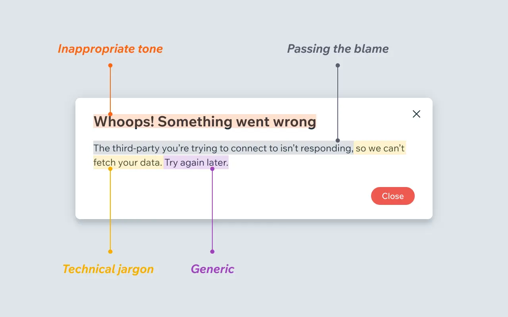

What makes a bad error message
- Inappropriate tone
- Technical jargon
- Passing the blame
- Generic for no reason

What make a good error message
- Say what happened and why
- Provide reassurance
- Be empathetic
- Help them fix it
- Always give a way out

Reference: https://wix-ux.com/when-life-gives-you-lemons-write-better-error-messages-46c5223e1a2f

