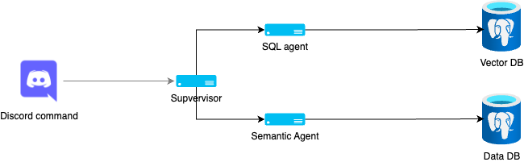

## Introduction
In the rapidly evolving field of artificial intelligence, the concept of agent supervisors has emerged as a powerful approach to orchestrating multiple AI agents for complex tasks. This article explores how building agent supervisors can lead to generating valuable insights, with a focus on a practical implementation in a Discord bot.

## Case Study: Discord Bot with Supervisor Architecture
Our team has developed a Discord bot that leverages the agent supervisor approach using Langgraph. This system demonstrates the power of coordinating multiple specialized agents to handle user queries efficiently and generate insights from various data sources.

### Key Components
1. **User Interface**: Discord chat, where users input their queries through slash commands.
2. **Supervisor**: Implemented with Langgraph, orchestrating the workflow and decision-making process. When a query is received, the supervisor evaluates its nature and determines which agents should be activated to handle the request. The supervisor ensures that the agents work in concert, passing intermediate results as needed to generate a comprehensive response.
3. **Agents**:
    - SQL Insights Agent: Translates natural language to SQL and queries the database. This agent is responsible for handling queries that can be answered through structured data. It translates natural language queries into SQL commands and executes them against a relational database. The results are then formatted and returned to the supervisor for further processing or direct response.
    - Semantic Insights Agent: This agent deals with unstructured data, leveraging a vector database to perform semantic searches. It is particularly useful for finding relevant messages or extracting insights from historical chat data. The agent preprocesses the Discord messages into embeddings, allowing for efficient similarity searches.
4. **Databases**:
    - Relational database: Store discord server events data
    - Vector database for semantic search
### Workflow
1. **User Input**: The bot receives a query through Discord. The user interacts with the bot by entering a query through Discord using slash commands.
2. **Supervisor Analysis**: 
    - The Langgraph-based supervisor receives the query and begins the analysis.
    - The supervisor interprets the natural language input and determines the intent behind the query.
    - It identifies whether the query is related to structured data (e.g., statistical information, activity logs) or unstructured data (e.g., discussions, semantic content).
3. **Agent Routing**:
- Based on the supervisor’s analysis, it routes the query to the appropriate agent:
    - **SQL Insights Agent**: If the query is related to structured data stored in the relational database.
        - Example: Queries like “What are the top 5 most active channels in the last month?”
    - **Semantic Insights Agent**: If the query requires insights from past Discord messages stored in the vector database.
        - Example: Queries like “Show me all discussions about project X from last week.”
4. **Data Retrieval and Processing**:
    - **SQL Insights Agent**:
        - The agent translates the natural language query into an SQL query.
        - It executes the SQL query against the relational database (PostgreSQL) to retrieve the necessary data.
        - The results are processed and formatted for clarity.
    - **Semantic Insights Agent**:
        - The agent performs a semantic search using the vector database.
        - It retrieves relevant messages or insights based on the preprocessed embeddings of Discord messages.
        - The results are filtered and organized for relevance.
5. **Response Generation**: Results are synthesized and presented back to the user in Discord.

## SQL Insights Agent Deep Dive
The SQL Insights Agent is a crucial component of our system, designed to bridge the gap between natural language queries and database operations. Here's how it works:
1. **Text-to-SQL Conversion**:
- **AI Model (sqlcoder)**:
    - The SQL Insights Agent utilizes sqlcoder, an advanced natural language processing (NLP) model, specifically trained to understand and translate natural language queries into SQL statements.
    - **Natural Language Understanding**:
        - sqlcoder processes the user’s input, identifies the key entities (e.g., tables, columns) and actions (e.g., select, filter, aggregate) required to fulfill the query.
    - **SQL Generation**:
        - Based on the parsed natural language, sqlcoder constructs a corresponding SQL query.
2. **SQL Verification**:
- **Verification Model (llama-2)**:
    - After generating the SQL command, the agent employs llama-2, another AI model, to ensure the correctness and efficiency of the SQL statement.
    - **Error Detection**:
        - llama-2 reviews the SQL query for syntax errors, logical inconsistencies, and potential performance issues.
    - **Optimization and Correction**:
        - If any issues are detected, llama-2 suggests or directly applies corrections to the SQL query.
3. **SQL Execution**: Runs the verified SQL query against the PostgreSQL database.
4. **Result Processing**:
- **Data Formatting**:
    - The retrieved data is processed to ensure it is clear, relevant, and presented in a user-friendly format.
    - **Error Handling**:
        - In cases where the query fails or retrieves no results, the agent generates informative error messages or suggestions for rephrasing the query.
    - **Success Rate**:
        - The SQL Insights Agent aims for a 95% success rate in query execution and result retrieval, ensuring that most user queries are handled effectively and efficiently.
## Benefits of This Architecture
1. **Flexibility**:
    - **Dynamic Query Routing**: The supervisor can dynamically route user queries to the most suitable agent, whether it’s for SQL-based insights or semantic searches. This dynamic routing ensures that each query is handled by the best possible resource, optimizing response accuracy and efficiency.
    - **Modular Expansion**: The architecture allows for seamless expansion. New agents can be added to the system without disrupting existing functionalities, enabling the incorporation of additional capabilities such as handling different data formats or integrating new data sources.
    - **Ease of Maintenance**: With clear separation of concerns, individual components (agents) can be maintained or upgraded independently. This reduces the risk of introducing errors when updating the system and simplifies troubleshooting.
2. **Natural Language Interface**:
    - **Accessibility**: Users can interact with the system using natural language, making it accessible to non-technical users who may not be familiar with SQL or other technical query languages. This broadens the user base and encourages more widespread use of the system.
    - **Intuitive Interaction**: The natural language interface allows users to express their queries in a way that feels intuitive and straightforward. This reduces the learning curve and improves user satisfaction by providing a more natural interaction experience.
    - **Enhanced User Engagement**: By lowering the barrier to entry, users are more likely to engage with the system regularly, leading to more frequent and varied queries that can provide richer insights over time.
3. **Semantic Search Integration**:
    - **Context-Aware Insights**: By utilizing a vector database of preprocessed Discord messages, the system can understand and provide insights based on the context of past conversations. This ability to perform semantic searches enables the retrieval of relevant information even when exact keywords are not used.
    - **Improved Relevance**: Semantic search allows the system to deliver more relevant results by understanding the meaning and intent behind user queries, rather than relying solely on keyword matching.
    - **Comprehensive Data Utilization**: Integrating semantic search ensures that unstructured data (like chat messages) is effectively utilized, providing a more comprehensive view of the available information.
4. **Robust Error Handling**:
    - **Verification Steps**: The use of verification steps, such as those implemented in the SQL Insights Agent, ensures that generated SQL queries are accurate and efficient. This reduces the likelihood of errors and improves the reliability of query results.
    - **High Accuracy and Reliability**: By employing multiple layers of verification and correction, the system achieves a high success rate in query execution. This robust error handling builds user trust and confidence in the system’s capabilities.
    - **Proactive Error Detection**: Verification models like llama-2 can proactively detect and correct errors or inefficiencies in queries, preventing issues before they affect the user experience.
## Challenges and Considerations
1. **Query Disambiguation**: Ensuring the supervisor correctly interprets user intent to route to the appropriate agent.
2. **Data Privacy**: Handling sensitive information in Discord messages when preprocessing for the vector database.
3. **Performance Optimization**: Balancing the load between SQL queries and semantic searches for efficient response times.
4. **Scalability**: Designing the system to handle increasing numbers of users and growing databases.

## Things to Improve
1. **Larger models for better SQL accuracy**: Select more advanced LLMs to better context and give semantic nuance to text-to-SQL queries to increase their accuracy.
2. **Better prompting strategies to reduce errors**: Smaller models benefit most from few-shot prompting or more chained prompting strategies that would increase their accuracy by a lot.

## Conclusion
Our Discord bot implementation demonstrates the practical application of agent supervisors in creating intelligent, multi-faceted systems. By combining SQL capabilities with semantic search and wrapping it in a user-friendly interface, we've created a powerful tool for generating insights from both structured and unstructured data sources
