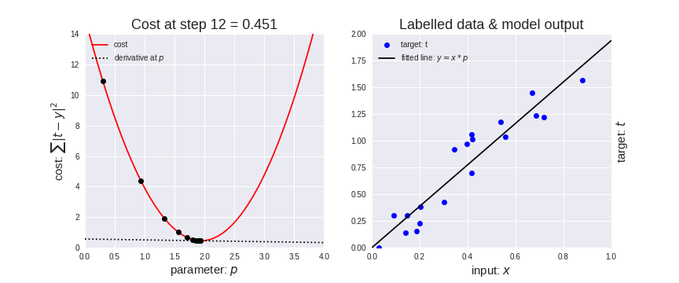

Gradient descent is a fundamental optimization algorithm in machine learning.  It's a bit like finding your way down a mountain in the fog: you take small steps in the direction that seems to be going downhill the fastest. 

In machine learning, the "mountain" is a mathematical function, and the "downhill direction" helps us find the best values for our model's parameters.

### Imagine you're sliding down a hill to find the lowest point
**The Hill**

Imagine you’re standing on a hill. The hill has many ups and downs, and your goal is to find the lowest point in the hill, where there’s a treasure hidden.

**Your Steps**

1. **Starting Point**: You start somewhere on the hill. You don't know if it's the lowest point, but you’re going to find out.

2. **Looking Around**: You look around to see which direction the ground slopes downward. This tells you which way to go to get closer to the lowest point.

3. **Taking a Step**: You take a small step down the hill in that direction.

4. **Repeat**: After taking a step, you look around again, see which way is down, and take another small step. You keep doing this until you reach the lowest point where you can’t go down any further.

### In Machine Learning
**1. The Hill**: Represents the error or how wrong the computer’s guesses are when trying to learn something (like recognizing cats and dogs).

**2. Lowest Point**: Represents the best possible way the computer can learn from the data, minimizing errors.

**3. Steps**: Each small step you take is like the computer adjusting its guesses a little bit each time to improve its learning.

**4. Looking Around:** The computer checks how it’s doing and decides which way to adjust its guesses to make fewer mistakes.

**5. Repeat:** The computer keeps adjusting its guesses little by little until it finds the best way to learn from the data, which is like you reaching the lowest point on the hill.

### Gradient Descent in simple terms
- **You:** The computer trying to learn.
- **Hill:** The error in guesses.
- **Lowest Point:** Best learning with the least errors.
- **Steps:** Small adjustments to improve guesses.
- **Looking Around:** Checking which way reduces errors the most.

Just like you keep stepping down the hill to find the treasure, the computer keeps adjusting its guesses to learn better and make the fewest mistakes.

### Reference
https://medium.com/onfido-tech/machine-learning-101-be2e0a86c96a