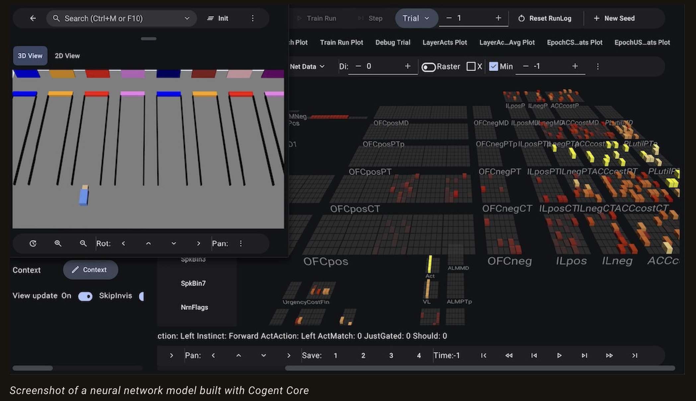
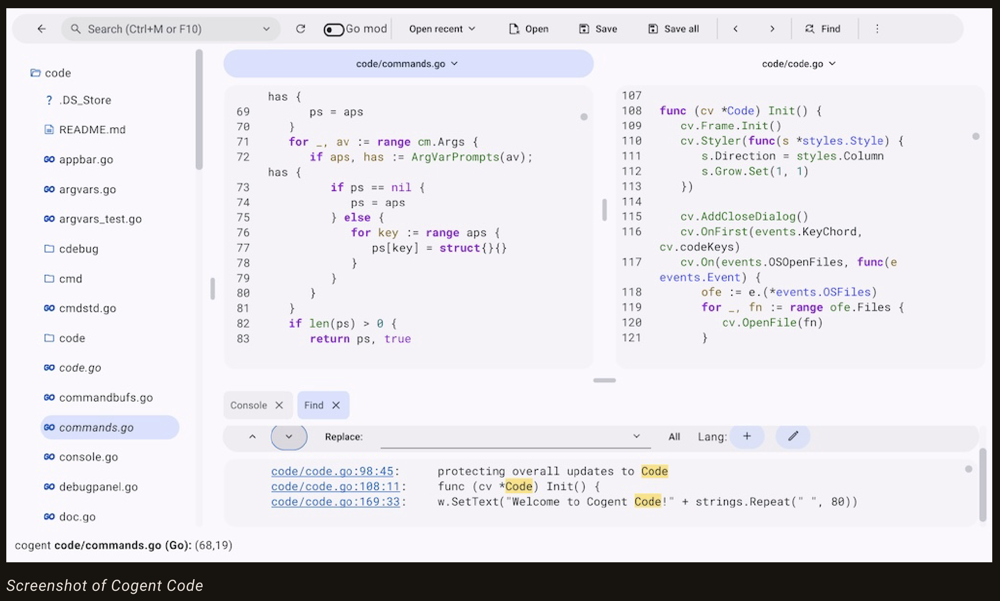

---
tags:
  - golang
  - go-weekly
  - networking
authors:
  - fuatto
title: "Go Commentary Aug 09"
description: ""
date: 2024-08-09
---
## [Cogent Core: A New GUI Framework for Go](https://www.cogentcore.org/blog/initial-release)

- GUI framework written in Go that allows you Code Once, Rune Everywhere (Core) (macOS, Windows, Linux, iOS, Android and web)

- The same Cogent Core app running on many devices using the same code:


- Simple Hello World app:

```go
package main

import "cogentcore.org/core/core"

func main() {
	b := core.NewBody()
	core.NewButton(b).SetText("Hello, World!")
	b.RunMainWindow()
}
```


- Supports all usual GUI widgets:

```go
core.NewButton(b).SetText("Send").SetIcon(icons.Send).OnClick(func(e events.Event) {
	core.MessageSnackbar(b, "Message sent")
})
core.NewText(b).SetText("Name:").SetTooltip("Enter your name in the text field")
core.NewTextField(b).SetPlaceholder("Jane Doe")
value := 0.5
spinner := core.Bind(&value, core.NewSpinner(b))
slider := core.Bind(&value, core.NewSlider(b))
spinner.OnChange(func(e events.Event) {
	slider.Update()
})
slider.OnChange(func(e events.Event) {
	spinner.Update()
})
core.NewColorButton(b).SetColor(colors.Orange)
type language struct {
	Name   string
	Rating int
}
sl := []language{{"Go", 10}, {"Python", 5}}
core.NewTable(b).SetSlice(&sl).OnChange(func(e events.Event) {
	core.MessageSnackbar(b, fmt.Sprintf("Languages: %v", sl))
})
```


- Interactive plots of data

```go
type Data struct {
	Time   float32
	Users  float32
	Profit float32
}
plotcore.NewPlotEditor(b).SetSlice([]Data{
	{0, 500, 1520},
	{1, 800, 860},
	{2, 1600, 930},
	{3, 1400, 682},
})
```


- Key features:

  - A full set of GUI widgets, with built-in support for most elements of [Material 3](https://m3.material.io/) standard
    - tooltips
    - drag-and-drop
    - sprites
    - popup completion
    - full text editor with code highlighting
    - ...

  - Extension styling properties makes styling easy
  
  - Responsive widget elements enables 1 codebase run across platforms

  - Transparent implementation of widgets makes customization easy

  - Dynamic color system

  - ...

- Full software ecosystem

  

  

  

## [Russ Cox Steps Down as Tech Lead of Go](https://groups.google.com/g/golang-dev/c/0OqBkS2RzWw/m/GzWvX5u6AQAJ?pli=1)

- Russ stepped down as Tech Lead of Go after 12 years, as Austin Clements taking the role.

- Now Russ is fulling working on Oscar - an AI agent system to help maintain OSS (including Gaby)

- Sources:
  - https://go.googlesource.com/oscar/+/refs/heads/master/README.md
  - https://go.googlesource.com/oscar/+/refs/heads/master/internal

---

https://www.cogentcore.org/blog/initial-release

https://groups.google.com/g/golang-dev/c/0OqBkS2RzWw/m/GzWvX5u6AQAJ?pli=1

https://go.googlesource.com/oscar/+/refs/heads/master/README.md

https://go.googlesource.com/oscar/+/refs/heads/master/internal

