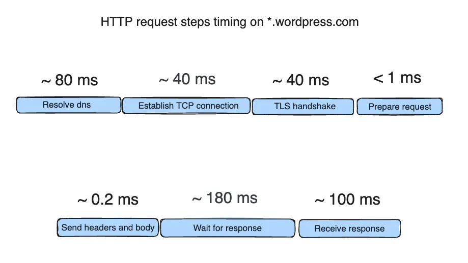

---
tags:
  - golang
  - go-weekly
  - networking
authors:
  - fuatto
title: "Go Commentary #4: Ethical Hacking, HTTP Requests, Mac App Development"
description: "This post explores two cutting-edge applications of Go programming. First, it details an ethical hacking project that successfully sent 500 million HTTP requests to 2.5 million hosts using Go's concurrency features and custom optimizations. The article then introduces DarwinKit, a powerful Go library for creating native Mac applications without Objective-C or Swift. Both examples demonstrate Go's versatility in handling high-performance networking tasks and cross-platform development, showcasing its potential for complex, scalable projects in cybersecurity and application development."
date: 2024-07-26
---
## [Using Go to send 500 Million HTTP Requests to 2.5 Million Hosts](https://www.moczadlo.com/2024/how-i-sent-500-million-http-requests-in-under-24h)

- Context: 
    - (Ethical hacking) To send 500 million of non RFC HTTP/1.1 requests to 2.5 million hosts in approx. a couple of hours.

    - Chose Go because of great concurrency support and fast. (The author did try Rust but too hard to understand)

- Problems:
    - If you use `curl` to send the requests (0.5s per request) 1 by 1 from single machine => 7.9 years.

    - Data transfer perspective (not that much):
        - 500 million requests * 1 KB (average request size) ≈ 478 GB
        - 500 million responses * 5 KB (average response size) ≈ 2.33 TB

    - Break down what HTTP client does in each call:

    ```go
    resp, err := http.Get("https://example.com")
    ``` 

        1. Resolve DNS
        2. TCP connect to another machine
        3. TLS handshake (generate and exchange cryptographic keys)
        4. Prepare HTTP request to send (normalize, encode)
        5. Wait for response and read it
        6. Parse response (decode, normalize and parse)
        7. Close connection (optional)


    - Measured results of sending HTTP/1.1 requests to subdomains of `*.wordpress.com` (wordpress.com has [wildcard dns](https://en.wikipedia.org/wiki/Wildcard_DNS_record) to prevent caching) shows that:

    

    - Resolving DNS and opening new TLS connection is slow (~160ms) but probably not notice how slow it is because the browser will open connect once and reuse it for many requests and HTTP/2 or HTTP/3 would be faster.

    - Can't rely on reusing connections since the need of sending many requests to many different hosts in different networks.

    - Would get rate-limited or banned quickly.

- Solution:
    Spread the load on many servers

    - Remove what we can from the steps: `Request parsing` and `DNS resolution`. (Simple crafted HTTP/1.1 requests by hand and [massdns](https://github.com/blechschmidt/massdns) to resolve thousands of DNS records in a couple of seconds)

    - Design the HTTP/1.1 sending mechanism:
        
        - Multiple worker pools that piped together:

            1. Request generation pool
            2. Sender pool
            3. Response pool

        

        - Use a concurrency-safe [queue](https://github.com/enriquebris/goconcurrentqueue) to seperate the worker pools and to reuse the objects and memory as much as possible.
    
    - Choose `fasthttp` over `net/http` to get x10 faster according to the [benmark](https://github.com/valyala/fasthttp?tab=readme-ov-file#http-client-comparison-with-nethttp)

    - Optimize the fasthttp's client to get rid of normalization step (fork and edit the lib)

        ```go
        req := rawfasthttp.AcquireRequest()
        resp := rawfasthttp.AcquireResponse()

        rawBytes := []byte("GET / HTTP/1.1\r\nHost: example.com\r\n\r\n")

        req.SetRequestRaw(rawBytes)

        err := client.Do(req, resp)
        ```
    
    - Override the `Dial` function to use the resolved IP addresses:

        ```go
        // single instance of custom dialer
        customDialer = &rawfasthttp.TCPDialer{}

        req := rawfasthttp.AcquireRequest()
        resp := rawfasthttp.AcquireResponse()

        resolved_ip := "127.0.0.1"

        req.SetDial(func(addr string) (net.Conn, error) {
            return customDialer.Dial(resolved_ip)
        })

        // ...
        ```
    
    - Optimize TLS handshake to prevent wasting CPU cycles by hardcoding the keys but had not enough time to change the fork so skipped.

    - Split 2.5 million hosts into chunks with 200 hosts per chunk (not take more than a couple of minutes to complete but big enough to not waste time on creating new connections). (200 is optimal for the usecase, the worker pods were prone to fail => minimize the lost requests/ retries)

    - Chose DigitalOcean with K8s to scale (cheapest one - 2TB+ of bandwidth per droplet). Also DigitalOcean gives new public IP for each droplet to avoid being banned from Cloudfare.

    - Wrote a auto-scroller to scale the deployment up and down based on the targets in queue (0 to 60 pods in a couple of minutes)

- Conclusion:

    - The final results:
        - Each pod achieved 100-400 requests per second
        - Scaled to 60 pods
        - Sent 500 million HTTP/1.1 requests to 2.5 million hosts in just a couple of hours

    - Although there will be a next post for a further detailed result, 
    

## [How I build simple Mac apps using Go](https://dev.to/progrium/how-i-build-simple-mac-apps-using-go-104j)

- Context:

    - There were no bindinds to native Mac APIs for Go => [DarwinKit](https://github.com/progrium/darwinkit)

        - Bindings for [33 frameworks](https://pkg.go.dev/github.com/progrium/darwinkit/macos@main#section-directories) with near complete coverage:
            - 2,353 classes
            - 23,822 methods and properties
            - 9,519 constants/enums
            - 543 structs
        - Automatic conversion and use of native Go builtin types in APIs
        - Support for block arguments as Go functions with properly typed arguments
        - Pre-made delegate implementations you can simply set Go functions on
        - 1-to-1 mapping to Objective-C symbols while still idiomatic to Go
        - Documentation for all symbols including a link to official Apple docs on that symbol
        - Growing collection of high-quality example starter apps for sponsors


- Future:
    
    - There are no bindings to Apple framework functions. The team are working on generating native Go function bindings for every framework function. Meanwhile, there is a workaround that involves using CGO (which DarwinKit is trying to help you avoid).

    - On the way of making DarwinKit not use CGO at all! Using [purego](https://github.com/ebitengine/purego), we can call into Apple frameworks without involving CGO. This will improve build time, make smaller binaries, and allow DarwinKit to be used in programs that need to avoid CGO for whatever reason.

    - For iOS and mobile devs, generated bindings are for MacOS for now. Any contribution is welcome.

---

- https://www.moczadlo.com/2024/how-i-sent-500-million-http-requests-in-under-24h
- https://dev.to/progrium/how-i-build-simple-mac-apps-using-go-104j
- https://github.com/progrium/darwinkit