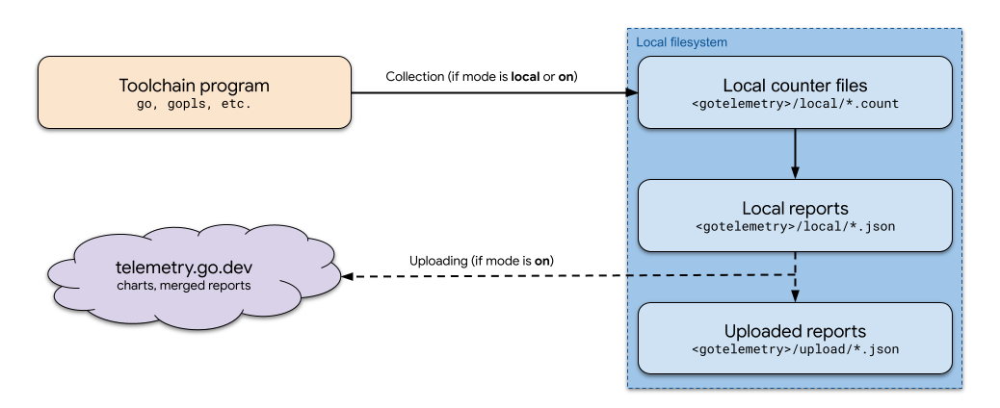

---
tags:
  - golang
  - go-weekly
  - networking
authors:
  - fuatto
title: "Go Commentary #10: Script, Telemetry"
description: "Exploring a Go library for shell-like scripting and Go's telemetry feature."
date: 2024-09-06
---

## [Script: Making it easy to write shell-like scripts in Go](https://github.com/bitfield/script)

- Go library that simplifies writing shell-like scripts by providing a fluent API for common operations like file manipulation, text processing, and command execution.

- Key features:

  - Chainable methods for piping operations
  - Easy file and directory operations
  - Text processing functions (grep, sed-like replacements)
  - Command execution and output handling
  - Error handling integrated into the API

- Usage:

  ```go
  // Read the contents of a file as a string
  contents, err := script.File("test.txt").String()

  // Count the number of lines that match a pattern
  numErrors, err := script.File("test.txt").Match("Error").CountLines()

  // Filter all the results through some arbitrary Go function
  script.Stdin().Match("Error").FilterLine(strings.ToUpper).Stdout()


  // Append the first 10 arguments to a file
  script.Args().Concat().Match("Error").First(10).AppendFile("/var/log/errors.txt")

  // Simple HTTP request
  script.Get("https://wttr.in/London?format=3").Stdout()
  // Output:
  // London: 🌦   +13°C
  ```

## [Go Telemetry](https://go.dev/blog/gotelemetry)

- Context:

  - the Go toolchain can collect usage and breakage statistics that help the Go team understand how the Go toolchain is used and how well it is working.

  

- Usage:

  ```
  go telemetry on

  go telemetry off

  // revert to the default mode of local-only telemetry
  go telemetry local
  ```

---

https://github.com/bitfield/script

https://go.dev/blog/gotelemetry

https://go.dev/doc/telemetry