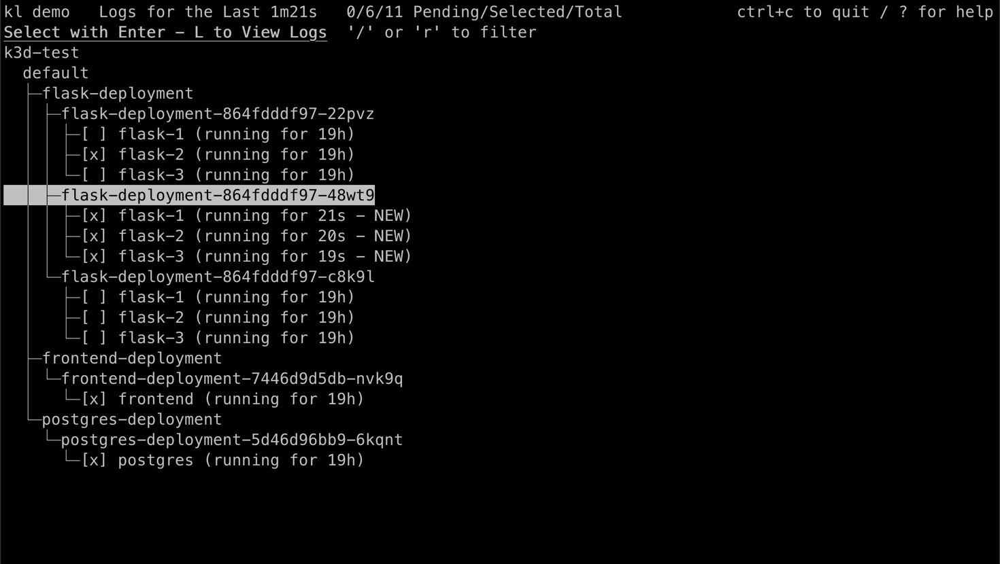
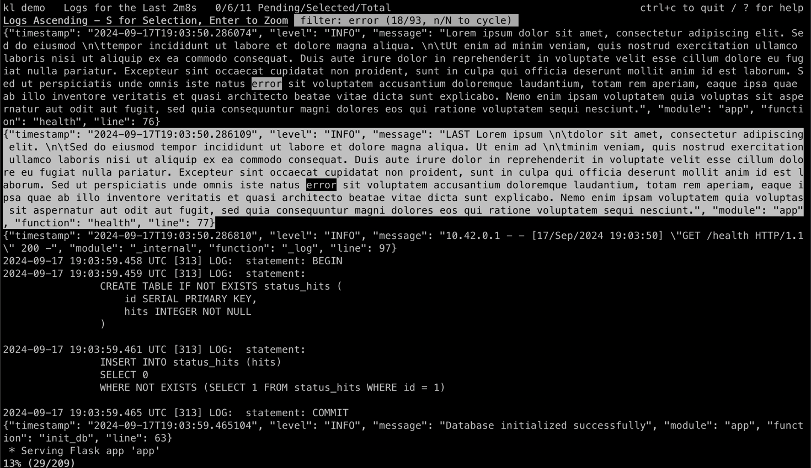
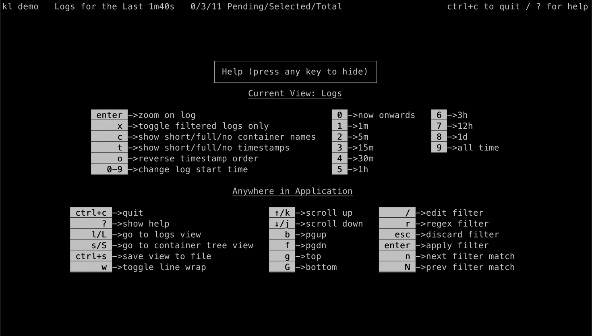
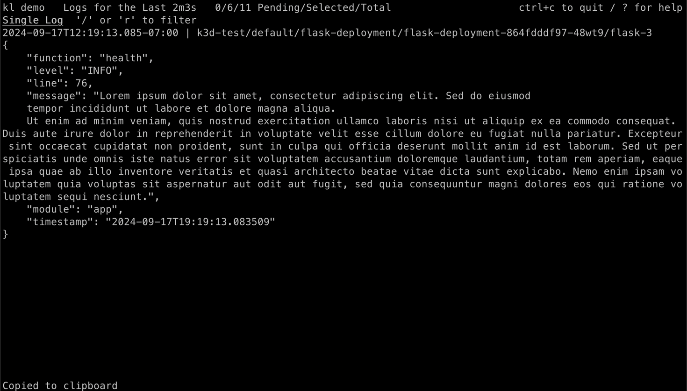
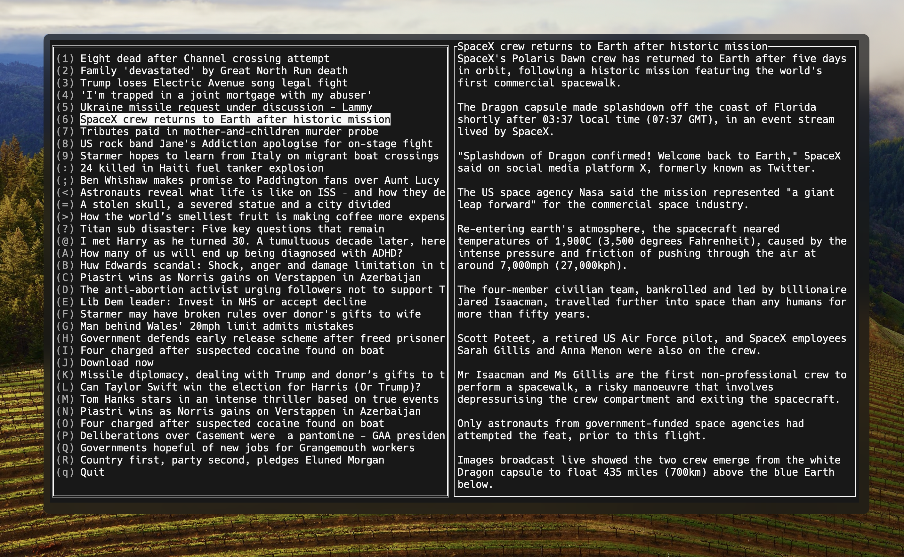

## [kl: An interactive Kubernetes log viewer for your terminal](https://github.com/robinovitch61/kl)

An interactive Kubernetes log viewer for your terminal.

```
// Example usage of kl
kl --context my-context,other-context -n default,other-ns
```






- This tool allows you to view logs across multiple containers, pods, and even clusters. It's like kubectl logs on steroids, which begs the question: why isn't this functionality built into kubectl itself? The fragmentation of the Kubernetes ecosystem continues unabated, with each new tool solving a problem that arguably shouldn't exist in the first place.

## [Restish](https://rest.sh/#/)

- A "CLI for interacting with REST-ish HTTP APIs." Because apparently, cURL and HTTPie weren't enough. Restish boasts features like automatic API discovery and generated commands:

```
# Perform an HTTP GET request
$ restish api.rest.sh/types

# Above is equivalent to:
$ restish GET https://api.rest.sh/types
```

```https
HTTP/2.0 200 OK
Content-Length: 278
Content-Type: application/cbor
Date: Tue, 19 Apr 2022 21:17:58 GMT

{
  $schema: "https://api.rest.sh/schemas/TypesModel.json"
  boolean: true
  integer: 42
  nullable: null
  number: 123.45
  object: {
    binary: 0xdeadc0de
    binary_long: 0x00010203040506070809...
    date: 2022-04-23
    date_time: 2022-04-23T21:41:58.20449651Z
    url: "https://rest.sh/"
  }
  string: "Hello, world!"
  tags: ["example", "short"]
}
```

While it's undeniably clever, one has to wonder: are we solving real problems, or are we just creating more abstraction layers to satisfy our insatiable appetite for "developer experience"? The irony of using a CLI to interact with REST APIs – which were designed for machine-to-machine communication – is not lost on me.

## [A fast full-text cli reader (works also with lobste.rs articles content)](https://github.com/piqoni/cast-text)

- A "zero latency, easy-to-use full-text news terminal reader." Yes, you read that correctly. In 2024, we're excited about reading RSS feeds in the terminal. It's as if we've come full circle, rejecting the rich multimedia experiences of modern web browsers in favor of monospaced fonts and ANSI color codes.

```
// Reading lobste.rs with cast-text
cast-text -rss https://lobste.rs/rss
```



The Pendulum Swings
This trend towards CLI tools in Go is part of a larger pendulum swing in our industry. We've gone from command-line interfaces to graphical UIs, from desktop applications to web apps, and now we're seeing a resurgence of terminal-based tools. It's as if we're collectively suffering from option paralysis, overwhelmed by the complexity of modern software stacks and yearning for the perceived simplicity of text-based interfaces.

But here's the rub: these new CLI tools are often just as complex as their graphical counterparts. They're built on layers of abstractions, requiring knowledge of specific command syntaxes and flags. We haven't simplified; we've just shifted the complexity to a different domain.


---

https://github.com/robinovitch61/kl

https://rest.sh/#/

https://github.com/piqoni/cast-text