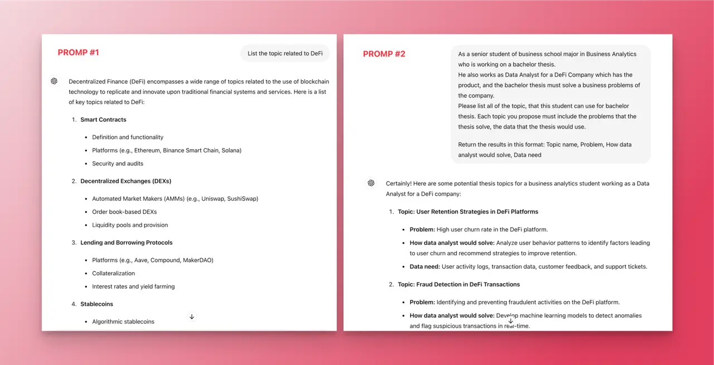
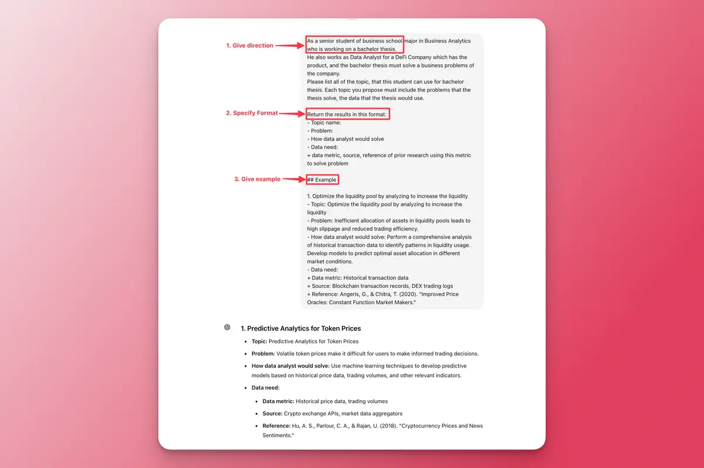
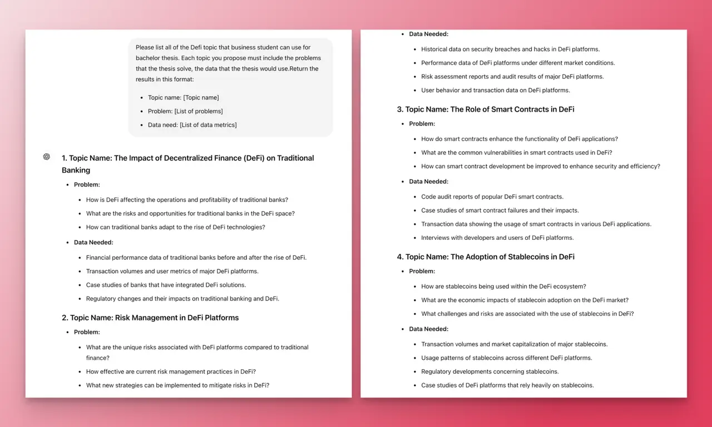
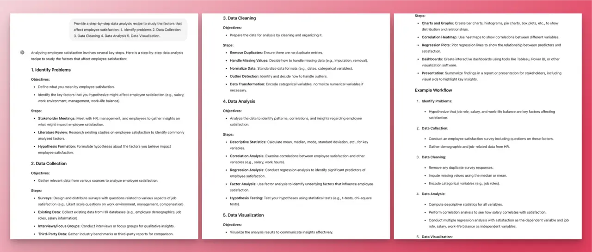
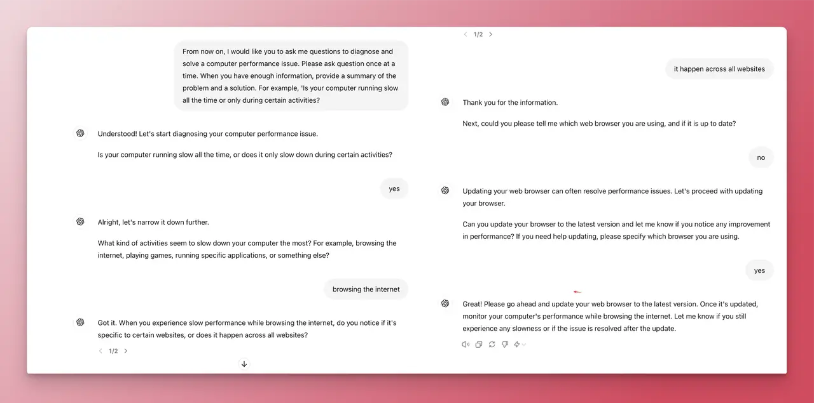

ChatGPT, an advanced language model by OpenAI, offers a unique way to interact with AI. The quality of results depends on the information and how well you craft your input. Then, it’s essential to understand how to talk with ChatGPT effectively.  

## How can you talk with ChatGPT?
Start by entering a message or prompt to begin the conversation. It's like a text-based chat with another person, but your interlocutor is AI. A prompt can include instructions, questions, context, inputs, or examples. Using these elements effectively can improve the quality of the results.

## How AI responds to the prompts?
AI systems like ChatGPT, Claude, and Gemini use natural language processing and machine learning. This allows them to understand conversational prompts, making the quality of the prompt crucial for the output's relevance and quality.

To effectively communicate and maximize the potential of ChatGPT, you need some strategies:

1. **Understand Your Objective**: Clearly define what you want to achieve with your prompt. Is it information, creativity, or problem-solving?
2. **Keep It Clear and Concise**: Avoid overly complex or vague prompts. Clarity leads to better AI responses.
3. **Context Matters**: Provide enough background for the AI to understand the scenario but avoid unnecessary information.
4. **Experiment and Iterate**: Don’t hesitate to refine your prompts based on the responses you get. Iteration is key to finding the most effective wording.
5. **Consider Your Audience**: Tailor your prompt based on who will interact with or benefit from the AI’s response.
6. **Evaluate and Adapt**: Continuously assess the effectiveness of your prompts and be ready to adapt as needed.

Here are two examples of prompt input for thesis topic about DeFi, and the resulting output from ChatGPT. It is obvious that instead of listing like the output of prompt 1, that of prompt 2 provides more valueable and usable information. 

What make the difference of these two?

## What are 5 principles of an effective prompt?
### Give Direction
The direction should describe the desired style in detail, or reference a relevant persona. You can design effective prompts for various simple tasks by using commands to instruct the model what you want to achieve, such as "Write", "Classify", "Summarize", "Translate", "Order", etc. You should also provide the context, which includes specifying a particular time period, geographical location, the role you want to play, or any other relevant limitations. 

### Specify Format
Be very specific about the instruction and task you want the model to perform. The more descriptive and detailed the prompt is, the better the results. This is particularly important when you have a desired outcome or style of generation you are seeking.

Define what rules to follow, and the required structure of the response.

### Provide Examples
Using prompts and examples can enhance the clarity of your question and guide Chat GPT in understanding the desired output. By providing sample inputs or expected formats, you can communicate your expectations effectively and receive more tailored responses.

### Evaluate Quality
You need to identify errors and rate responses, testing what drives performance.

### Divide Labor
You should split tasks into multiple steps, chained together for complex goals.

## Prompt Pattern
### Output customization
**1. Give persona**
- **Use case**: Get better outputs by simulating an expert or specific role.
- **Structure and Key Ideas:**
    - Act as persona X and provide outputs that they would create.
    - Explain <term> for <personaX>
- Example
    - Explain the value chain model for a business freshman.
    - Please list all of the Defi topic that business student can use for bachelor thesis.

**2. Give template**
- **Use case**: Get the output in a specific structure
- **Structure and Key Ideas:** Provide a template with placeholders for ChatGPT to fill in.
- **Example**: Please list all of the Defi topic that business student can use for bachelor thesis. Each topic you propose must include the problems that the thesis solve, the data that the thesis would use.Return the results in this format:
    - Topic name: [Topic name]
    - Problem: [List of problems]
    - Data need: [List of data metrics]
- Output
    
    

  **3. Provide Recipe**
- **Use case**: When you want achieve a specific end result in a provided sequence of steps.
- **Structure and Key Ideas**:
    - Specify the desired outcome and any known constraints or partial information.
    - **Example pattern**: Provide step-by-step recipe to <do something>: <list your self-defined sequence of steps>
- **Example**:  Provide a step-by-step data analysis recipe to study the factors that affect employee satisfaction: 1. Identify problems 2. Data Collection 3. Data Cleaning 4. Data Analysis 5. Data Visualization.
- **Output**
    
    

### Context control
- **Use case**: When you want to maintain and manage the context of the conversation to ensure coherence and relevance in ongoing interactions.
- **Structure and Key Ideas:** Instruct ChatGPT to remember specific details from the conversation and use them in future responses.
- **Example**: Please remember for every the data analysis request I want to solve by using R.

### Interaction
- **Use case**: You allow  ChatGPT to drive the interaction, ensuring that it gathers all necessary information to provide a comprehensive response.
- **Structure and Key Ideas:** Instruct ChatGPT to ask a series of questions aimed at achieving a specific outcome.
- **Example**: From now on, I would like you to ask me questions to diagnose and solve a computer performance issue. Please ask question once at a time. When you have enough information, provide a summary of the problem and a solution. For example, 'Is your computer running slow all the time or only during certain activities?

- 
