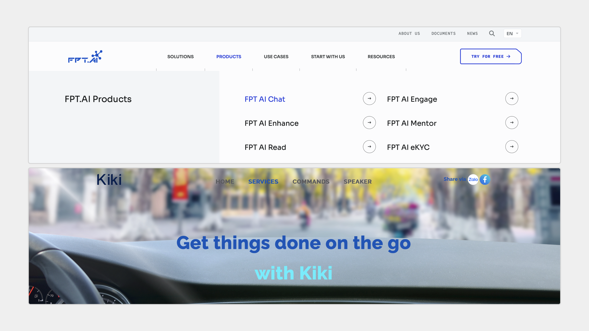
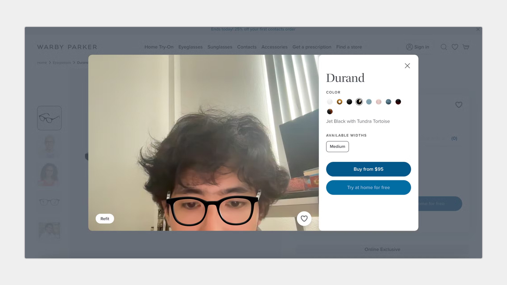
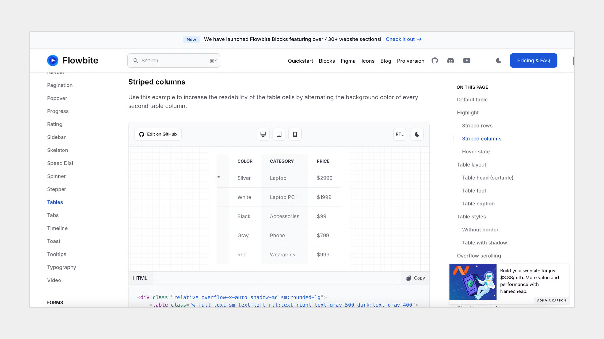
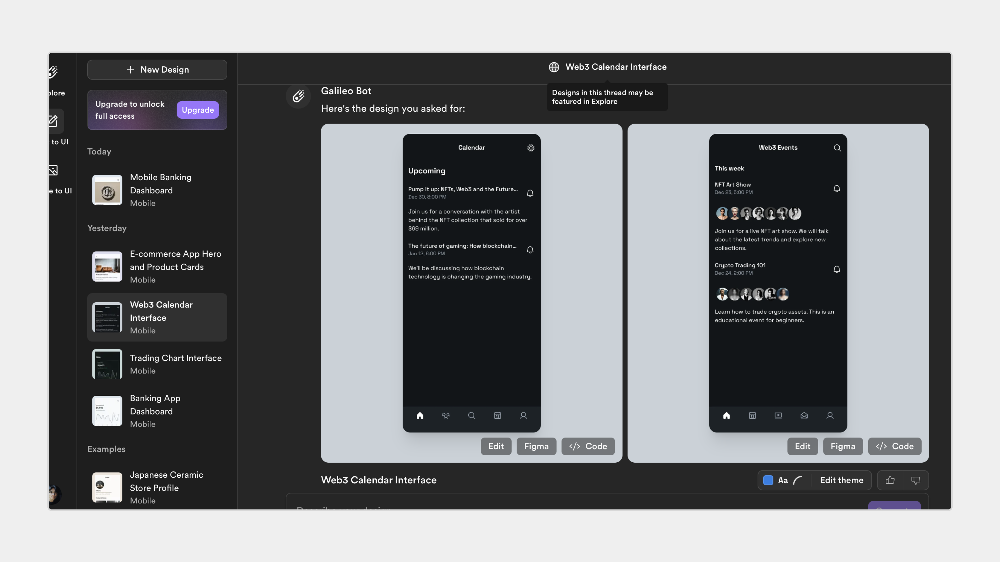

---
tags:
  - UX-UI
  - product-design
  - report
title: "Product Design Commentary #1: New Technologies Changing UX/UI and Product Design"
date: 2024-09-30
description: New tools are changing how we design products. In the first edition, we look at voice controls, mixed reality, reusable design parts, and smart helpers. See how they're being used, what's popular, and why designers should care. Learn to make things that are easier and better to use. 
authors:
  - changtrailucluong
---

As technology evolves, design processes are being transformed by advancements like Voice User Interfaces (VUI), Augmented Reality (AR), Virtual Reality (VR), Modular Design Systems, and AI tools. These innovations are helping designers automate repetitive tasks, enhance user experiences, and ensure consistency across products. In this article, we explore how these tools are shaping the future of UX, UI, and product design, making interactions more intuitive and efficient.

## Voice User Interface (VUI)
Voice User Interfaces (VUI) are growing rapidly with widespread integration into devices like smart speakers, mobile phones, and automobiles. Services such as **Siri**, **Alexa**, and **Google Assistant** are leading the way, and many more products are expected to follow in the near future.

### The Future of VUI
By 2026, nearly **50% of the U.S. population** is expected to be using voice-activated devices. This trend encourages businesses and UX designers to consider effective ways of incorporating VUI into their products to meet user demands.

### Products Leading VUI Trends
**Vietnam**:

- **FPT AI**: [10 Tips for Creating the Best Chatbot Script](https://fpt.ai/blogs/10-tips-creating-best-chatbot-script-fptai-conversation-part-1/)
- **Zalo AI**: [Kiki - Zalo AI](https://kiki.zalo.ai/)

**Global Products**:

- **Google Assistant**: [Google Assistant](https://assistant.google.com/)
- **Amazon Alexa**: [Amazon Alexa Smart Home](https://www.amazon.com/alexa-smart-home/)

## Augmented Reality (AR) and Virtual Reality (VR)
AR and VR are quickly becoming standards in multiple industries, enhancing both user experience and product interaction.

### Growth Forecast
The number of AR users is expected to increase from **0.44 billion in 2019** to **1.73 billion by 2024**, with the AR/VR market projected to reach **$40 billion in revenue by 2027**.

### Practical Applications in UX
- **E-commerce**: AR allows users to preview products in real-world environments, such as **trying on shoes virtually**, **placing furniture in a room**, or **trying on clothing**.
    - Example: [L'Oreal AR Skincare](https://www.lorealparisusa.com/skin-care/facial-moisturizers/age-perfect-rosy-tone-cooling-night-moisturizer)
    - Example: [Warby Parker AR Glasses Try-On](https://www.warbyparker.com/)
- **Education and Training**: VR is being utilized to provide immersive, direct-learning environments, where learners can practice skills in a safe, virtual setting.

### Products Leading AR/VR Trends
**Vietnam**:

- **VinFast AR/VR**: [VinFast Showroom with AR/VR](https://vinfastauto.com/vn_vi/vingroup-phat-trien-cong-nghe-arvr-tai-showroom-vin3s)
- **Viettel x VR360**: [Viettel Collaboration with VR360](https://vr360.com.vn/du-an-hop-tac-giua-viettel-va-vr360)

**Global Products**:

- **Meta Horizon Worlds**: [Meta Horizon World](https://www.meta.com/horizon-worlds/)

## Modular Design Systems
**Modular Design Systems** allow teams to build reusable components that create consistency across products. Elements like buttons, navigation bars, fonts, and more are organized into a system, making it easy for teams to maintain a unified user experience across different platforms.

### Benefits
Modular systems are designed once and can be reused across various products, saving development time and ensuring a cohesive user experience.

### Examples
- **Ant Design**: [Ant Design System](https://ant.design/)
- **Tailwind CSS**: [Tailwinds Flowbite](https://flowbite.com/docs/getting-started/introduction/)
- **Shadcn UI**: [Shadcn UI Design System](https://ui.shadcn.com/docs/figma)

*All these systems are available as Figma libraries as well as for development, making it easy to ensure design and implementation are well-aligned.*

### Application in Design & Development
- **For Designers**: Designers use the design system as the primary source for creating components in Figma. All designs strictly adhere to the principles of the system library, limiting customization.
- **For Developers**: Developers also have access to the pre-built component libraries that follow the design system. This ensures that the web version closely mirrors the design mockups.

One significant advantage is **responsiveness across devices**. By using a single web design, it can adapt to tablet and mobile formats easily.

Example: [Flowbite Component Example](https://flowbite.com/docs/components/tables/)

## AI Tools for UX, UI, and Product Designers
AI is transforming the design industry by automating repetitive tasks, streamlining the research process, and optimizing UI/UX design.

### For UX & Research
AI plays a crucial role in **UX research**, helping designers better understand user behavior and needs by analyzing data and automating research processes. These tools provide data-driven insights that optimize the user experience from the early stages.

- **ChatGPT**: [ChatGPT](https://chatgpt.com/)
- **Maze**: [Maze AI Testing](https://maze.co/ai/)
- **Claude AI**: [Claude AI](https://claude.ai/new)

### For UI Design
AI also plays an important role in **automating UI design processes** such as layout adjustment, color selection, and image processing. This helps UI designers save time while ensuring that the user interface always meets the highest standards of aesthetics and functionality.

- **Uizard**: [Uizard](https://uizard.io/)
- **Galileo AI**: [Galileo AI](https://www.usegalileo.ai/)
- **Creatie AI:** [Creatie AI](https://creatie.ai)

## Conclusion
The integration of VUI, AR/VR, Modular Design Systems, and AI is transforming modern design by enhancing user experience and streamlining workflows. To stay competitive, designers must leverage these tools effectively, focusing on user feedback, privacy, personalization, and cross-platform performance. Embracing these technologies will enable teams to create innovative, user-centered products that stand out in the market.