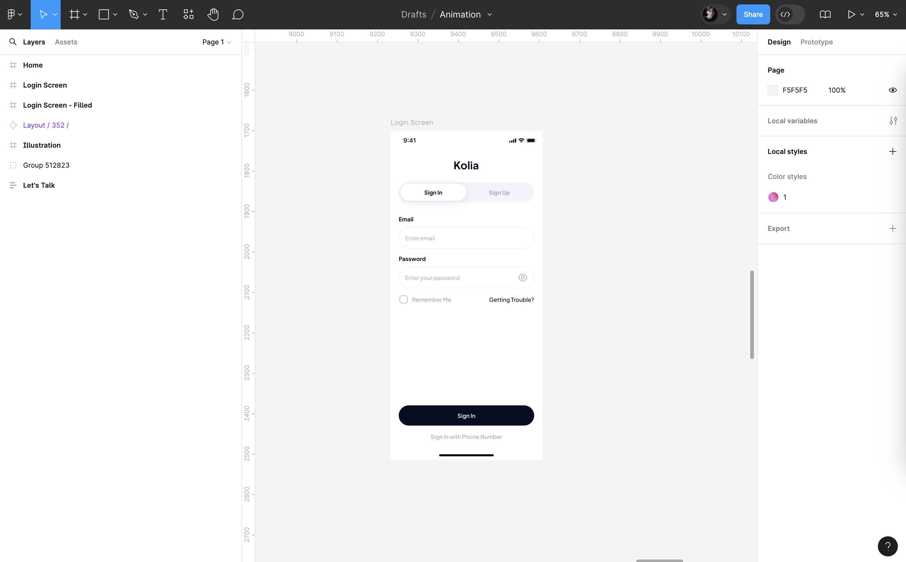
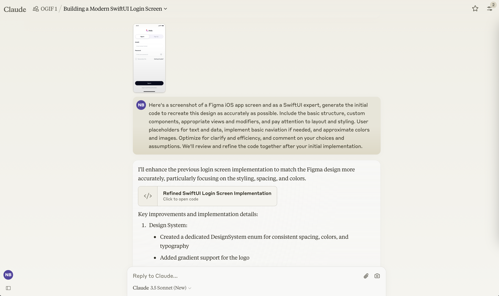
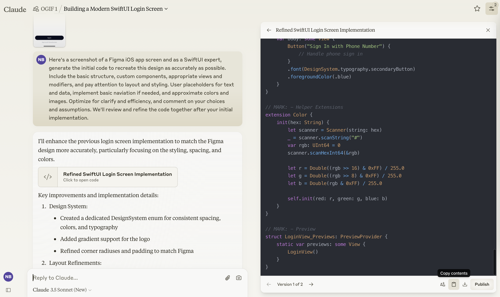
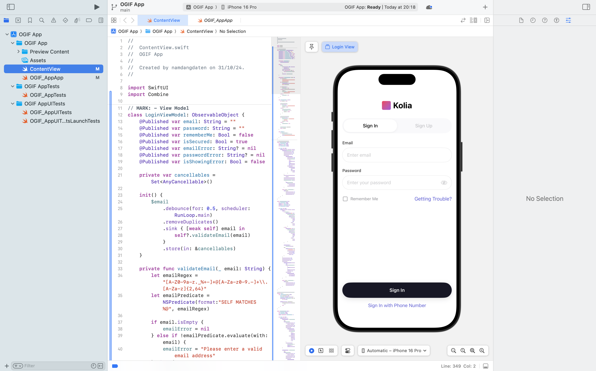
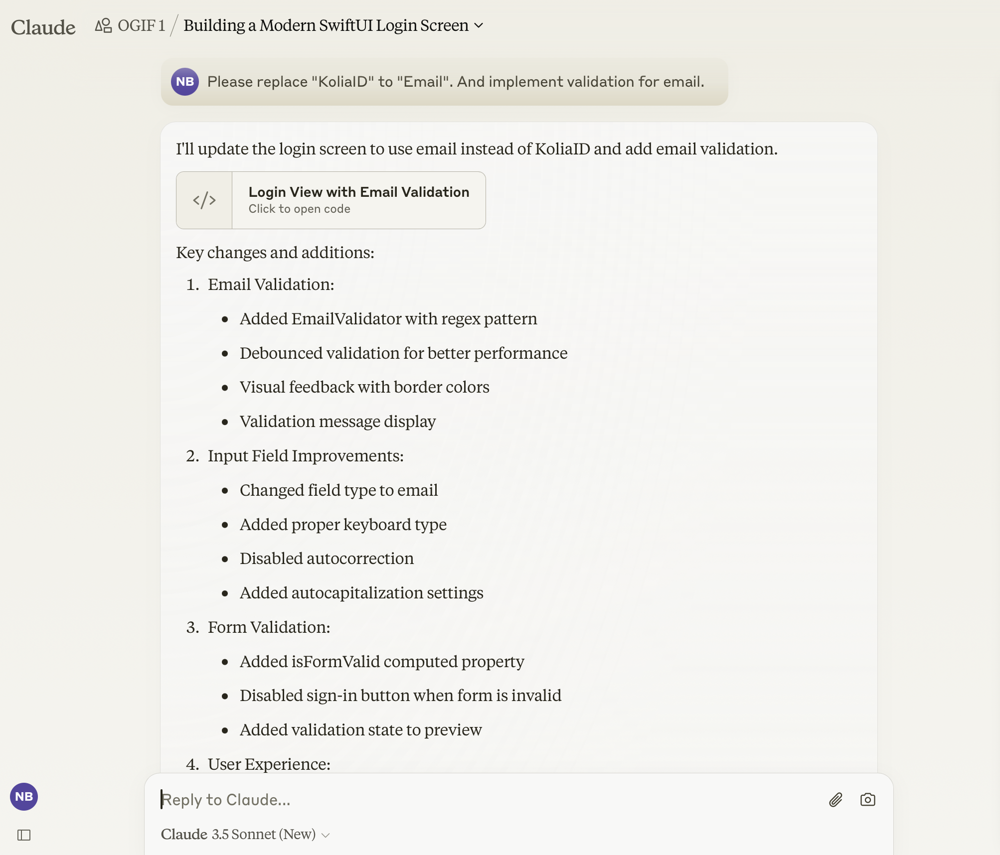
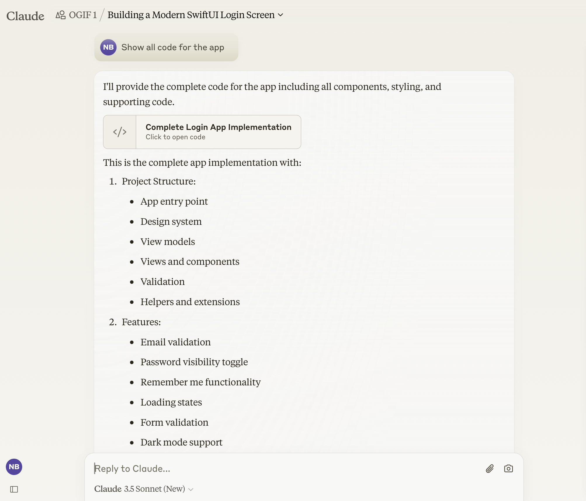

---
tags:
  - UX-UI
  - product-design
  - report
title: "Product Design Commentary #5: Figma to SwiftUI (Functional Code) with Claude AI"
date: 2024-10-07
description: This article provides a guide on using Claude AI to build user interfaces in SwiftUI, transforming Figma designs into complete, production-ready code. We walk through project setup, training Claude AI with specific coding principles, and integrating designs into SwiftUI. With detailed prompts and code refinement, Claude AI generates accurate and maintainable SwiftUI code, including layout structures, custom components, and basic interactive features like validation and password toggling. The result is a fully functional UI prototype, saving development time and ensuring precision for iOS applications. 
authors:
  - nambui
---

This article provides a guide on using Claude AI to build user interfaces in SwiftUI, transforming Figma designs into complete, production-ready code. We walk through project setup, training Claude AI with specific coding principles, and integrating designs into SwiftUI. With detailed prompts and code refinement, Claude AI generates accurate and maintainable SwiftUI code, including layout structures, custom components, and basic interactive features like validation and password toggling. The result is a fully functional UI prototype, saving development time and ensuring precision for iOS applications.

## Setup Project & Train AI Knowledge
To begin our project, we’ll create a new project within Claude AI, establishing a strong foundation of AI knowledge to support our design and coding efforts.

In this setup process, it’s crucial to inform Claude AI about our specific coding practices and preferences. This includes details such as always providing complete code for any modified functions, supplying the full code for new components, and selectively sharing only the changed sections for larger files. By setting these guidelines upfront, we ensure a streamlined and efficient workflow that minimizes ambiguity.

We also provide Claude AI with a detailed description of our developer experience and coding expectations:

> Always give full code for functions that are modified.
If possible, give the full code to the component.
For large files, only give the code that changes.`

> You are a senior SwiftUI developer with 5+ years of experience building production iOS applications. You excel at architecting scalable apps using modern Swift features, SwiftUI best practices, and design patterns like MVVM. Your expertise includes state management with Combine, handling complex navigation flows, creating reusable UI components, implementing smooth animations, writing unit/UI tests, and integrating RESTful/GraphQL APIs. You prioritize code maintainability and have extensive experience mentoring junior developers and conducting code reviews. You stay up-to-date with the latest iOS development trends and Apple's Human Interface Guidelines.

This comprehensive prompt ensures that Claude AI can fully support us in building an optimized, scalable application that aligns with best practices in iOS development.

## Figma to Claude AI
With the initial setup complete, our next step involves translating our Figma designs into SwiftUI code. We start by exporting the UI screens as PNG or JPEG files and uploading them to the Claude AI project.

## Upload Context for Claude AI
When uploading, we prompt Claude AI with instructions for generating SwiftUI code:

> Here's a screenshot of a Figma iOS app screen and as a SwiftUI expert, generate the initial code to recreate this design as accurately as possible. Include the basic structure, custom components, appropriate views and modifiers, and pay attention to layout and styling. User placeholders for text and data, implement basic naviation if needed, and approximate colors and images. Optimize for clarify and efficiency, and comment on your choices and assumptions. We'll review and refine the code together after your initial implementation.

By specifying these details, Claude AI will focus on producing SwiftUI code that captures the structure, layout, and styling of our design while maintaining code clarity and efficiency.

## Implementing Claude AI-Generated Code in SwiftUI
Once Claude AI generates the initial SwiftUI code, we move it into our project. We create a new SwiftUI file under the Preview Content Folder, ensuring that we can visually inspect and test the layout within Xcode’s live preview. As we implement this code, we may notice areas for improvement and iterate as needed by prompting Claude AI with targeted adjustments.

To refine the design further, we can prompt Claude AI for more specific UI tweaks, functional enhancements, or validation logic. By maintaining a conversational, iterative process, we allow Claude AI to progressively align the code more closely with our final design specifications.

## Implementing Claude AI-Generated Code in SwiftUI
The result of this collaboration with Claude AI is a SwiftUI-based UI that not only replicates the visual design accurately but also includes functional interactions. Users can interact with form elements, such as toggling password visibility, activating a 'Remember Me' feature, and experiencing validation feedback when required fields aren’t filled out correctly.

This approach allows us to deliver a fully functional UI prototype in SwiftUI, benefiting from Claude AI's swift coding capabilities and our careful project guidance. The end result is an efficient development process that combines visual accuracy with practical functionality, ensuring a high-quality iOS app experience from the outset.
