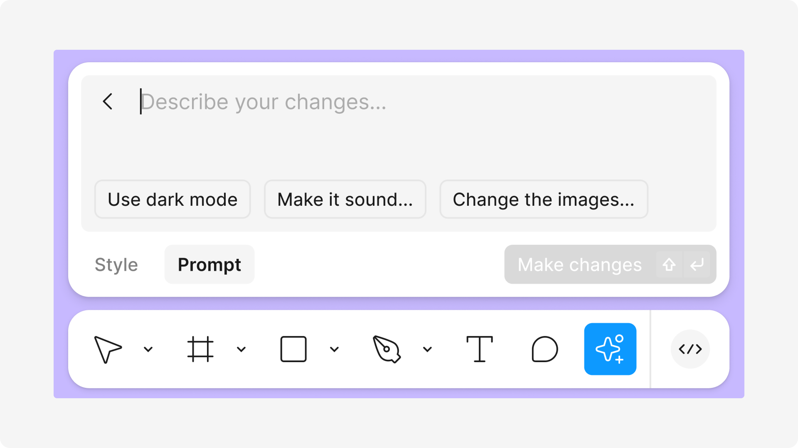

---
tags:
  - UX-UI
  - product-design
  - report
title: "Product Design Commentary #2: Unpacking the Sparkles Icon and AI Onboarding Challenges"
date: 2024-10-07
description: "In this second edition, we explore the use of the Sparkle (✨) icon for AI-driven features and the common confusion it creates for users. It covers best practices for designing effective onboarding for AI tools, highlighting the importance of clear communication, contextual help, and easy-to-follow tutorials to ensure a smooth user experience. By focusing on these elements, designers can enhance user understanding and engagement with AI features."
authors:
  - nambui
---

## AI Icon - Sparkles
Article: https://www.nngroup.com/articles/ai-sparkles-icon-problem/

The Spark icon has become increasingly common today, primarily used for AI-related features. However, the icon carries multiple meanings and is interpreted in various ways, making it ambiguous.

### Ambiguity
The icon lacks a clear definition or consistent meaning.
    
For example, the Spark icon is used in apps like **Plane Finder,** but its meaning varies between apps, leaving users unsure about its exact purpose.
 

    
The **Ulta & Google Meet** apps face a similar issue where the Sparkle icon leads to confusion. Users struggle to accurately guess the exact meaning or purpose of the icon, as it is unclear. This inconsistency in usage results in misunderstandings about what the icon is supposed to represent in different contexts.

    

    
The image presents statistics on how users interpret the Spark icon. The results show that many users associate it with saving favorites, special information, or promotions. This indicates a lack of clarity in the icon design, which is commonly used by many brands today, leading to user confusion.
    
### Misuse of the icon
As more AI features are introduced, overuse of the Sparkles icon (✨) can increase user confusion, especially since it’s commonly associated with AI-driven functionalities like recommendations and automation.

- The icon is often unclear, leading users to misinterpret its connection to AI.
- This vagueness highlights the need for **context** and better explanations to ensure users understand its role in representing AI-related features.
- Without clarity, users may fail to recognize the association between the icon and AI technology.
        

        

        

        

        
### Impact on UX
Without proper context (such as tooltips or labels), the Sparkles icon can cause confusion and reduce interface clarity.
    

    
### Summary & Conclusion
- The **sparkles icon (✨)** is frequently used to represent AI features, but it often leads to **ambiguity** and **misunderstanding**.
- Users frequently **misinterpret** the icon, associating it with unrelated functions.
- Providing **context** and clear explanations is essential for improving its effectiveness.
- **Consistent and thoughtful usage** of the icon can make it a valuable tool for AI-driven functionality.
- Design teams should prioritize **clarity and user experience** when using abstract icons in interfaces.

## New AI User Onboarding
Article: https://www.nngroup.com/articles/new-AI-users-onboarding/?lm=ai-magic-8-ball&pt=article

### Simplify Onboarding
A study with 6 participants from China tested AI chatbots like Baidu's Ernie bot, ChatGLM, and SparkDesk. Out of the group, 3 had no prior experience with AI, while others had limited knowledge, thinking AI mainly created images and videos. SparkDesk provided a long tutorial but assumed users already knew how chatbots worked, causing confusion.

In contrast, US ChatGPT users would ask questions starting with “Can you?” which allowed them to quickly understand the tool’s capabilities. This interaction helped them grasp the tool’s potential more easily.

### Use the Tool Name to Indicate Functionality
**App-store descriptions** are crucial for clarifying a tool’s function. For example, the **EF Hello** app is a **good practice** by using a clear name and tagline that clearly communicates its AI-driven language learning capabilities. In contrast, the **Ernie chatbot** represents a **bad practice** because its unclear name makes it difficult for users to understand the app’s purpose, causing confusion and making it harder for users to remember. Clear, concise descriptions are essential to guide users effectively.

### Follow Best Practices for Onboarding Tutorials
Users tend to skip lengthy tutorials, so it’s essential to provide **contextual help** based on their current actions. For instance, the **SparkDesk** app offered multiple FAQs but failed to address core questions like "What does this tool do?" or "How does it work?". Useful tips should appear after users understand the interface, similar to how **Perplexity.ai** uses hover tooltips. Unnecessary onboarding steps, like the **Ernie app**'s character selection, may confuse users by leading them to believe the character’s personality affects the tool’s output, causing misunderstandings about its capabilities

- **Avoid pop-up windows** during onboarding, as users may mistake them for ads and **dismiss them immediately**.
- Pop-up instructions are often unnecessary if the icons are **self-explanatory** and their functions are clear to users.

### Provide General Task Examples Instead of Specific Ones
New users often begin with AI chatbots by following provided examples. However, overly specific examples like “Poem with Plum” or “Horoscope Matching” may not resonate with most users. Broader examples like "Generate text" or "Create an image" are more effective in helping users explore the tool’s capabilities. These general tasks, such as "Help me study" or "Help me debug," allow users to naturally discover the AI’s potential, making tools like ChatGPT easier to use and more practical in real-life scenarios. Clear guidance enhances the overall user experience.

## Key Takeaways for Designing AI Apps
- **Simplify Onboarding**: Keep instructions short, answering key questions about the app's function and how users can interact with it.
- **Contextual Help**: Introduce features gradually as users interact to avoid overwhelming them with too much information.
- **Broad, Generalized Examples**: Use general examples to demonstrate AI's capabilities, encouraging user exploration.
- **Clear Communication**: App name, tagline, and store description should clearly convey the product’s function.
- **Minimize Complexity**: Eliminate unnecessary pop-ups and features to simplify the UX.
- **Adapt the Experience**: Support users with timely help as they explore the app.
- **Testing & Feedback**: Test with real users, especially those with limited AI experience, to identify pain points.
