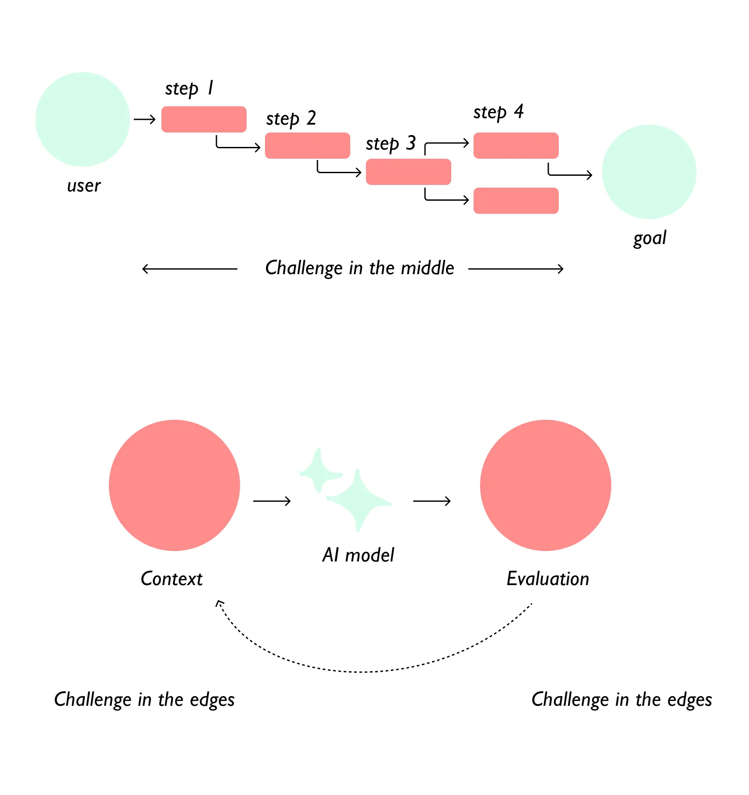
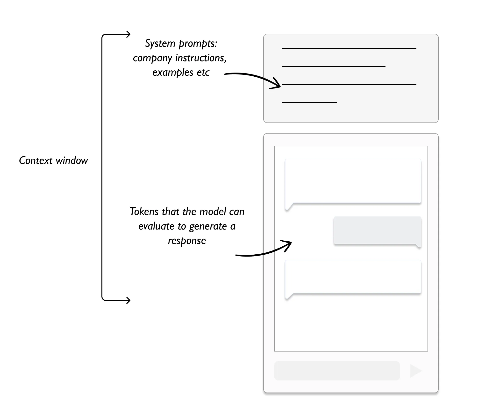
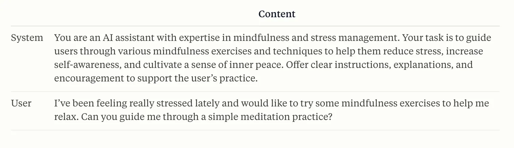

---
tags:
  - UX-UI
  - product-design
  - report
title: "Product Design Commentary #3: The Art of Prompting in AI-Human Interaction"
date: 2024-10-14
description: "In this third edition, we delve into the art of prompting in AI-human interaction. We explore the evolution of communication between humans and machines, focusing on the crucial role of UX designers in crafting effective prompts for large language models. The commentary covers the importance of context, system prompting techniques, and structured frameworks for prompting, highlighting how these elements shape the future of human-AI interactions and user experiences."
authors:
  - changtrailucluong
---

The longstanding challenge of communication between humans and machines has been ongoing since the dawn of computing. With the emergence of large language models (LLMs), prompting has become a powerful tool in facilitating this communication. The role of UX designers is to help bridge this gap by designing effective systems and interactions that allow humans to better understand and utilize these advanced AI technologies.

### The Emergence of Prompting

LLMs, such as GPT and similar models, rely heavily on user prompts to generate responses. UX designers play a crucial role in shaping how these prompts are structured, ensuring that AI can effectively interpret user intent. Just as graphical user interfaces (GUIs) revolutionized human-computer interaction, AI has the potential to further evolve how we interact with technology, offering deeper and more intuitive experiences.

### A Mental Shift in Design

As we move away from traditional command-based interfaces, the challenge lies in providing AI with appropriate context to generate meaningful outputs. Designers must now focus on the context in which AI models operate, ensuring continuous improvement and iteration to optimize user experiences.

### Context and AI Models

Effective communication with AI relies on providing clear context, both from the user and from the system. Whether it's a conversational prompt or a store-like interaction, understanding context shifts complexity to the edges, allowing AI models to interpret and respond more effectively. Designers can assist by ensuring that the system captures the right context through prompts, making AI interactions smoother.

### **The Craft of Prompting (System Prompting)**

UX designers can enhance AI interactions by crafting effective system prompts. These prompts help guide the AI, providing a consistent tone and behavior.

- **Interface Prompting:** Designers can provide conversational starters and suggest follow-ups.
    
    
    
- **System Prompting:** Hidden prompts guide the AI in a specific direction, ensuring consistent tone and behavior across the tool.
    
    
    
- **Training Data:** The UX role is crucial in helping train models or assist in fine-tuning them to avoid bias and ensure ethical use.

### Understanding the Context Window

The concept of a **context window** is essential in AI interactions, as it determines how much of the conversation the AI can remember. System prompts are embedded within this window to ensure that AI responses align with company values and user needs. Models like **Google’s Gemini** use context windows to retain relevant information over long conversations.

### Approaching Prompting

Effective prompting requires structured frameworks, such as **RACE** (Role, Action, Context, Expectation), where designers guide AI through clearly defined parameters. **Few-shot prompting** helps the AI understand what is expected by providing relevant examples, while **Chain-of-thought reasoning** ensures that the AI processes complex tasks step-by-step. **ChatGPT** uses these techniques to allow users to interact with the AI more intuitively and receive more accurate responses.

### Closing Remarks: Prompting for the Future

As UX designers continue to master the art of prompting, collaboration and experimentation are key. Prompting will evolve as a tool to shape human-AI interactions, ensuring that AI is used responsibly and effectively. Designers must take on the challenge of refining these systems, ensuring meaningful and transparent communication between humans and machines, just as UX shaped the first generation of graphical user interfaces.
