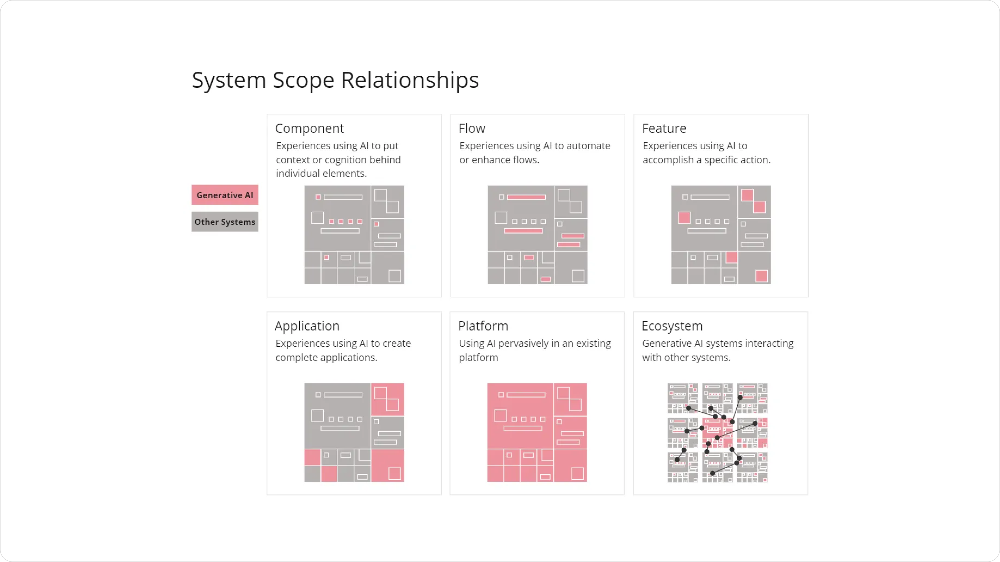
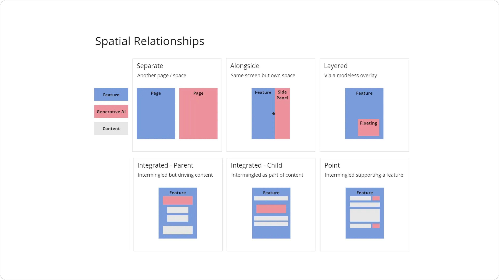
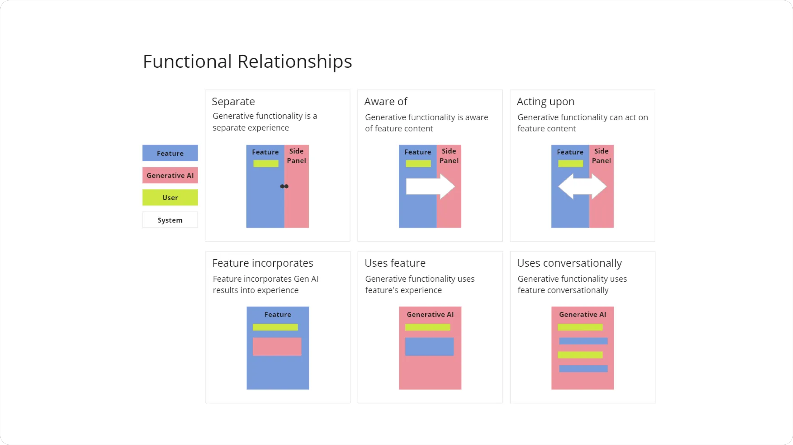

---
tags:
  - UX-UI
  - product-design
  - report
title: "Product Design Commentary #4: Generative AI UX design patterns"
date: 2024-10-22
description: "This fourth edition looks at how Generative AI fits into digital systems. We examine the connections between AI and other parts of a system, focusing on scope, space, and function. Learn how these connections affect the way we design AI features and make them easy to use. Get practical tips on adding AI to your products in ways that make sense for users."
authors:
  - nambui
---

### Exploring Functional and Spatial Relationships in Generative AI Design
The integration of Generative AI into user experiences is transforming how we interact with digital systems. As we explore the intricate dynamics of AI and its role in enhancing human-computer interaction, it becomes essential to understand the functional and spatial relationships that AI establishes within systems. These relationships directly impact the effectiveness and intuitiveness of user interactions with AI-driven systems.

This article explores the scope of relationships between Generative AI and other system elements, focusing on three key aspects: **System Scope Relationships**, **Spatial Relationships**, and **Functional Relationships**.

### System Scope Relationship
The first layer in understanding how Generative AI fits into larger systems is to explore the **System Scope Relationships**. This relationship defines the scale at which AI integrates with other elements of a system and plays a crucial role in determining its interaction model. The five categories within system scope are

1. **Component**:
    - **Example**: AI used to provide additional context or cognitive insight behind individual elements in a system. For instance, a feature that suggests relevant actions for a user in a specific interface component.
2. **Flow**:
    - **Example**: AI automates or enhances multi-step flows. A practical example would be a chatbot guiding users through a multi-step process, automatically completing sections based on previous inputs.
3. **Feature**:
    - **Example**: Here, AI powers a specific action or feature. Consider an AI-driven grammar checker embedded in a word processor.
4. **Application**:
    - **Example**: AI creates entire applications or powers core experiences. For example, tools like Grammarly, which is primarily an AI-driven application built around content refinement and language improvement.
5. **Platform and Ecosystem**:
    - **Example**: On a larger scale, platforms or ecosystems use AI pervasively. An ecosystem may see different systems interacting through a network of AI technologies, such as multiple SaaS tools integrated with AI APIs to enhance functionalities and data flow across systems.

Each level of this scope reveals the depth at which AI interacts within a digital system—from individual elements to entire ecosystems. Designers should consider how AI features align with the scale of their product's experience.

### Spatial Relationships
In terms of user interface (UI) design, **Spatial Relationships** describe the physical layout and placement of AI components relative to other features on a screen. This placement is crucial for ensuring a seamless interaction between AI elements and the rest of the user experience. The diagram highlights the following relationships

1. **Separate**:
    - **Description**: Generative AI is placed on a completely different page or space.
    - **Example**: Think of an AI-driven support system that opens a separate window or app when initiated, like a full-screen chatbot.
2. **Alongside**:
    - **Description**: Generative AI is placed on the same screen but in its own space, typically as a side panel.
    - **Example**: A sidebar AI assistant that provides suggestions while users work in the main content space.
3. **Layered**:
    - **Description**: Generative AI exists as a floating modal or overlay.
    - **Example**: A floating AI chatbot on a shopping website that pops up over the main content area when activated.
4. **Integrated (Parent and Child)**:
    - **Description**: AI is intermingled with the feature and drives the content. In the parent relationship, AI takes the primary role, while the child relationship sees the AI supplementing the feature.
    - **Example**: AI tools that refine user-written text in real-time, such as an AI-driven grammar checker in a text editor.
5. **Point**:
    - **Description**: AI supports a specific feature, acting at a particular point in the content.
    - **Example**: AI-powered auto-suggestions that appear while typing in a search bar, subtly enhancing the primary feature.

The spatial design directly impacts user navigation and interaction fluidity, and placing AI in the appropriate spatial relationship ensures a seamless user experience.

### Functional Relationships
Lastly, **Functional Relationships** refer to how Generative AI interacts with other features and content at a functional level. The interaction model can vary based on the role AI plays within the system. The different types of functional relationships include

1. **Separate**:
    - **Description**: AI operates in a separate experience without direct interaction with other features.
    - **Example**: A separate AI content generation tool like MidJourney, which creates art without influencing other features directly.
2. **Aware of**:
    - **Description**: Generative AI is aware of other content or features, but it does not act upon them directly.
    - **Example**: An AI that passively monitors text input and offers suggestions based on the content without actively changing it.
3. **Acting upon**:
    - **Description**: Generative AI can directly interact with and modify content or features based on user input.
    - **Example**: AI-powered content moderation tools that automatically remove inappropriate content in a chatroom.
4. **Feature incorporates**:
    - **Description**: AI-generated outputs are integrated into the user experience, enhancing the primary feature.
    - **Example**: A text editor like Microsoft Word that incorporates AI-generated writing suggestions directly into the content being created.
5. **Uses feature**:
    - **Description**: Generative AI relies on other features to function properly.
    - **Example**: An AI system that relies on database queries to generate relevant reports or suggestions.
6. **Uses conversationally**:
    - **Description**: AI interacts with features and the user through conversational inputs and responses, often as a two-way exchange.
    - **Example**: A conversational AI that interacts with users through voice commands, such as Google Assistant, which processes natural language inputs to perform tasks.

These functional dynamics define how deeply integrated AI is with system features and user actions, guiding how AI can best support or enhance user experiences.

### Conclusion
The evolution of Generative AI within digital systems hinges on its **scope**, **spatial**, and **functional relationships**. Designers and developers must pay close attention to how these relationships manifest within their products to ensure that AI serves to enhance the user experience rather than disrupt it. By understanding how Generative AI fits into these relationships, we can design more intuitive, helpful, and powerful AI-driven experiences that feel natural and effortless for the user.

Generative AI is a transformative tool, and its success relies on how well it integrates into the systems and experiences we create. As AI technology evolves, designers must constantly rethink these relationships to maintain an optimal balance between functionality and usability.
