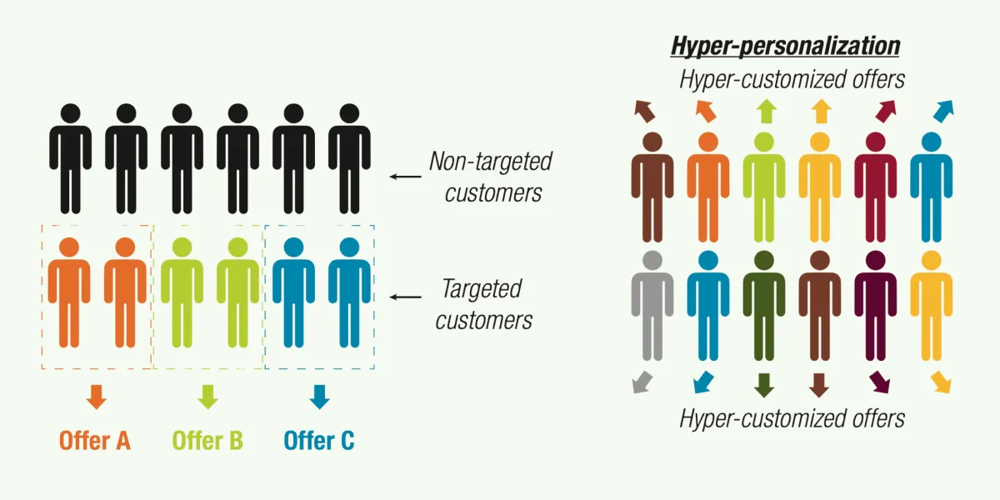
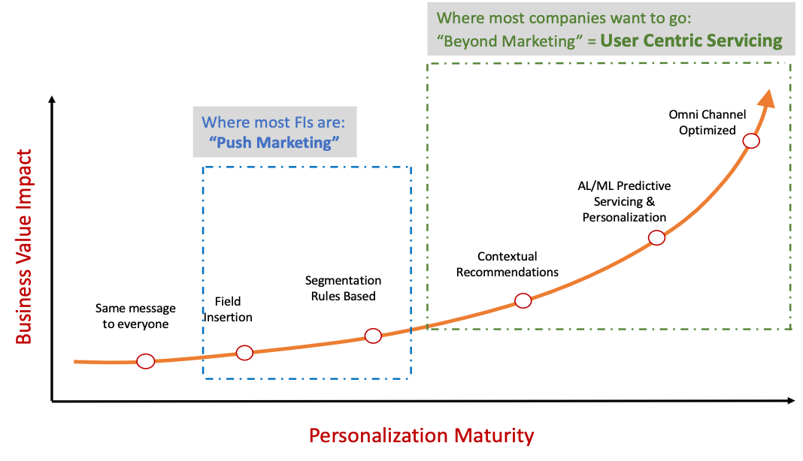

---
tags:
  - UX-UI
  - product-design
  - report
title: "Product Design Commentary #7: Hyper-Personalization - How AI Improves User Experience Personalization"
date: 2024-11-28
description: Hyper-Personalization represents the future of product development, delivering personalized experiences that adapt to each user's needs. In this model, everyone will have their own version of the internet, shaped by AI interfaces that understand their preferences, goals, and personal context.
authors:
  - anna
---

Hyper-Personalization represents the future of product development, **delivering personalized experiences that adapt to each user's needs**. In this model, everyone will have their own version of the internet, shaped by AI interfaces that understand their preferences, goals, and personal context. These smart systems automatically adjust the user interface, showing up when needed and disappearing after completing tasks ( called [Ephemeral Web-Based Applications](https://www.nngroup.com/articles/ephemeral-web-based-applications/)). This approach creates unique experiences that fit specific use cases.

By using AI, we can create more personal moments, experiences, and interactions. This level of deep personalization promises to change how we use technology, making our digital experiences better, more efficient, and more suited to our individual needs and preferences.

## Hyper-Personalization vs. Traditional Personalization
The main difference between Hyper-Personalization and basic Personalization is that it **uses many different types of data** to create a complete picture of each user. Basic Personalization only makes suggestions based on groups of users using basic information. On the other hand, Hyper-Personalization focuses on each person with more detailed analysis, using up-to-the-minute data along with AI and data processing. This helps understand users better and predict what they might do next, allowing for a more personal experience across websites, emails, and mobile apps.

| **Criteria** | **Hyper-Personalization** | **Traditional Personalization** |
| --- | --- | --- |
| **Level of customization** | Very detailed, uses real-time data, behavior, and specific context for each user. | Based on common traits or basic data like name, gender, or age. |
| **Data sources** | Real-time data, behavior history, personal preferences, location, current context | Basic user info (age, gender, location), general purchase history. |
| **Technology** | Smart technology that can learn and predict | Simple if-then rules. |
| **Key features** | Automatically suggests products/services based on each person's specific behavior and situation. | Shows content or products based on general customer groups. |
| **Interaction** | Real-time interaction that changes based on what the user is doing right now. | Fixed interaction that doesn't change in real-time. |
| **Goal** | Make customers happier by better understanding their personal needs and situation. | Make products/services more relevant to target customers. |
| **Examples** | - Amazon's product suggestions based on what you're searching for right now | - Netflix showing movies based on what you like to watch | - Marketing emails that start with your name | - Product suggestions based on customer groups |

## How Hyper-Personalization Makes Things Personal
Hyper-Personalization works through four main steps:

### Step 1: Data Acquisition and Preparation
- **Collecting Information:**
    - **Basic Personal Info:** Age, gender, location, income
    - **How People Use the Product:** Purchase history, habits, time spent on site, items in cart, visits
    - **Personal Preferences:** Likes, interests, feedback
    - **Current Activity:** Recent searches, recent purchases, comments, likes, shares
    - **Current Situation:** Location, time, user status, mood (for example, rapid scrolling or leaving pages quickly may indicate frustration or dissatisfaction)
- **Cleaning Up Information:**
    - Filling in missing information with reasonable values
    - Finding and fixing incorrect information
    - Making sure all information is organized in the same way
- **Creating Helpful Insights:** Taking existing information and turning it into useful insights for AI
    - For example: Working out how valuable a customer is or how often they shop

### Step 2: Choose the Right AI Method
- **Collaborative Filtering (CF)**: Most effective when there is enough data about how users interact with items. Makes recommendations by finding products that similar users have enjoyed.
- **Content-Based Filtering (CBF)**: Ideal for systems with detailed product attributes. Recommends items similar to customers' previous purchases.
- **Hybrid Models**: Best suited for addressing cold start problems and enhancing accuracy by combining both customer data and product characteristics to generate more precise recommendations.
- **Advanced Techniques**: Use neural networks and deep reinforcement learning to analyze user behavior patterns, enabling the system to better understand and respond to user needs.

### Step 3: Train and Test the System
- **Split the Model Training:**
    - Training Data (70-80%): Used to teach the system.
    - Testing Data (10-15%): Check how well the system works.
    - Validation Data (10-15%): Fine-tune the system to avoid mistakes.
- **Check Performance:**
    - Look at how many people click, buy, or find the suggestions helpful.

### Step 4: Keep Improving
- **A/B Testing:** Test different approaches to find what works best.
- **Model Retraining:** Keep the system up to date with new information about how customers behave.

## Practical Applications of Hyper-Personalization

*Source: [LinkedIn](https://www.linkedin.com/pulse/leveling-up-personalization-maturity-curve-amir-yazdanpanah)*

Hyper-Personalization has 3 main real-world uses:

1. **Adaptive Content:** It can tailor content to fit each person. This works well for product marketing and especially in education. For example, [Sesame Workshop](https://techcrunch.com/2017/06/07/sesame-workshop-and-ibm-team-up-to-test-a-new-a-i-powered-teaching-method/) tested an AI-powered vocabulary learning app with kindergarten students. The app uses Sesame Street characters in games and videos to help kids learn new words. The AI adjusts lessons based on each student's ability and lets parents and teachers track progress. Students learned better, even with difficult words. This personalized learning approach helps make education more effective, where students of all levels can learn and grow together.
2. **Personalized Recommendations:** Streaming apps like [Spotify](https://sea.mashable.com/tech/34358/spotify-wants-to-make-you-an-ai-playlist-for-every-occasion) and Netflix use AI to suggest songs and movies based on what you watch. Amazon's product suggestions are another good example. Amazon looks at what customers buy, view, and rate to understand what each person likes. This kind of suggestion can work for many services that need to match individual needs. Here are some examples:
    - Suggesting travel plans and hotels for vacations
    - Recommending fashion styles based on personal taste
    - A personal magazine that picks articles you'll enjoy
    - Custom diet and exercise plans that fit your health needs
3. **Adaptive User Interfaces:** Many apps have too many features that can overwhelm users. [Contextual AI](https://business.adobe.com/blog/perspectives/contextual-ai-the-next-frontier-of-artificial-intelligence) helps by learning how you use the app and showing only the features you need, making it simpler to use. For example, [Siemens](https://www.youtube.com/watch?v=D9_U2EI0Sdw)' NX CAD, a 3D design software used in architecture and engineering, uses AI to learn from users and predict what commands they might need next. This makes the software easier to use for both new and experienced users.

## Challenges Around Hyper-Personalization
1. **Privacy:** Since AI learns from user data, privacy is a major concern. The key is to be open with users. Always ask for permission before collecting data, clearly explain what data you want to collect, how you plan to use it, and how you'll protect it. Make it easy for users to delete their personal information if they want to.
2. **Bias:** Social media apps often show users only what they already like or agree with. This can make people less open to different viewpoints. To reduce this problem, make sure to use diverse data when training the AI. If you're using data from users, consider having a way to review content. Keep checking your product's AI to make sure it's fair to everyone.
3. **Fatigue:** Seeing the same kind of content over and over can get boring. People's interests change over time, and AI based on past behavior can't always predict when someone wants something new. To fix this, let users reset their preferences or control how personalized their experience is. For example, a music app might suggest a random song that's different from what the user usually likes, just to offer something fresh.

## Conclusion
Beyond learning and health applications, we can use personalization in finance. For example, creating personalized financial dashboards that only show portfolio and transactions that matter to users. Or suggesting the best times to pay bills and save money based on spending habits.

While personalization paints a perfect picture, it's not without problems. Users can get bored seeing the same things, content can be one-sided, and there are data privacy risks. That's why it's important to keep focusing on what users need - research, design, test, and improve - to solve these issues and make sure your product succeeds.

**Learn more:**

- An article on UX Design discussing how [generative AI](https://uxdesign.cc/transforming-ux-with-generative-ai-7b06ea329286) is transforming user experience
- A technical deep dive on LinkedIn about [building AI models](https://www.linkedin.com/pulse/building-ai-models-hyper-personalization-technical-deep-deepak-gupta-tohuc/) for hyper-personalization