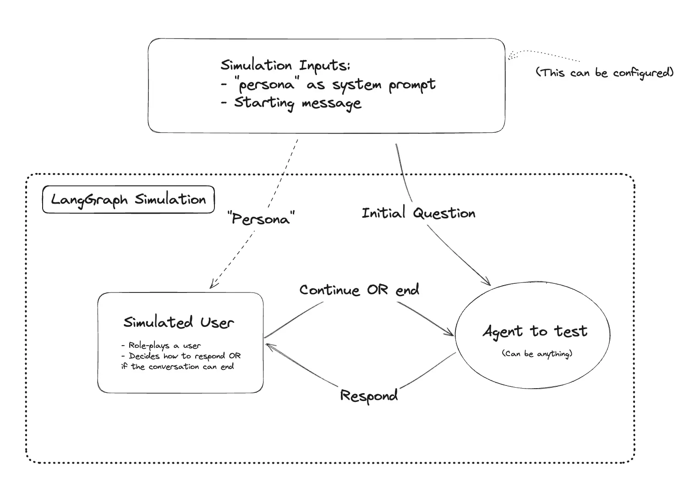
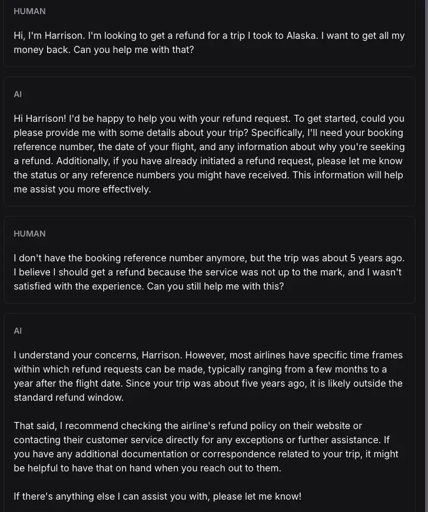
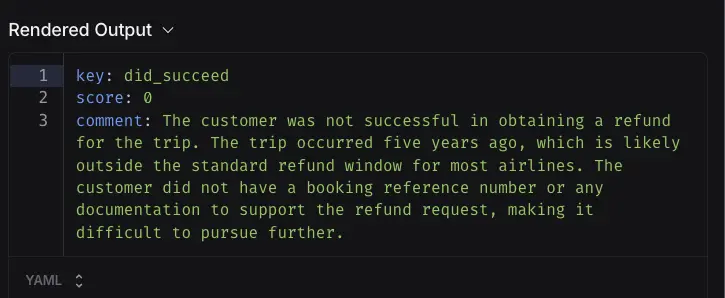

---
tags:
  - llm
  - ai-agents
  - ai-evaluation
authors:
  - hoangnnh
date: 2024-09-06
title: "Evaluate Chatbot Agent by User Simulation"
description: "When building a chatbot agent, it's important to evaluate its performance and user satisfaction. One effective method is user simulation, which involves creating virtual users to interact with the chatbot and assess its responses. This approach allows for a more realistic evaluation of the chatbot's capabilities and user experience."
---

When building a chatbot agent, it's important to evaluate its performance and user satisfaction. One effective method is user simulation, which involves creating virtual users to interact with the chatbot and assess its responses. This approach allows for a more realistic evaluation of the chatbot's capabilities and user experience.

## Introduction

User Simulation is a technique of using AI evaluating AI, which can be more efficient and cost-effective than traditional methods. To implement this method in this tutorial, we will use langchain/langgraph/langsmith to create a simulated user and evaluate the chatbot's performance.

## System Design



The system will have two main components:

- Agent: This is the chatbot agent that we want to evaluate. It can be a simple rule-based agent or a more complex model-based agent.
- Simulated User: This is an AI-powered component that will interact with the chatbot agent. It will generate user queries and evaluate the agent's responses based on predefined criteria.

## Implementation

### Step 1: Set up the Chatbot

- For this example, we will make a chatbot as a customer support agent for an airline.'

```ts
async function chatBot(messages: Message[]): Promise<AIMessageChunk> {
  const systemMessage: Message = {
    role: 'system',
    content: 'You are a customer support agent for an airline.',
  }
  const allMessages = [systemMessage, ...messages]

  const response = await llm.invoke(allMessages.map((m) => [m.role, m.content]))
  return response
}
```

### Step 2: Set up the Simulated User

- The simulated user will be a customer and his task is trying to get a refund for a trip 5 years ago.

```ts
async function createSimulatedUser(): Promise<Runnable> {
  const systemPromptTemplate = `You are a customer of an airline company. \
  You are interacting with a user who is a customer support person. \

  {instructions}

  When you are finished with the conversation, respond with a single word 'FINISHED'`

    const instructions = `Your name is Harrison. You are trying to get a refund for the trip you took to Alaska. \
  You want them to give you ALL the money back. \
  This trip happened 5 years ago.`

  const prompt = ChatPromptTemplate.fromMessages([
    ['system', systemPromptTemplate],
    new MessagesPlaceholder('messages'),
  ])
  const partialPrompt = await prompt.partial({ instructions })

  const chain = await partialPrompt.pipe(llm)
  return chain
}
```

### Step 3: Evaluator and helper functions

- Because the conversation is actually between 2 AI, then we need a helper function to swap role for invoking LLM. 

```ts
function swapRoles(messages: any[]): any[] {
  return messages.map((m) =>
    m instanceof AIMessage
      ? new HumanMessage({ content: m.content })
      : new AIMessage({ content: m.content }),
  )
}
```

- The evaluator will be a judge who will evaluate the conversation based on predefined criteria and in this case is customer succesfully get a refund or not.

```ts
const parser = StructuredOutputParser.fromZodSchema(
  z.object({
    reasoning: z
      .string()
      .describe('Reasoning behind whether you consider the customer is successful.'),
    didSucceed: z
      .boolean()
      .describe('Whether the customer successfully refunded the trip or not.'),
  }),
)

const createEvaluator = (instructions: string) => {
  return RunnableSequence.from([
    ChatPromptTemplate.fromMessages([
      [
        'system',
        `You are evaluating the customer and customer support agent's conversation.
        The customer's task was to: ${instructions}.
        `,
      ],
      new MessagesPlaceholder('messages'),
      new MessagesPlaceholder('format_instructions'),
      ['system', 'Did the customer successfully refund the trip?'],
    ]),
    model,
    parser,
  ])
}

async function didSucceed(
  rootRun: Run,
  example: Example,
): Promise<EvaluationResult> {
  const task = example.inputs['instructions']
  const conversation = rootRun.outputs?.['messages']
  const evaluator = createEvaluator(task)

  const result = await evaluator.invoke({
    messages: conversation,
    format_instructions: parser.getFormatInstructions(),
  })

  return {
    key: 'did_succeed',
    score: result.didSucceed ? 1 : 0,
    comment: result.reasoning,
  }
}
```

### Step 4: Run the simulatio

- Now we can run the simulation.

```ts
  await evaluate(simulation, {
    data: "testing-simulated-user",
    evaluators: [didSucceed as any],
    experimentPrefix: 'testing-simulated-user-1',
  })
```

### 5. Result

- Conversation:



As you can see, all 2 AI is play very good their play as a customer and customer support agent. Besides that, it seem the customer is failed to get a refund for the trip. Now let check whether the evaluator give a correct score or not.



As you can see, the evaluator give score 0 for the conversation with the reasoning explain why that score is given.

## Conclusion

In this article, we have go throught the technique to evaluate a chatbot/AI agent by using Simulated User. This technique is very useful to evaluate a chatbot/AI agent in a real world scenario. and it is also very flexible to be used in a variety of use case.

## References
- https://github.com/langchain-ai/langgraph/blob/main/examples/chatbot-simulation-evaluation/agent-simulation-evaluation.ipynb


