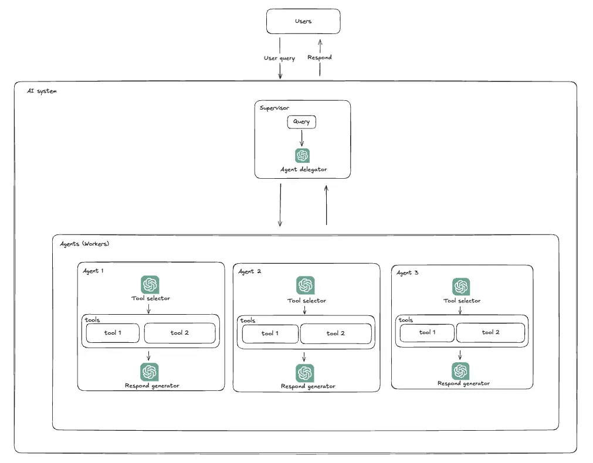
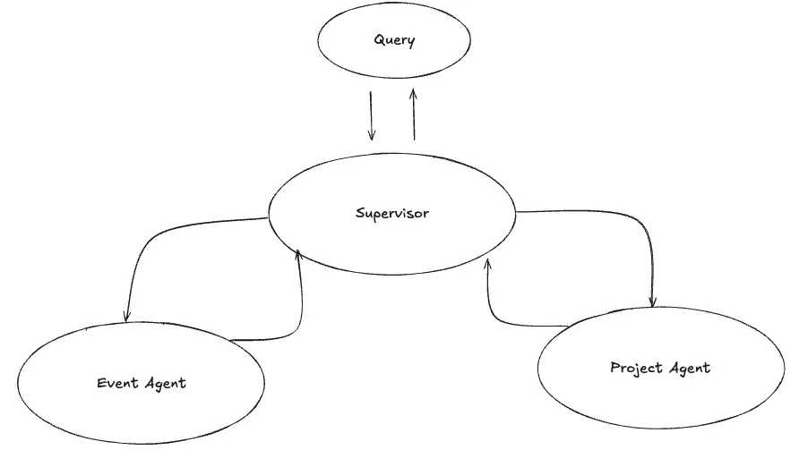
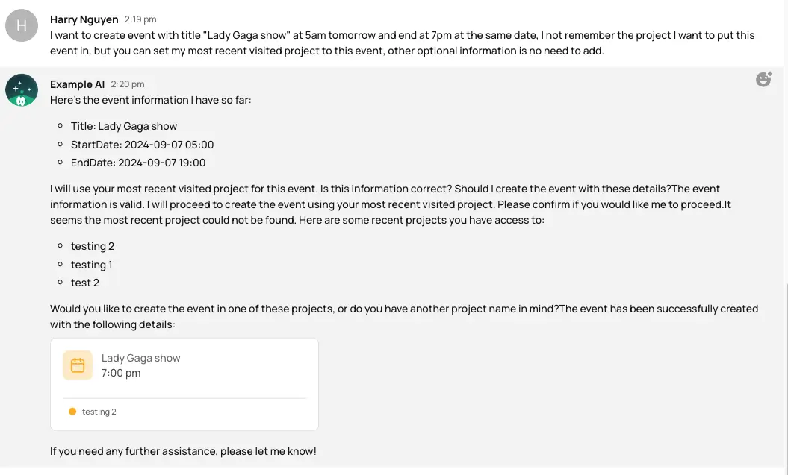
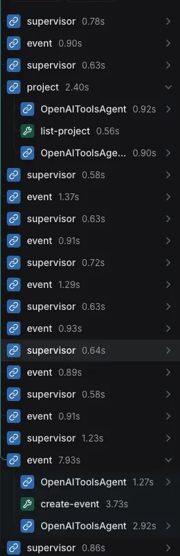

---
tags:
  - llm
  - AI integration
authors:
  - hoangnnh
date: 2024-09-06
title: "Multi-agent collaboration for task completion"
description: "In AI integrated systems, instead of put all workload on a single agent, we can apply divide and conquer strategy to distribute workload to multiple agents. This approach can enhance task completion by leveraging the unique skills and capabilities of each agent.This approach allows for more complex and nuanced problem-solving, as well as increased efficiency and scalability. By coordinating and communicating effectively, agents can work together to achieve common goals, divide labor, and overcome challenges that a single agent might face alone"
---

In AI integrated systems, instead of put all workload on a single agent, we can apply divide and conquer strategy to distribute workload to multiple agents. This approach can enhance task completion by leveraging the unique skills and capabilities of each agent.This approach allows for more complex and nuanced problem-solving, as well as increased efficiency and scalability. By coordinating and communicating effectively, agents can work together to achieve common goals, divide labor, and overcome challenges that a single agent might face alone.

## Problems

Imagine we plan to integrate AI into our application, we build an AI agent with tools which can access all features of our application. However, When the AI agent is asked to perform a complex task that requires multiple steps or involves multiple features of the application, it may struggle to complete the task effectively. It might be because the AI agent feel hard to understating the context of the task, or because the defined system prompt is too complex for the AI agent to understand specific instructions. Moreover, the AI agent may not have the ability to perform all the necessary steps or access all the required features of the application. That why we need to design AI system with multiple agents, each agent is responsible for a specific task or feature and when received a complex task, agents in system can collaborate with each other to complete the task.

## System design



A Multi-agent AI system can be designed as follows:

- Supervisor: The supervisor agent is responsible for coordinating and managing the workflow of the system. It receives the task request, route the request to appropiate agents, after agents complete their tasks, the supervisor agent will collect the results and continue making decision whether route the task to another agent or return the final result to the user.

- Agents: Each agent is responsible for a specific task or feature of the application. Agents can communicate with each other through supervisor to complete a complex task. In sub-task handling, they can use tools which is assigned to them to perform the task.

There are other variations of this design like add a layer of agent to become super-agent, or make a tools pool which can be used by any agent in the system. But they have the same idea, which is to distribute the workload to multiple agents.

## Example

Let's consider a scenario where we have an event management application, it has features like event creation, project management,... We want to create an AI agent that can handle a complex task of creating an event, creating project, event managements. We can design a multi-agent AI system as follows:



- Supervisor: Responsible for routing the task request to appropriate agents and collecting the results. We will defined its system prompt as below:

```ts
const systemPrompt = `You are a supervisor tasked with managing a conversation between user and the following workers: {members}. Each worker is responsible for a specific scope of works:'
    ##Worker list:
    - Event: Only Responsible for handling the Event module including creating, updating, and managing events within projects
    - Project: Only Responsible for handling the Project module including listing projects/workspaces/hubs, creating, updating, and managing projects
    Given the following user request, analyze it carefully to determine which worker is most appropriate to handle the specific action requested, respond with the worker to act next. Each worker will perform task and respond with their results and status. When finished, respond with FINISH.`
```

- Event agent: Responsible for handling the Event module including creating, and managing events within projects. We will defined its system prompt similar like this:

```ts
const systemPrompt=`You are an intelligent assistant responsible for handling the Event module. Given a Event struct format, you will collect event information and map it to the Event struct fields when processing requests. Your responses should be concise and focused on the event details.
  {event_struct_format}
`
```

- Project agent: Responsible for handling the Project module including listing projects/workspaces/hubs, creating, updating, and managing projects. We will defined its system prompt similar like this:

```ts
const systemPrompt= `You are an intelligent assistant responsible for handling the Project module. Given a project struct format, you will collect project information from user input and map it to the Project struct fields when processing requests. Your responses should be concise and focused on the project details.
  {project_struct_format}
`
```

- Tools: Each agent will have a set of tools that they can use to perform their tasks. For example, the Event agent will have tools for creating events, updating events, and managing events. The Project agent will have tools for listing projects, creating projects, invite member to project.

Now, let's consider a user request: "I want to create event with title "Lady Gaga show" at 5am tomorrow and end at 7pm at the same date, I not remember the project I want to put this event in, but you can set my most recent visited project to this event, other optional information is no need to add.". As you can see, to complete this task, we need to use Project agent to get the most recent visited project and Event agent to create the event. The supervisor agent will route the task to appropriate agents and collect the results untils the task is completed.

- Result:



With multi-agent AI, the task is completed successfully, 2 agents collaborate to complete the task, and the supervisor agent manage the workflow. So how supervior agent route the task to appropriate agents? Let's see inside the system.



As you can see, the supervisor is divide tasks into smaller tasks, and handle them one by one. it route task to agents to reasoning, process task, when agents process task, they will user power of LLM to decide to call tool or not. After that, it will return result to supervisor, supervisor will collect result and combine them to continue reasoning, thiking to process request until it reach the final result.

## Conclusion

Multi-agent AI system is a powerful tool that can be used to solve complex tasks. It allows us to distribute the workload to multiple agents, each of which is responsible for a specific scope of work. This can improve the efficiency and accuracy of the system. However, it also introduces new challenges such as coordination and communication between agents, and managing the workflow. To overcome these challenges, we need to design a well-defined system prompt for each agent, and a supervisor agent to manage the workflow.

## References
- https://arxiv.org/abs/2308.08155
- https://github.com/langchain-ai/langgraphjs/blob/main/examples/multi_agent/agent_supervisor.ipynb
