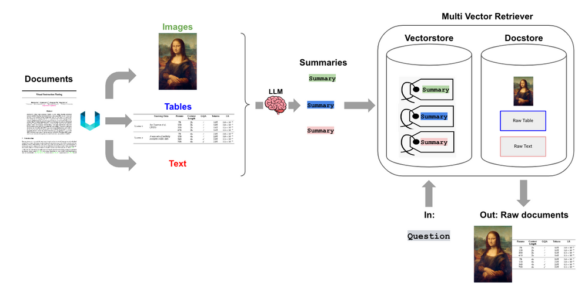
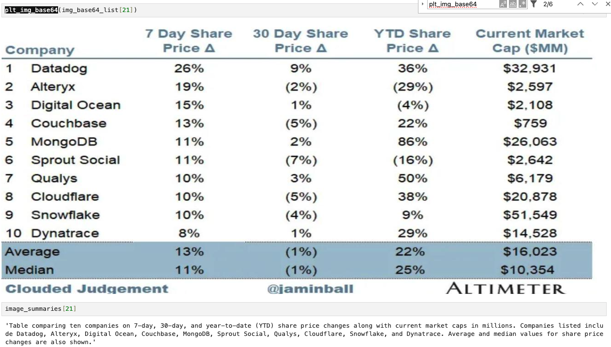
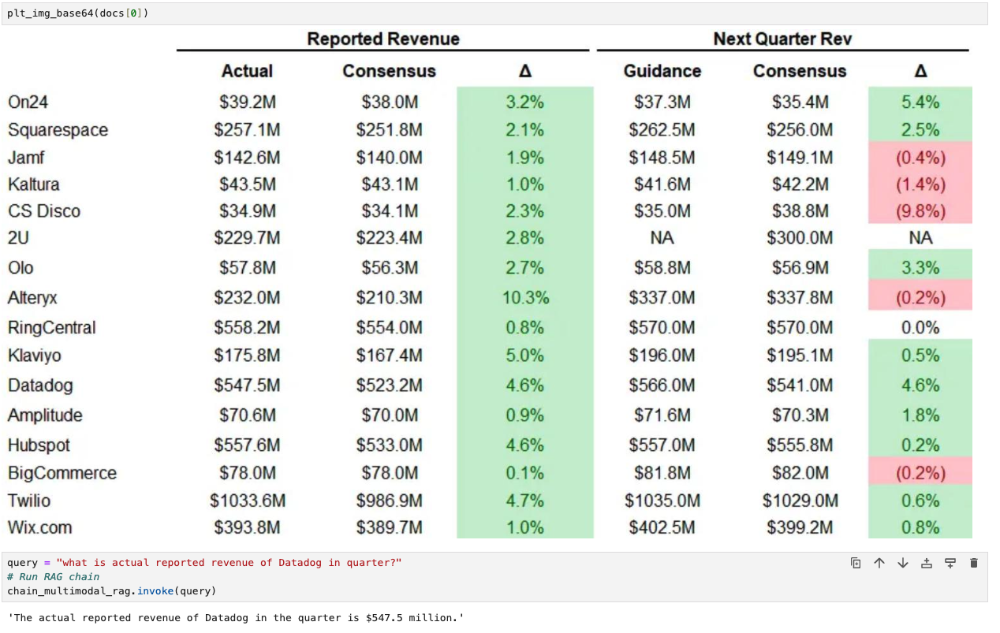

In spite of having taken the world by storm, Large Language Models(LLM) still has some limitations such as limited context window and a knowledge cutoff date. Retrieval-Augmented Generation(RAG) steps in to bridge this gap by allowing LLMs to access and utilize external knowledge sources beyond their training data. However, data is not text based only, it also can be image, audio, table in docs,... It make information captured is lost in most RAG application. Therefore, preprocess multimodal data is a problem we should not ignore in making RAG application. In this note, we will explore how to effectively preprocess and integrate multimodal data to enhance the performance and utility of RAG systems.

### Challenge in Multimodal RAG
Taking an example: Doing preprocessing for document(.pdf) file. the document contain a mixture of content types, including text, table and images. When we chunking and embedding data, text splitting may break up tables, corrupting the data in retrieval and the images can lose data in someway. 
So how to do it properly. There are several method, but there are 2 main methods are currently used:
 - Use a multimodal embedding model to embed both text and images.
 - Use a multimodal LLM to summarize images, tables, pass summaries and text data to a text embedding model such as OpenAI’s “text-embedding-3-small”.

In this note, we will focus on second method.

### Multimodal LLM
The main idea of this approach is transform all of your data into a single modality: text. This means that you only need to use a text embedding model to store all of your data within the same vector space.



This method is involved following step:

1. Extract images, tables, and text from document.
2. For tables and images, pass them through LLM to summarize the main content in text based.
3. Embedding images,table summaries and text to vectorDB and also raw data for reference.
4. When searching similarity in retrieval step, get the relevant context and feed raw data to LLM to generate output.

### Implementation
We take this [post](https://cloudedjudgement.substack.com/p/clouded-judgement-111023) for doing implementation cause it contain many chart images. We will follow steps above to do preprocessing for this document.

1. **Extract data from document**: We use [Unstructured](https://unstructured.io/) - a great ELT tool well-suited for this because it can extract elements (tables, images, text) from numerous file types. And categorized them base on there types. 
  ```python
  from unstructured.partition.pdf import partition_pdf

  # Get element
  raw_pdf_elements= partition_pdf(
        filename=path + fname,
        extract_images_in_pdf=True,
        infer_table_structure=True,
        chunking_strategy="by_title",
        max_characters=4000,
        new_after_n_chars=3800,
        combine_text_under_n_chars=2000,
        extract_image_block_types=["Image", "Table"],
        extract_image_block_output_dir=path,
        extract_image_block_to_payload=False
    )
  ```
2. **Summary tables and images**: We chunking text data normally and for extracted table, image, we pass them through LLM (gpt-4o model) to get summary. We can use those prompt for each kind of data to get main content.
  ```python
  table_sum_prompt = """You are an assistant tasked with summarizing tables for retrieval. \
    These summaries will be embedded and used to retrieve the  raw table elements. \
    Give a concise summary of the table that is well optimized for retrieval. Table: {element} """
  
  image_sum_prompt = """You are an assistant tasked with summarizing images for retrieval. \
    These summaries will be embedded and used to retrieve the raw image. \
    Give a concise summary of the image that is well optimized for retrieval."""
  ```
  After summarizing, the sample result will similar to below.

  

3. **Embedding data**: We embedding tables and images summaries to vectorDB and also store raw data to get reference. Remember that we store embeded summarized data(vector) and its raw content but not summarized content.
   
4. **Retrieval**: when we search for similarity through vectorDB, we will get related context(raw content) and then we feed it with original user's input to generate the response. That why we store raw data but not summarized data because we want something like: "Hey GPT, I have some images and table, can you answer my question based on them", but not: "Hey GPT, I have some images summaries and table summaries, can you answer my question based on these summaries".
   ```python
    def prompt_func(data_dict):
      """
      Join the context into a single string
      """
      formatted_texts = "\n".join(data_dict["context"]["texts"])
      messages = []

      # Adding image(s) to the messages if present
      if data_dict["context"]["images"]:
          for image in data_dict["context"]["images"]:
              image_message = {
                  "type": "image_url",
                  "image_url": {"url": f"data:image/jpeg;base64,{image}"},
              }
              messages.append(image_message)

      # Adding the text for analysis
      text_message = {
          "type": "text",
          "text": (
              "You are AI assistant which is capable of answering questions.\n"
              "You will be given a mixed of text, tables, and image(s) usually of charts or graphs.\n"
              "Use this information to provide investment advice related to the user question but keep answer clean and understandable. \n"
              f"User-provided question: {data_dict['question']}\n\n"
              "Text and / or tables:\n"
              f"{formatted_texts}"
          ),
      }
      messages.append(text_message)
      return [HumanMessage(content=messages)]
   ```

5. **Testing**: To testing what we have done so far, let take and image in document and findout our RAG can extract the information from it and answer correctly.
   
    
   
  We take an image which is a table content data about reported revenue of tech companies in quarter. An then we ask some information inside that image. For example: "what is actual reported revenue of Datadog in quarter?" which we can see on the image is $547.5 million. Our RAG response the ansewr correctly.

### Conclusion
The integration of various data types, such as text and images, into LLMs enhances their ability to generate more wholistic responses to a user’s queries. More new model come and solve the problems realted to different type of data in LLM. This concept of multimodal RAG is an early but important step toward achieving human-like perception in machines.

## References
- https://medium.com/kx-systems/guide-to-multimodal-rag-for-images-and-text-10dab36e3117
- https://blog.langchain.dev/semi-structured-multi-modal-rag/
- https://unstructured.io
