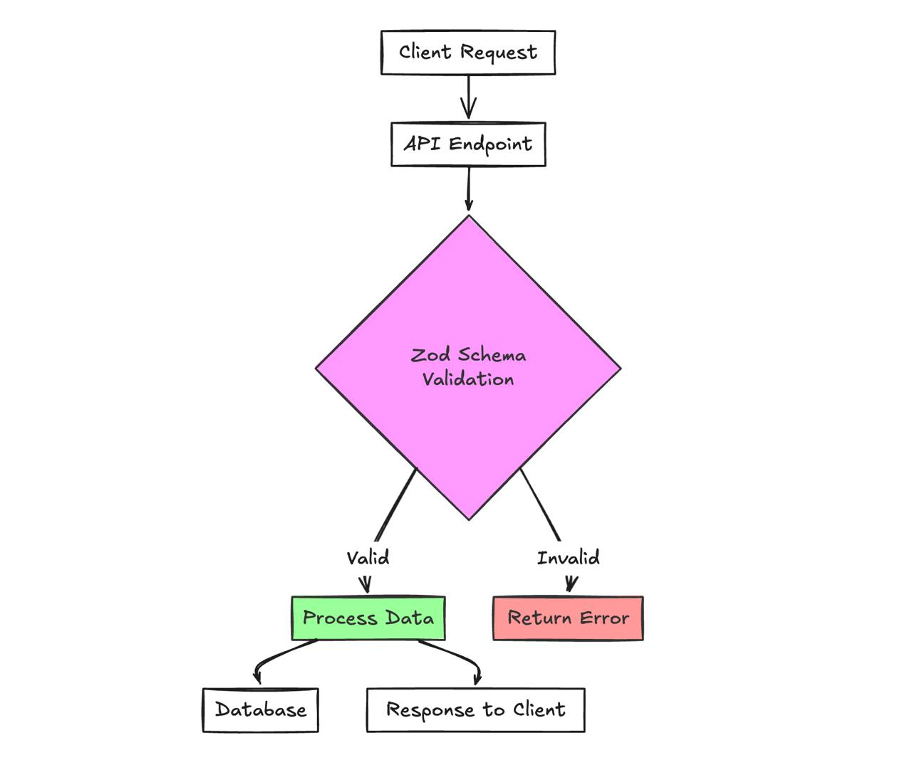
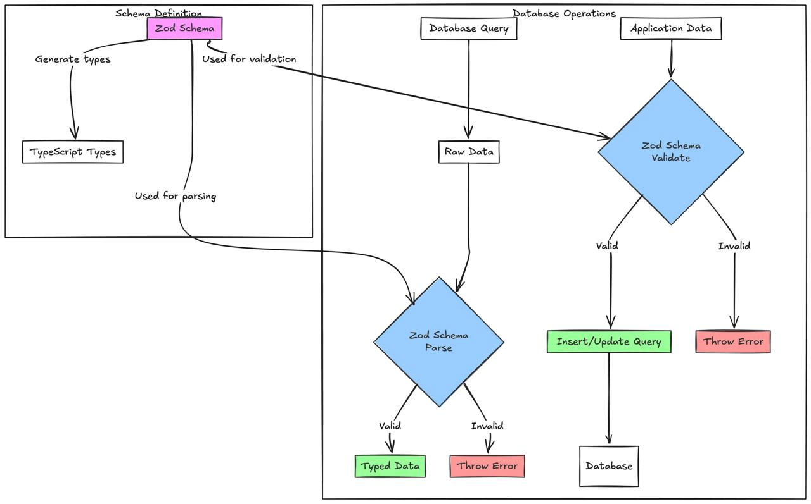

## Introduction to Zod & Understanding Data Integrity
Zod is a TypeScript-first schema declaration and validation library that ensures data integrity through runtime validation. It provides a way to define schemas that represent the shape and constraints of your data, offering both compile-time type inference and runtime validation.

Data integrity refers to the accuracy, consistency, and reliability of data throughout its lifecycle. In modern applications, maintaining data integrity is crucial as data flows through different layers of the application, from API endpoints to database operations.



## Real-world Use Cases

### API Request Validation
```typescript
const UserSchema = z.object({
  email: z.string().email(),
  password: z.string().min(8),
  age: z.number().min(18),
  role: z.enum(['admin', 'user'])
});

app.post('/register', (req, res) => {
  const result = UserSchema.safeParse(req.body);
  if (!result.success) {
    return res.status(400).json({ errors: result.error.issues });
  }
  // Proceed with valid data
});
```

### Form Data Validation
```typescript
const ContactFormSchema = z.object({
  name: z.string().min(2),
  email: z.string().email(),
  message: z.string().min(10).max(500)
});

// Integration with React Hook Form
const form = useForm({
  resolver: zodResolver(ContactFormSchema)
});
```

### Database Schema Validation
```typescript
const ProductSchema = z.object({
  id: z.string().uuid(),
  name: z.string(),
  price: z.number().positive(),
  category: z.enum(['electronics', 'clothing', 'books']),
  inStock: z.boolean(),
  createdAt: z.date()
});

type Product = z.infer<typeof ProductSchema>;
```



## Practices for Maintaining Data Integrity with Zod

### Define Single Source of Truth
Maintain a centralized schema definition that can be shared across different parts of your application. This ensures consistency and makes updates easier to manage.

```typescript
// schemas/user.ts
export const UserSchema = z.object({
  // ... schema definition
});

export type User = z.infer<typeof UserSchema>;
```

### Compose Complex Schemas
Break down complex schemas into smaller, reusable components for better maintainability and reusability.

```typescript
const AddressSchema = z.object({
  street: z.string(),
  city: z.string(),
  country: z.string(),
  postalCode: z.string()
});

const UserSchema = z.object({
  // ... other fields
  address: AddressSchema,
  shippingAddress: AddressSchema.optional()
});
```

### Implement Custom Validations
Create custom validation rules for specific business requirements.

```typescript
const PhoneSchema = z
  .string()
  .regex(/^\+?[1-9]\d{1,14}$/)
  .refine((val) => {
    // Additional custom validation logic
    return true;
  }, "Invalid phone number");
```

### Error Handling
Implement proper error handling and meaningful error messages.

```typescript
const validateData = <T>(schema: z.ZodType<T>, data: unknown): T => {
  try {
    return schema.parse(data);
  } catch (error) {
    if (error instanceof z.ZodError) {
      throw new ValidationError(error.issues);
    }
    throw error;
  }
};
```

## Conclusion
Adopting a data-first approach with Zod provides a robust foundation for maintaining data integrity in TypeScript applications. By implementing proper schema validation, you can catch data-related issues early in the development process, reduce runtime errors, and improve the overall reliability of your applications.

The combination of compile-time type checking and runtime validation makes Zod an excellent choice for projects where data integrity is crucial. Its declarative approach to schema definition and extensive validation capabilities make it a powerful tool in modern TypeScript development.

## References
- [Zod Official Documentation](https://zod.dev)
- [TypeScript Integration Guide](https://github.com/colinhacks/zod#typescript-integration)
- [Building Type-Safe APIs with Zod](https://blog.logrocket.com/schema-validation-typescript-zod/)
- [Zod Best Practices](https://github.com/colinhacks/zod#best-practices)

