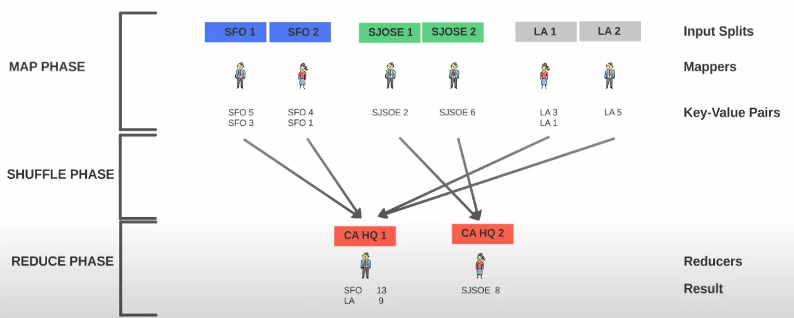

---
tags:
  - engineering/data
  - mapreduce
  - distributed
  - hadoop
authors: Dung Ho
github_id: dudaka
date: 2022-10-24
title: MapReduce
description: We are the head of census bureau for the state of California and tasked with finding the finding the population of all cities in California. All the resources we want are ready but we have only four months to finish the task. Calculating the population of all cities for a big state like california is not an easy task. The sensible thing to do is to divide the state by city and make individuals in charge of each city to calculate the population of each city where he is in charge of...
authors:
  - dudaka
icy: "10"
---

## What is MapReduce?
Let's start with an example.

We are the head of census bureau for the state of California and tasked with finding the finding the population of all cities in California. All the resources we want are ready but we have only four months to finish the task. Calculating the population of all cities for a big state like california is not an easy task. The sensible thing to do is to divide the state by city and make individuals in charge of each city to calculate the population of each city where he is in charge of.

For illustration purpose, there are three cities: San Francisco (SFO), San Jose (SJOSE) and LA.

Person 1 will be in charge for SFO, person 2 will be in charge for San Jose, and person 3 will be in charge of LA.

We have divided California into cities and each city is assigned to a person and he is responsible for finding the population of the assigned city. We now need to give instructions to each person on what they have to do. Thus, we ask each person to go to a home knock on the door and when someone answers the door, ask how many people live in the home and note it down.  Each one notes down the city they're responsible for and the number of people live in the home. Then, the person has to go to the next home and repeat the same process until he covers all homes in the assigned city.

For a person who covers SFO, he goes to first home, there are five people in the home so he note down `SFO 5`, three people are living in the second home so he note down `SFO 3`, so on.  It's a classic divide and conquer approach.
Same instructions will be carried out by everyone involved person 2 will go to San Jose and Person 2 will do the same in LA. When each person is done with their assigned city, we ask them to submit their results to the state's headquarters.
We'll have a person in the headquarters to receive the results from all cities and aggregate them by city to come up with population of each city for the entire state.
Therefore, four months in with this strategy, we're able to calculate the population of california.

Next year, we're asked to do the same job, we have all the resources we want but this time we have two months to finish the task. So we would simply double the number of people to perform the task. We will divide SFO into two divisions and add one person to each division and we will do the same thing for San Jose and LA. Each person responsible for a division will perform the same task as before, we can also do the same thing at the headquarters.

Let's divide the headquarters into two: `CA HQ 1` and `CA HQ 2` and one person to each division.  With twice as much people, we can finish the task in half the time but there is one small problem, we want the census takers for SFO, called `SFO 1` and `SFO 2`, send their results to either `CA HQ 1` or `CA HQ 2`.

We don't want `SFO 1` sending results to `CA HQ 1` and `SFO 2` sending their results to `CA HQ 2` because this would result an population count for SFO divided between `CA HQ 1` or `CA HQ 2`.  That is not ideal because we want consolidated population count by city, not partial counts.

So, what we can do is to instruct census takers in `SFO 1` and `SFO 2` to send their results to either `CA HQ 1` or `CA HQ 2`.  Similarly we should instruct census takers for San Jose and LA, they should either send it to `CA HQ 1` or `CA HQ 2`.
With this model, again, we were able to complete the census calculation in two months.

If next year if we were asked to do the same thing in a month, we know exactly what to do and we can simply double the resources and apply our model. Now, we have a good enough model, not only the model works but it also can scale.

The model we have here is called _MapReduce_. MapReduce is a programming model for distributed computing. It's not a programming language, it is a programming model which we can use to process huge data sets in a distributed fashion.

Now let's look at the faces involved in Mapreduce. The phase where individuals collect the population of their assigned city or part of the city is called a [[MapReduce Components#Map Phase|_Map phase]].

The individual person involved in the actual calculation is called the _Mapper_ and the city or the part of the city he is working with is known as the _Input Split_.
The output from each mapper is a _Key Value pair_ as we can see the key is `SFO` the value is `5` or the key is `SJSOE` the value is `2`.

The phase where you aggregate the intermediate results from each city or mappers in the headquarters is called the _Reduced phase_ and the individuals who work in the headquarters are known as _Reducers_ because they reduce or consolidate the output from many different mappers. Each reducer will produce a result set.

The phase in which the values from the different mappers are copied or transferred to reducers is known as the _Shuffle phase_. The shuffle phase comes in between map and the reduced phase. Therefore, map phase, shuffle phase and reduce face are the three phases of Mapreduce.

## Summary
MapReduce is:

- A distributed programming model for processing large data sets
- Conceived at Google and Hadoop's adapt this programming model.
- Can be implemented in any programming language and Hadoop supports a lot of programming language to write Mapreduce programs. We can write a Mapreduce program in Scala, Python, C/C++ and of course Java.
- Mapreduce is not a programming language, it is a programming model.
- Hadoop implements Mapreduce so that the Mapreduce system in Hadoop manages the communicationsm, data transfer, parallel execution across the distributed servers or nodes.
