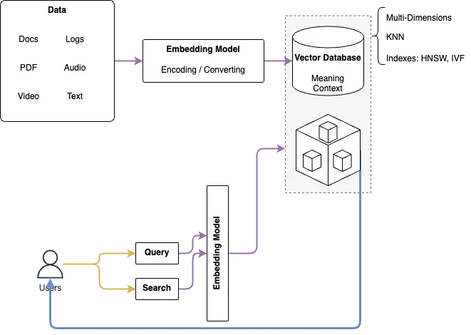

---
tags:
  - engineering/data
  - vector-database
  - database
authors: Long Bui
github_id: longbuivan
date: 2024-03-15
icy: 10
discord_id: 1157659003527106600
title: Quick Learning Vector Database
description: The motivation of this thoughts that trying to discover the LLMs and Generative AI...
authors:
  - longddl
---

## Motivation of Vector Database

- The motivation of this thoughts that trying to discover the LLMs and Generative AI
- In order to create or build, train any models there are multiple factors will need to be considered: lakes of data, metadata, data management, infrastructure, etc.
- Vector Databases are used like underlying of Gen AI
- Where everything are tokenized, vectorized and serialized into a single language
- Explored blog posts, articles from [What is a AWS Vector Database?](https://aws.amazon.com/what-is/vector-databases/)

## Learning Notes

- Data from internet/database/users are inputted and converted and encoded (video, speech, images, text, etc.) to a vector using a vector embedding model such as Gemini, OpenAI, etc.
- Developing Products: Drant*, Milvus*, redis, pgvector(extension), Pinecone, LanceDB, oracle, MongoDB(Atlas), AthenaDB
- Different with Relation DB where in Vector Database has multiple dimensions (**legacy from multi-dimensional data mode**l)
- Data structure: save the vector; don't define the structure for the table.
- How to query data? Query the vector that is similar to others in DB base on algorithms (KNN and could be different/better model as I think)
- Indexing the data in the database, Indexing Algorithms: Flat, HNSW, IVF ==> I think we have room for optimizing the caches and indexes.

- Working flow of Vector Database with Gen AI:
  - An embedding model converts the data to a vector data structure. (We need to optimize the algorithm for the huge of parameters)
  - Convert the input(end-user) to a vector.
  - Querying data in the database.
  - Compare the query vector with the database/cache to find out the resources in the DB

- Diagram to describe the Working Flow

- Benefits:
  - Flexibility: schemaless, non-structured
  - Scalability: bucketing data, dynamic programming
  - Speed/ performance: Search vector
  - Standardization: formatting all data into a single format

- Use cases:
  - Feeding Realtime data for LLMs models
  - Resolving searching problems
  - Serving Video/Image recognition problems
  - Better similarity recommendation with contexts and situations

- Technical Challenges:
  - Performance: indexing for Flat (elastic search, redis, pgvector) querying using vector
  - Optimize long-term caching memory
  - Hardware optimization for hosting and computing data
  - Improve KNN performance models
