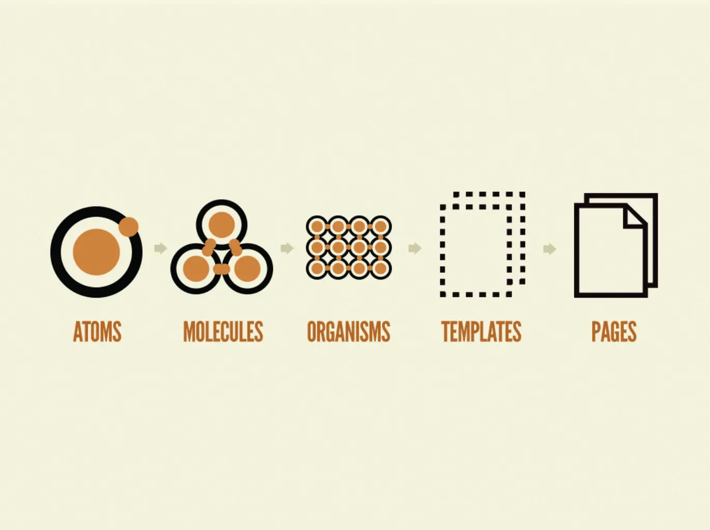
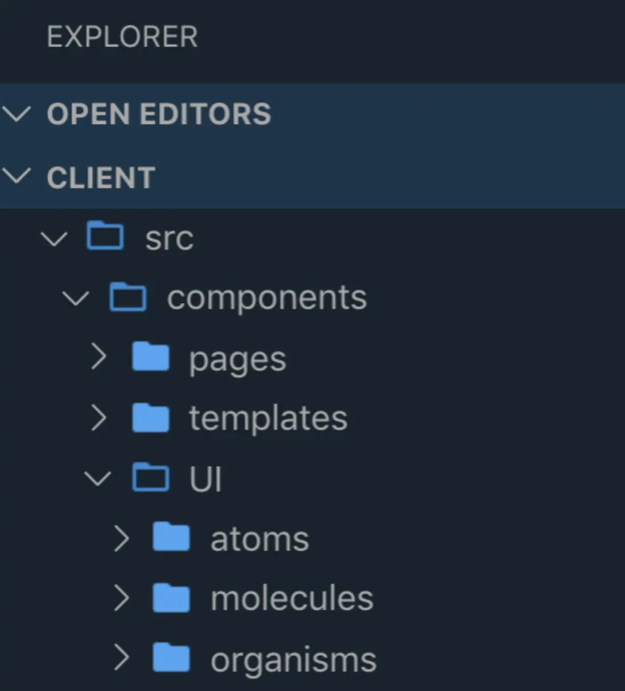

## Atomic design pattern
Atomic design is a methodology for crafting design systems with five key fundamental building blocks, which, when combined, promote consistency, modularity, and scalability.

**Why using atomic design**

- Atomic design provides frontend engineers with flexible and consistent designs from the beginning.
- We can move from the abstract to the concrete thanks to Atomic design. As a result, we can design systems that encourage consistency and scalability while also displaying information in its final context. Additionally, by putting a system together rather than taking it apart, we avoid picking out the best patterns later.
- The method fits incredibly well with component-based architectures like React, Vue,...

## How does it work?
There are 5 distinct levels of atomic design which are: atoms, molecules, organisms, templates, and pages.

**Atoms**

- Atoms are the basic building blocks of matter. When applied to web interfaces, they are our `HTML` tags like an `input` or a `button`.
- These are fairly abstract elements which often not useful on their own but are good references in the context of a pattern if seen on a bigger picture.

**Molecules**

Just like in chemistry, molecules are a set of atoms combined. This could include a form input with a title and input standing next to each other or a header containing multiple atoms like icons, buttons, or inputs.

**Organisms**

Molecules give us some functional building blocks to work with, and they are a sub-set of organisms. Molecules when joined together create organisms which is a relatively complex and distinct section of an interface.

**Templates**

Templates consist mostly of groups of organisms to form pages, keep in mind that these template doesn't contain data and only contain props.

Templates begin their life as HTML wireframes, but over time become the final deliverable.

t this stage we can really see the design coming together and making more sense for the clients to see the layout of the interface before finalizing it.

**Pages**

Pages are specific instances of templates. Here, placeholder content is replaced with real representative content to give an accurate depiction of what a user will ultimately see.

**Atomic design folder structure**

This is an example of an application folder structure using atomic design, as you can see there are 5 distinct layers and you can organize them in anyway you want following your own preference.

## Reference
- https://bradfrost.com/blog/post/atomic-web-design/#atoms
- https://andela.com/insights/structuring-your-react-application-atomic-design-principles/
- https://blog.ippon.tech/atomic-design-in-practice/
