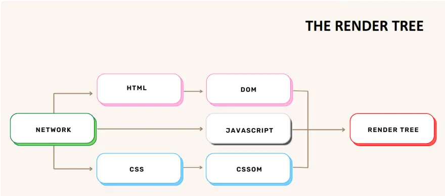

---
tags:
  - rendering
  - dom
  - cssom
  - render-tree
authors:
  - namnd
github_id: nguyend-nam
title: From Markup to Pixels - A look inside the DOM, CSSOM, and Render Tree
description: A deep dive into the rendering process of a web page, exploring the Document Object Model (DOM), CSS Object Model (CSSOM), and the Render Tree.
date: 2023-09-11
icy: 10
---

Inside a web browser, there exists a software component responsible for determining the content to show you based on the data it receives. This component is known as the browser engine.

The browser engine is a fundamental element present in all major web browsers, and various browser manufacturers give their engines distinct names. For instance, Firefox's browser engine is known as [Gecko](https://en.wikipedia.org/wiki/Gecko_(software)), while Chrome uses [Blink](https://en.wikipedia.org/wiki/Blink_(browser_engine)), a derivative of [WebKit](https://en.wikipedia.org/wiki/WebKit).

## From raw bytes of HTML to DOM
We are all familiar with the term **Document Object Model** or DOM, but it's always helpful to revisit how this crucial component is constructed: It starts with **bytes** of data that the browser reads from the HTML files, which are then transformed into readable **characters**.

But that bunch of text doesn't produce an actual website. Those characters are parsed into **tokens**, such as the start or end HTML tags, the content characters and so on. The browser then organizes those tokens into **nodes**, and assembles into the hierarchical structure known as the DOM. 

> Check out this article for a more detailed understanding about this process: [How web browsers work - parsing the HTML (part 3, with illustrations)](https://dev.to/arikaturika/how-web-browsers-work-parsing-the-html-part-3-with-illustrations-45fi).

*Image Source: [How web browsers work - parsing the HTML (part 3, with illustrations)](https://dev.to/arikaturika/how-web-browsers-work-parsing-the-html-part-3-with-illustrations-45fi)*

## How about CSS?
As soon as the browser begins to parse the HTML, once encountering a `link` tag to a CSS file, it simultaneously makes a request to fetch that. As you may anticipate, the procedure mirrors the way browsers form the DOM (from bytes to the object model). This process forms a tree structure called the **CSS Object Model** (CSSOM).

> For further information, please check out this article: [How web browsers work - parsing the CSS (part 4, with illustrations)](https://dev.to/arikaturika/how-web-browsers-work-parsing-the-css-part-4-with-illustrations-4c).

*Image Source: [How web browsers work - parsing the CSS (part 4, with illustrations)](https://dev.to/arikaturika/how-web-browsers-work-parsing-the-css-part-4-with-illustrations-4c)*

As you can see in the example above, the elements have both inherited styles from the parent (depicted in white), and their own styles that overwrite the inherited ones (depicted in black). And since we can have several CSS files linked to our HTML, that's when the [Specificity](https://developer.mozilla.org/en-US/docs/Web/CSS/Specificity) comes in handy for the browser in determining which style to apply to a particular node.

## Combining the DOM with the CSSOM
The browser traverses every visible node starting from the root of the DOM tree. Certain nodes are ignored by default (such as script or meta tags), while for others, the browser seeks the relevant rules within the CSSOM and proceeds to paint them on the screen. The browser will also ignores the nodes that are hidden due to their CSS property (`display: none` for example).

Now the Render Tree holds the information of the **visibility** of each node and its **styles**, but what needs to be done next to calculate the exact position of those elements and paint them to the screen?

*Image Source: [How web browsers work - the render tree (part 7, with illustrations)](https://dev.to/arikaturika/how-web-browsers-work-the-render-tree-part-7-with-illustrations-24h3)*

## The Layout/Reflow stage
The **Layout**/**Reflow** is a process to find the **geometry** of elements. The main thread walks through the DOM and constructs a layout tree that stores details such as **x and y coordinates**, as well as **bounding box dimensions**.

*Image Source: [Inside look at modern web browser (part 3)](https://developer.chrome.com/blog/inside-browser-part3/)*

This process happens every time we change something in the DOM that affects the layout, which may include:
- Adding or deleting elements from the DOM
- Resizing the browser window
- Changing the width, the position of an element or floating it

## The Painting stage
Despite having a DOM, style information, and a layout, these elements alone do not suffice for rendering a web page. Once the browser determines which nodes should be visible and calculates their positions within the viewport, the next step is to actually draw (render) them. Similar to the layout phase, the painting process doesn't occur just once but repeatedly whenever there are changes to the appearance of on-screen elements.

**Painting** means the browser needs to draw every visual part of an element to the screen, including text, colors, borders, shadows, and elements like buttons and images. To ensure repainting can be done even faster than the initial paint, the drawing to the screen is generally broken down into several **layers**. When this happens, compositing becomes necessary.

## Compositing
**Compositing** is a method used to divide different elements of a webpage into distinct layers, independently rendering each layer, and then combining them to form a complete page in a separate thread known as the compositor thread. When scrolling occurs, this approach becomes efficient because the layers are already rendered, requiring only the composition of a new frame. Similarly, animation can be achieved by repositioning these layers and composing a new frame, enabling smooth and responsive animations.

To determine which elements should be placed within specific layers, the main thread goes through the layout tree to generate the **Layer tree**.

> Learn more about the **Layers panel** of DevTools [here](https://blog.logrocket.com/eliminate-content-repaints-with-the-new-layers-panel-in-chrome-e2c306d4d752/).

*Image Source: [Inside look at modern web browser (part 3)](https://developer.chrome.com/blog/inside-browser-part3/)*

Once the Layer tree is established and the orders of rendering are determined, the main thread transfers that information to the compositor thread. The compositor thread then begins the process of rendering each layer. Some layers, such as those having the entire length of a webpage, can be quite extensive. To handle this, the compositor thread breaks them down into smaller sections known as **tiles** and dispatches each tile to **raster threads**. These raster threads are responsible for rendering each tile and storing the results in the memory of the GPU.

*Image Source: [Inside look at modern web browser (part 3)](https://developer.chrome.com/blog/inside-browser-part3/)*

## Reference
- https://developer.chrome.com/blog/inside-browser-part3/
- https://blog.logrocket.com/how-browser-rendering-works-behind-scenes/
- https://dev.to/arikaturika/series/17842
- https://twitter.com/alexxubyte/status/1534201516063461376
