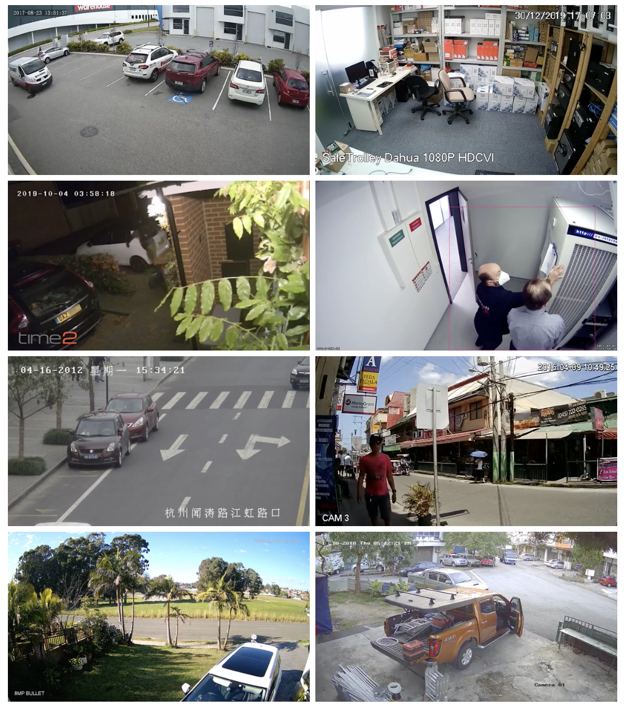
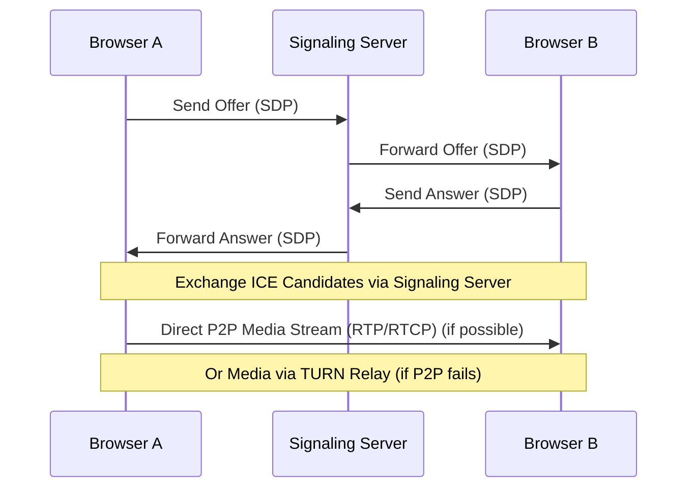
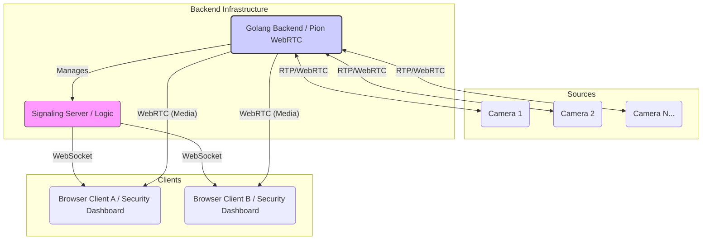

When you need to get video from point A to point B *fast* and reliably, directly in a browser without extra installs, **WebRTC** (**Web Real-Time Communication**) is fundamentally the right tool. It establishes direct peer-to-peer connections between browsers for media, which drastically cuts latency compared to constantly relaying video through a central server. It's built into browsers, no plugins needed. Simple concept, powerful results.

Of course, "peer-to-peer" isn't always truly direct due to firewalls and **NAT (Network Address Translation)**. That's where **ICE (Interactive Connectivity Establishment)**, along with **STUN (Session Traversal Utilities for NAT)** and **TURN (Traversal Using Relays around NAT)** servers, comes in. **ICE** uses **STUN** to discover public IP addresses and tests direct connectivity. If that fails, **TURN** acts as a fallback relay. A robust **WebRTC** setup needs this infrastructure for reliable connection establishment in real-world networks. The signaling to coordinate all this still needs a capable backend.



## Why Golang for the Backend?

Enter **Golang**. For building the signaling servers, managing connections, and potentially handling **TURN** relaying or even more complex media processing logic, Go is an extremely strong contender.

Why Go?

* **Concurrency is King:** Go's **goroutines** are lightweight, concurrent execution units managed by the Go runtime, not heavyweight OS threads. Combined with **channels** for safe communication between them, this makes handling *tens of thousands* of simultaneous network connections—like countless **WebRTC** signaling sessions or media streams—far more resource-efficient and conceptually simpler than managing threads in languages like Java or C++. This isn't just a minor feature; it's a paradigm shift for network services.
* **Raw Performance:** Go compiles directly to efficient machine code. While maybe not always matching hyper-optimized C++, it's significantly faster than interpreted languages and plenty fast for demanding network I/O and typical media routing tasks. Garbage collection is optimized for low latency, which is critical.
* **Simplicity & Productivity:** A clean syntax, strong typing, excellent standard library (especially for networking), and fast compile times mean you can build and iterate on complex systems quickly. Deployment is often trivial – just copy a single static binary.

## Pion: WebRTC Implemented Natively in Go

We're not just talking theoretically here. For implementing the **WebRTC** stack in **Golang**, we've successfully utilized `github.com/pion/webrtc/v3`. **Pion** is a remarkable open-source project. It provides a comprehensive **WebRTC** API implemented *entirely in Go*. This is crucial. It means no wrestling with CGO or external C library dependencies. You get idiomatic Go code, better portability, and easier debugging. **Pion** gives you the low-level access needed to build sophisticated signaling logic and interact directly with media tracks if necessary.

```go
package main

import (
	"fmt"
	"[github.com/pion/webrtc/v3](https://github.com/pion/webrtc/v3)"
	// ... other necessary imports like signaling client, track handling etc.
)

// Conceptual example - actual implementation requires signaling logic, error handling etc.
func setupPeerConnection() (*webrtc.PeerConnection, error) {
	// Use Google's public STUN server for NAT traversal discovery
	config := webrtc.Configuration{
		ICEServers: []webrtc.ICEServer{
			{
				URLs: []string{"stun:stun.l.google.com:19302"},
			},
			// In production, you'd likely add TURN servers here too
			// {
			//	 URLs: []string{"turn:your.turn.server:3478"},
			//	 Username: "user",
			//	 Credential: "password",
			// },
		},
	}

	// Create a new RTCPeerConnection
	peerConnection, err := webrtc.NewPeerConnection(config)
	if err != nil {
		return nil, fmt.Errorf("failed to create PeerConnection: %w", err)
	}

	// Set up event handlers for ICE candidates, tracks, data channels etc.
	peerConnection.OnICECandidate(func(c *webrtc.ICECandidate) {
		if c == nil {
			return
		}
		// Send the candidate to the remote peer via your signaling mechanism
		fmt.Printf("New ICE candidate found: %s\n", c.ToJSON().Candidate)
		// signalingClient.SendCandidate(remotePeerID, c.ToJSON())
	})

	peerConnection.OnTrack(func(track *webrtc.TrackRemote, receiver *webrtc.RTPReceiver) {
		fmt.Printf("Track received: Type=%s, Codec=%s\n", track.Kind(), track.Codec().MimeType)
		// Logic to handle incoming media track (e.g., forward it, save it, display it)
	})

	fmt.Println("PeerConnection configured with STUN")
	return peerConnection, nil

	// Remember to close the PeerConnection when done:
	// defer peerConnection.Close()
}

func main() {
	_, err := setupPeerConnection()
	if err != nil {
		panic(err)
	}
	// Main application loop would handle signaling messages (offers, answers, candidates)
	// to establish and manage the connection.
	fmt.Println("Conceptual Go + Pion setup complete. Waiting for signaling...")
	select {} // Block forever
}

```
*Conceptual Golang snippet showing Pion PeerConnection setup with STUN and basic event handlers.*

## Tackling the Multi-Stream Challenge: A Real-World Use Case

Okay, let's get specific. We have direct, hands-on experience architecting and deploying systems using this **Golang + Pion WebRTC** stack for highly demanding scenarios: specifically, streaming multiple, concurrent video feeds for security monitoring operations. Think of a control room needing simultaneous, low-latency views from dozens, potentially hundreds, of cameras displayed on browser-based dashboards.

This isn't trivial. The key challenges involved more than just basic **WebRTC**:

* **Scalability Architecture:** Designing the Go backend (potentially multiple instances) to gracefully handle connection surges and manage state for thousands of peers without bottlenecks. This involves load balancing signaling and potentially media traffic if **TURN** is heavily used.
* **Signaling Complexity:** Implementing a robust signaling protocol (often over WebSockets) to reliably exchange **SDP (Session Description Protocol)** offers/answers and **ICE** candidates between all peers.
* **Low Latency Media Flow:** Ensuring the **RTP/RTCP** packets making up the video and audio streams traverse the network efficiently. Minimizing jitter and packet loss is paramount for a clear, real-time view. This required careful network configuration and potentially custom logic in the Go backend if acting as a selective forwarding unit (SFU).
* **State Management:** Keeping track of potentially thousands of active connections, their states, associated users, permissions, etc., requires careful data structuring and management in the Go backend.
* **Resource Optimization:** Continuously monitoring and optimizing CPU, memory, and network bandwidth usage. Inefficient code or resource leaks can quickly cripple a high-throughput system.

Here's a simplified view of the basic **WebRTC** connection flow involving signaling:



And here's a high-level look at the architecture for the multi-stream security application:



## Potential Considerations: Is Golang Mainstream for Video?

Now, let's be direct. Is **Golang** the *most* common language you hear about when people discuss building hardcore video processing engines or established streaming platforms? Maybe not. Often, you'll see C++ mentioned for maximum performance in media manipulation, or Node.js due to its prevalence in web development and large package ecosystem.

So, is Go obscure here? I wouldn't say obscure, but perhaps *less traditional* for teams coming purely from a video engineering background that grew up on C/C++. Some might perceive its ecosystem for specialized video codecs or complex media pipeline tools as less mature than C++ libraries that have been around for decades.

However, this perspective misses the bigger picture for *many* modern streaming applications, especially those tightly integrated with web technologies like **WebRTC**:

1.  **Networking & Concurrency:** Go's core strength is *exactly* what's needed for the signaling and connection management backbone of **WebRTC**. Its performance here is stellar and development is arguably much faster than C++.
2.  **Pion Changes the Game:** Libraries like **Pion** provide the necessary **WebRTC** stack *natively* in Go. You're not fighting wrappers; you're working directly with a capable, modern implementation.
3.  **System Integration:** Go excels at building the complete *system* – the APIs, the signaling logic, the connection management – not just the raw video encoding/decoding (which **WebRTC** often delegates to the browser or optimized native libraries anyway).
4.  **Performance is Sufficient (and Excellent):** For signaling, relaying, and managing connections, Go's performance is more than adequate and often surpasses alternatives due to its efficient concurrency.

The argument isn't about whether Go can run FFMPEG slightly slower than C++ in a benchmark; it's about whether Go can build a *scalable, reliable, maintainable system* for delivering real-time video effectively. Our experience confirms it absolutely can.

## The Result: Fast, Scalable, Reliable Video Infrastructure

By combining **Golang's** backend strengths with **Pion's WebRTC** implementation, we built systems capable of delivering numerous secure, low-latency video streams to standard web browsers for critical monitoring tasks.

The key advantages remain compelling:

* **High Throughput:** Efficiently handles massive numbers of concurrent connections.
* **Low Latency:** Essential for real-time interaction and monitoring.
* **Cross-Platform Delivery:** **WebRTC** ensures compatibility with modern browsers everywhere.
* **Developer Productivity:** Go enables rapid development and deployment of robust services.
* **Scalability:** Architectures built on Go can scale horizontally relatively easily.

## Confidence in Go for Real-Time Video

Building sophisticated real-time video applications requires choosing the right tools for the *entire* job, not just isolated parts. While **Golang** might not be the historical default in some video niches, its strengths in concurrency, networking performance, and developer productivity, combined with excellent libraries like **Pion**, make it an outstanding choice for modern **WebRTC** infrastructure. We've successfully implemented demanding multi-stream systems using this stack, proving its capability for scenarios where performance, scalability, and reliability are non-negotiable. We know how to engineer high-quality, real-time video delivery using Go, and we're ready to apply that expertise to new challenges. It just works.