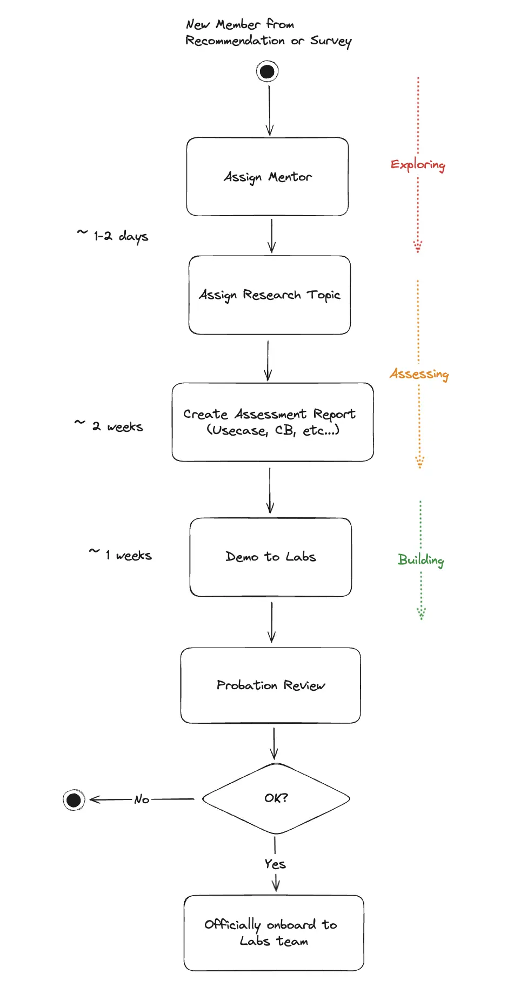

---
tags:
  - labs
  - process
title: Labs - New Member Onboarding
date: 2023-11-21
description: New members joining our Labs team can be recommended either personally by an existing team member or through a development plan survey. Once onboarded, each new member is paired with a mentor who provides guidance on our operational practices within the team, specifically in relation to a chosen research topic. The initial probation period for new members is set to one month.
authors:
  - thanh
---

New members joining our Labs team can be recommended either personally by an existing team member or through a development plan survey. Once onboarded, each new member is paired with a mentor who provides guidance on our operational practices within the team, specifically in relation to a chosen research topic. The initial probation period for new members is set to one month.

During this probation, we expect two main deliverables from the new team member:

- First, an assessment report which should include a use-case and a cost-benefit analysis. This report should be completed within two weeks.
- Second, the new member is expected to conduct a demonstration for the team labs, which should be prepared within a week.

We will do probation reviews based on the [review template](https://docs.google.com/spreadsheets/d/1Z0Wj3dy6bSHXHO8rCL7mrrjRvI4vbupcfyxRYSCtGFs/edit#gid=1586333671) or the chad diagram to evaluate their work.

