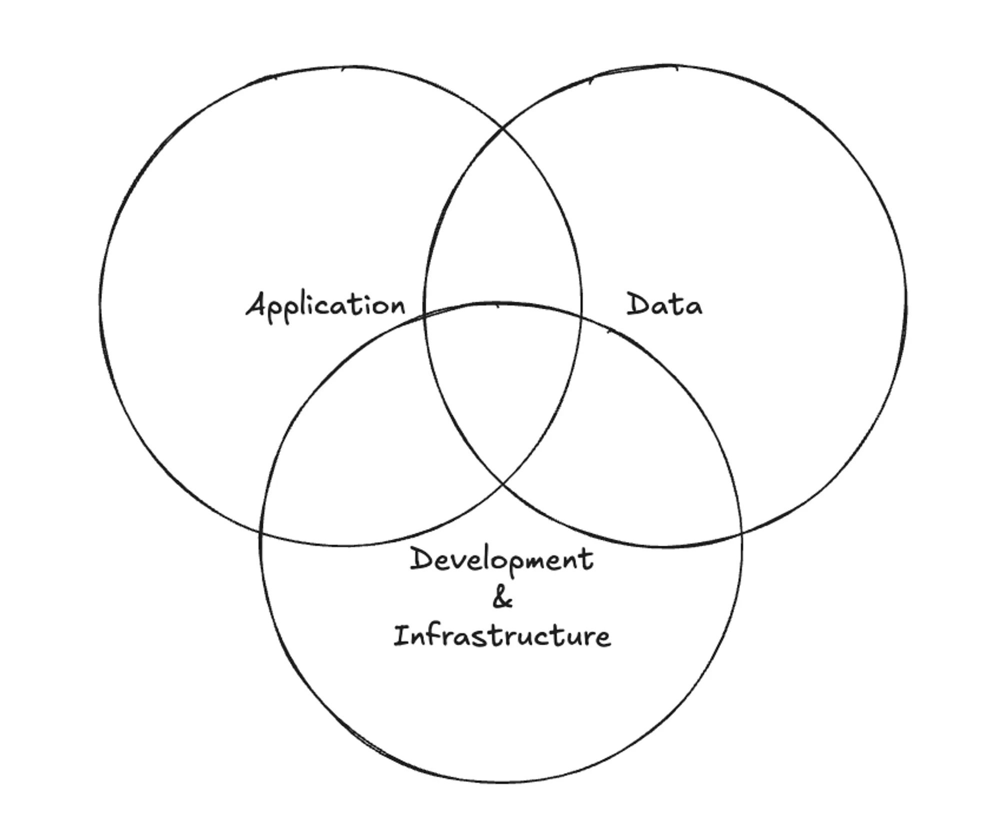

---
tags:
  - security
  - startup
title: 'A Holistic Guide to Security'
date: 2024-09-06
description: A high-level overview of how to implement a holistic approach to securing your application platform.
authors:
  - thanh
---

Security is no longer just a technical concern—it’s a core component of client trust. When our team launched a new collaboration tool, we quickly realized this. Early in the development process, we were focused on delivering features, but as we started engaging with enterprise clients, security-related questions became a priority:

- “Is our chat data private?”
- “Does your software comply with GDPR standards?”
- “How secure is our file upload?”

Many customers have legitimate concerns, driven by high-profile data breaches from well-known companies. Addressing these challenges is not only necessary for compliance but also crucial for earning trust, scaling effectively, and winning new clients. This memo outlines a strategic plan to establish a strong security foundation, allowing us to prioritize security while continuing to deliver features at pace.

## Objectives

Our primary security goals include:

- Ensuring the security of our application, data, and infrastructure.
- Achieving compliance with key global standards like GDPR and ISO.
- Providing transparent answers to clients' security concerns.
- Implementing effective security measures without compromising our agility.

## A Holistic Approach to Security

Security is an ongoing process that must be applied across three critical areas: application security, data security, and development & infrastructure security.

### 1. Application Security

Securing the application itself is the first line of defense. This involves protecting the app from unauthorized access and preventing common security vulnerabilities.

- **Key Practices:** Implementing secure authentication mechanisms, following best practices for API design, and conducting regular penetration testing.
- **Compliance Standard:** [OWASP](https://owasp.org/) (Open Web Application Security Project) offers a framework and guidelines to prevent the most common vulnerabilities, including cross-site scripting and SQL injection.

### 2. Data Security

At the heart of every platform lies data—ensuring the confidentiality, integrity, and availability of this data is crucial.

- **Key Practices:** Encrypting sensitive data (e.g., passwords, credit card information) both at rest and in transit, respecting user privacy through data ownership and control, and providing mechanisms for user data deletion.
- **Compliance Standards:** [GDPR](https://gdpr-info.eu/) (General Data Protection Regulation) and [CCPA](https://oag.ca.gov/privacy/ccpa) (California Consumer Privacy Act) are two major regulations governing data privacy, setting a high standard for transparency and user control.

### 3. Development & Infrastructure Security

Integrating security into the development lifecycle is vital for maintaining a secure infrastructure. From developer access to production environments, everything needs stringent security protocols.

- **Key Practices:** Setting up role-based access control (RBAC), requiring multi-factor authentication (MFA) for accessing development services, and providing regular cybersecurity training for all employees.
- **Compliance Standard:** [ISO 27001](https://www.iso.org/standard/27001) outlines best practices for information security management, focusing on risk assessment and mitigation.

## A 3-Month Security Roadmap

Building a security foundation takes time. We’ve devised a phased approach over the next three months to implement security protocols in a manageable, prioritized way. This plan allows us to remain nimble while progressively enhancing security.

### Phase 1: Immediate Actions

Focus on implementing foundational security measures that address immediate risks.

- **Authentication & Authorization:** Secure the login process using MFA, and implement secure token refresh policies.
- **Data Encryption:** Configure AES-256 encryption for sensitive data.

### Phase 2: Short-Term Actions

Once immediate risks are handled, shift focus to building a stronger defense against potential threats.

- **OWASP Checklist:** Address key vulnerabilities such as improper input validation, session management, and common risks from the [OWASP Top Ten list](https://owasp.org/www-project-top-ten/).
- **GDPR/CCPA Compliance:** Implement data minimization strategies, and develop transparent processes for user consent, data access, and deletion requests.

### Phase 3: Long-Term Actions

Finally, strengthen our infrastructure security to protect against sophisticated threats.

- **Environment Segmentation:** Ensure clear separation between development, testing, and production environments to reduce risk from cross-environment threats.
- **Log Management and Monitoring:** Set up a robust logging and alert system to monitor unusual activity, providing early warnings of potential security incidents.

## Tailoring Security to Fit Our Context

While this security roadmap offers a structured approach, it's important to remember that the specifics of security strategies should adapt to the unique needs of each business. For our platform, this plan balances immediate priorities with long-term goals, ensuring we build a secure foundation without losing focus on growth. However, other team may require a different plan based on their specific client needs, regulatory requirements, and available resources.

## Conclusion

We hope this memo delivers a high-level overview of the key components required for a successful security implementation plan. While the security requirements of every business may differ, we believe this approach can serve as a foundation for creating a customized strategy that aligns with your particular context.
