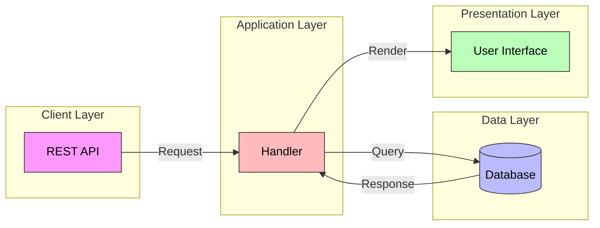
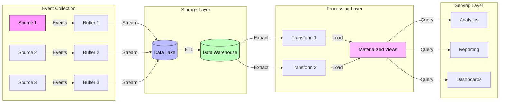
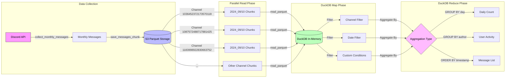
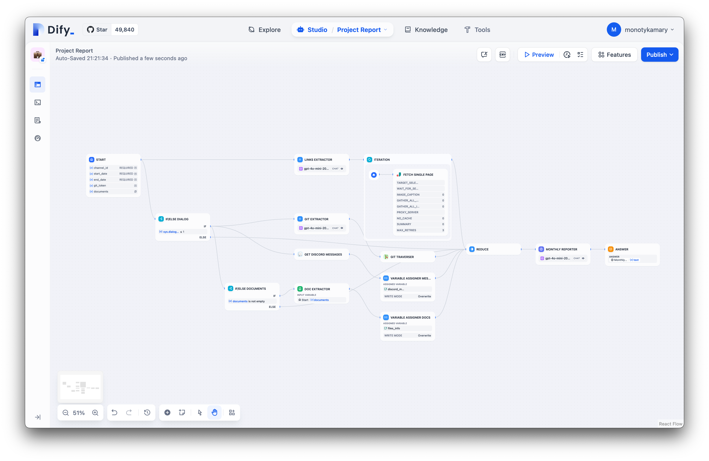
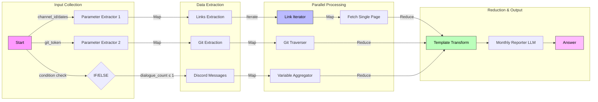

---
tags:
- "data-engineering"
- "system-design"
- "architecture"
- "etl"
title: "Building a Data-Driven Project Reporting System: A Lens into Modern Data Engineering"
description: "Learn how to transition from application development to data engineering by building a modern project reporting system. Discover essential mindset shifts, best practices, and hands-on implementation using tools like Apache Spark, DuckDB, and Modal. Master system-level architecture and data pipeline design for scalable enterprise solutions."
short_title: "A Lens to Modern Data Engineering"
date: "2024-10-29"
authors:
- "monotykamary"
---

Picture yourself as a skilled carpenter who's mastered building beautiful furniture, only to be asked to construct an entire house. The tools in your belt are valuable, but suddenly you need to think about foundations, load-bearing walls, and how water, electricity, and heat will flow through the entire structure. This is precisely how it feels transitioning from application development to data engineering – the shift from crafting individual components to architecting entire systems.

In this exploration, we'll examine how building an automated project reporting system reveals the fundamental mindset shifts required when moving from application to data engineering. More than just a technical guide, this case study illuminates the journey from component-level thinking to systems-level architecture.

## When bottom-up meets top-down

Traditional application development is inherently bottom-up. You build features brick by brick, focusing on individual user interactions, single-record operations, and immediate feedback loops. It's like constructing a building one room at a time, perfecting each space before moving to the next.

Consider this scenario that might feel painfully familiar: Your technology consulting firm needs monthly reports combining:

- Communication patterns from Discord (the pulse of your team)
- Git repository metrics (the fingerprints of your code)
- Project milestones and deliverables (your promises to the world)
- Team performance metrics (the story behind the numbers)

Attempting to solve this with traditional application development patterns is like trying to understand a city's traffic patterns by watching a single intersection. You need to zoom out and see the entire system.

## The great mindset shift

Let's examine how the same problem looks through different lenses:

### The application developer's view:

This approach reflects typical bottom-up thinking: handle each request as it comes, process data on demand, and focus on individual transactions. It's the world of CRUD (Create, Read, Update, Delete) where each operation is discrete and immediate. Like a restaurant taking orders one at a time, it works beautifully at small scale but becomes chaotic during rush hour.

When your system needs to process months of historical data across multiple channels while maintaining performance, you need a fundamentally different approach. Instead of thinking in terms of individual operations, you need to think in terms of events and data flows – much like how event sourcing captures the entire history of state changes rather than just the current state.

### The Data Engineer's view:

Just as event sourcing maintains an immutable log of all events that have occurred in a system, data engineering thinks in terms of continuous data flows and transformations. Rather than asking "what is the current state?", we ask "how does our data evolve over time?"

This generalized flow demonstrates how data engineering systems typically operate:

1. Collect events from various sources continuously
2. Store raw data in its original form (Data Lake)
3. Transform and structure data for analysis (Data Warehouse)
4. Create optimized views for specific use cases
5. Serve data through multiple interfaces

## A real-world example: Project reporting

Let's see how these principles apply to our specific use case of building an automated project reporting system. Here's how we can architect a solution that handles Discord communications, Git metrics, and team performance data:

### Implementation details

Notice the fundamental shift here – instead of reacting to individual requests, we're designing a system that anticipates data flow patterns. This top-down approach forces us to answer critical questions before writing a single line of code:

1. **Data Flow Patterns**: How does data naturally move through our organization?
2. **Scale Considerations**: What happens when our team doubles? When our project count triples?
3. **System Boundaries**: Where does our data come from, and where does it need to go?
4. **Future Flexibility**: How can we design for unknown future requirements?

## The orchestra of automation

Think of data engineering as conducting an orchestra rather than playing a single instrument. Every component must work in harmony, and the conductor must understand not just individual parts but how they create a cohesive whole.

This workflow demonstrates system thinking in action. Each component exists not in isolation but as part of a larger data symphony, where timing, coordination, and scalability are paramount.

## The Data Engineer's mental models

Looking back at our workflow diagrams, you might notice recurring patterns. This isn't coincidental – data engineers think in terms of fundamental data processing paradigms that appear across different scales and contexts:

- **Map-Reduce Patterns**: Breaking large problems into parallel processing units (map) and then combining results (reduce). You see this in our Parameter Extractors that map to individual data sources, and in our Template Transform that reduces multiple streams into a final report.
- **Extract-Transform-Load (ETL)**: The classic pattern of data movement and refinement. Whether it's pulling Discord messages or Git metrics, we're constantly extracting raw data, transforming it into useful formats, and loading it where it needs to go.
- **Event Streaming**: Thinking of data as continuous flows rather than discrete states. Our system doesn't just capture snapshots – it maintains ongoing awareness of communication patterns and development activities.
- **Parallel Processing**: The instinct to ask "what can run simultaneously?" Notice how our data collection phase spans multiple channels concurrently, and our processing phase handles different data types in parallel.

These patterns become second nature to data engineers, forming a mental toolkit that can be applied to problems at any scale. Whether you're processing gigabytes or petabytes, the fundamental thinking remains the same – it's all about managing data flows, transformations, and scale.

## Architectural decisions that shape systems

### 1. Storage format: The foundation of scale

Choosing Parquet as our storage format isn't just about storing data – it's about anticipating how that data will be accessed, processed, and evolved over time:

- Columnar storage enables efficient querying of specific fields (like having direct elevator access to each floor of a building)
- Built-in compression reduces storage costs while maintaining accessibility
- Schema enforcement ensures data consistency across your entire ecosystem
- Predicate pushdown optimization means your queries work smarter, not harder

### 2. Query engine: The power of perspective

DuckDB serves as our primary query engine because it embodies the data engineering mindset:

- Process data where it lives, avoiding unnecessary movement
- Leverage SQL's declarative nature for complex analytics
- Scale vertically within reasonable bounds before adding complexity
- Integrate seamlessly with existing tools and workflows

### 3. Orchestration: The conductor's podium

Modal as our orchestration framework reflects system-level thinking:

- Deploy and scale functions as part of a cohesive whole
- Manage dependencies at the system level, not just the component level
- Monitor and log with a holistic view of system health
- Optimize costs across the entire processing pipeline

## The data engineering toolbox: A systems approach

The transition to data engineering requires an introductive or mastery look at the tools that support system-level thinking:

### Processing engines

These aren't just query executors – they're system coordinators:

- **Apache Spark**: Distributed processing as a first-class citizen
- **DuckDB**: Analytical processing that thinks beyond rows and columns
- **Apache Beam**: Unified processing patterns across batch and stream

### Storage solutions

Storage in data engineering isn't about files – it's about data flow:

- **Data Lakes**: The reservoir of your organization's data potential
- **Data Warehouses**: Where raw data transforms into business insights
- **Data Formats**: The communication protocol of your data ecosystem

### Orchestration tools

These aren't task schedulers – they're system choreographers:

- **Apache Airflow**: Complex workflows as code
- **Dagster**: Data-aware process management
- **Modal**: Serverless orchestration at scale

## Understanding the evolution

The transition from application development to data engineering represents a fundamental shift in how we approach problems:

| Aspect | Application Development (Bottom-Up) | Data Engineering (Top-Down) | Key Insight |
| --- | --- | --- | --- |
| **Problem Solving** | Feature-by-feature construction | System-level architecture | Solutions must scale with the organization |
| **Data Flow** | Request-driven, immediate | Pattern-based, anticipatory | Design for data's natural movement |
| **Scale Focus** | Linear (user by user) | Exponential (system capacity) | Build for tomorrow's scale today |
| **System Boundaries** | Clear, limited scope | Fuzzy, evolving edges | Expect and design for change |
| **Processing Mode** | Synchronous, immediate | Asynchronous, batch-oriented | Balance immediacy with efficiency |
| **Development Flow** | Iterative feature addition | Holistic system evolution | Small changes have system-wide impacts |

## The path forward: From components to systems

The journey from application development to data engineering demands more than learning new tools – it requires developing a new way of seeing. Like an architect who must consider both the individual bricks and the entire skyline, data engineers must balance immediate needs with system-level considerations.

Our project reporting system serves as a microcosm of this transition. Through it, we see how bottom-up, feature-driven development evolves into top-down, systems-level thinking. The tools might be familiar, but their application requires a fundamentally different perspective.

What makes this transition challenging isn't the technical complexity – it's the required shift in mindset. But once you start seeing systems instead of features, patterns instead of transactions, and flows instead of requests, you'll never look at software engineering the same way again.

Remember: In data engineering, the system is the feature. Your success isn't measured by individual components working correctly, but by how well they work together to create value greater than the sum of their parts.