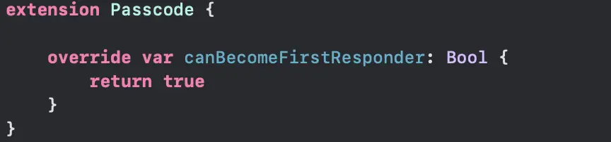
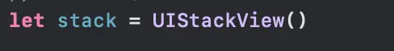

The highlights before we are write our code.

Our Passcode view can “becomeFirstResponder” and “resignFirstResponder” to show and hide virtual keyboard if needed.

=> Our Passcode nearly same with TextField.

Define our passcode view:

By default, to show keyboard on the screen user should touch in TextField or TextView to edit. We can make our custom view as keyboard input view by override “canBecomeFirstReponder” method and conform to UIKeyInput Protocol

Now our view can show keyboard, you can test it by call passcode.becomeFirstResponder()

To help user easy using our passcode view we can add a tap gesture and call becomFirstReponder() to show keyboard. Now you can easy tap to show keyboard.

Now we are going to build our logic to handle user input. There are 3 methods we need focus:

Now append or delete our code string if needed.

Greet, our passcode logic finished, the next challenge is map our code to PIN UI when code changed

Add an UIStackView to our Passcode view. Stack will distribute “Dot View” as Pin.

Create our Pin View

Create two more helper methods to create emptyPin and normal pin

Map user input code to Array of Pin views and distribute to stack

The helper method to remove all add Arranged sub view from stack

Call our update stack when code changed

Create ViewController to test our stack:

Make our PasscodeView conform to UITextInputTraints to able to set keyboard to numPad

Result

Add a callback when user finished input.

Full source code at:
[https://github.com/viettrungphan/Passcode.git?source=post_page-----a6ddae69f405----------------------](https://github.com/viettrungphan/Passcode.git?source=post_page-----a6ddae69f405----------------------)

Please notice the project written by Xcode 11 beta. Your can simple copy all Prefix Passxxx and Pin files to your xcode project to test.
