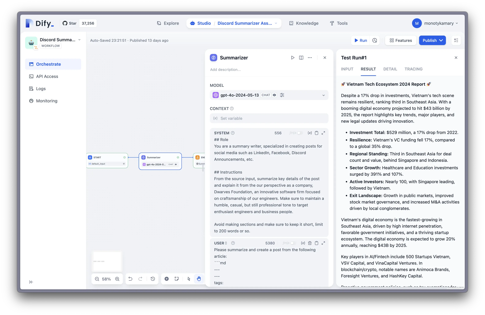

Organizations are constantly seeking ways to improve efficiency and productivity. Large Language Models (LLMs) have emerged as a powerful technology that can be leveraged to create intelligent internal tools. However, integrating LLMs into existing workflows can be complex and resource-intensive. This is where managed LLMOps comes into play, offering a streamlined approach to developing and deploying LLM-powered tools. In this post, we'll explore how platforms like Dify are revolutionizing the way companies build internal AI tools.

## The Challenge of Building LLM-powered Internal Tools

While LLMs offer immense potential for enhancing business processes, harnessing their power for internal tools comes with several challenges:

1. **Complexity**: Integrating LLMs requires deep technical knowledge of AI and machine learning.
2. **Resource Intensity**: Training and fine-tuning LLMs can be computationally expensive and time-consuming.
3. **Maintenance**: Keeping LLM-based tools up-to-date and performing optimally requires ongoing attention.

These factors can make it difficult for many organizations to take full advantage of LLM technology, especially those without dedicated AI teams.

## Managed LLMOps: A Solution for Efficient Development

Managed LLMOps platforms provide a solution to these challenges by offering a comprehensive environment for developing, deploying, and managing LLM-powered applications. These platforms abstract away much of the complexity associated with LLMs, allowing developers and business users to focus on creating valuable tools rather than grappling with the intricacies of AI infrastructure.

## Dify: An Example of Managed LLMOps in Action

Dify is an excellent example of a managed LLMOps platform that simplifies the creation of LLM-powered internal tools. Let's explore some of its key features:

1. **User-Friendly Interface**: Dify provides an intuitive UI that allows both technical and non-technical users to create AI applications.
2. **Pre-built Templates**: Users can quickly get started with templates for common use cases.
3. **Customization Options**: While offering simplicity, Dify also allows for deep customization when needed.
4. **Integrated Workflow Management**: The platform includes tools for managing the entire lifecycle of AI applications.

To further streamline the deployment process and optimize resource management, we use elest.io to deploy Dify. Elest.io is a fully managed DevOps platform, similar to DigitalOcean's marketplace but with a wider range of open-source applications. This approach offers several advantages:

- **Simplified Setup**: Elest.io automates much of the deployment process, reducing the time and expertise required to get Dify up and running.
- **Cost Control**: By leveraging elest.io's infrastructure, we can easily manage and optimize costs across different cloud providers.
- **Flexibility**: Elest.io's support for various cloud providers allows us to choose the most suitable and cost-effective option for our needs.
- **Scalability**: As our LLM tool usage grows, elest.io makes it easier to scale our Dify deployment to meet increasing demands.

This combination of Dify's powerful LLMOps capabilities and elest.io's streamlined deployment process creates an efficient, cost-effective solution for organizations looking to leverage LLMs in their internal tools. This makes it so the average developer can build and deploy an internal tool in minutes.

## Case Studies: Internal Tools Built with Dify

To illustrate the power of managed LLMOps, let's look at some example tools that can be built using Dify:

### 1. SQL Sorcerer
This agent transforms everyday language into SQL queries, enabling non-technical team members to extract insights from databases without learning complex query languages. We use it to make queries to our DuckDB database, which we've used to integrate our very own memo website and knowledge base.

### 2. OGIF Memo Summarizer
Specialized in extracting information from YouTube transcripts, this tool can quickly generate time-stamped summaries with key points, saving hours of manual video analysis. We've recently written an article about this tool, which you can read [here](how-we-crafted-the-ogif-summarizer-bot-to-streamline-weekly-knowledge-sharing.md).

### 3. Discord Summarizer Assistant
Leveraging large language models, this workflow assists with translating and summarizing conversations across different languages, facilitating global team communication.

These are some of the tools we use to essentially 10x our productivity. We extensively use Claude 3.5 Sonnet, and occasionally GPT4o for more nuanced instructions. Without the hard work of @innno_ and the effort she has put into writing and working with our social media platforms, we wouldn't be able to build these tools.

## Best Practices for Developing Internal LLM Tools

When using managed LLMOps platforms like Dify to create internal tools, consider the following best practices:

1. **Start with a Clear Use Case**: Identify specific pain points or inefficiencies in your workflows that LLMs can address.
2. **Iterate Based on Feedback**: Regularly collect and incorporate user feedback to improve your tools.
3. **Ensure Data Privacy**: When dealing with sensitive internal data, make sure your LLM applications adhere to your organization's security policies.
4. **Monitor Performance**: Use the analytics provided by your LLMOps platform to track usage and optimize performance.

## Conclusion

Managed LLMOps platforms like Dify are democratizing access to AI technology, allowing organizations of all sizes to create powerful internal tools without the need for extensive AI expertise. By simplifying the development and deployment process, these platforms are paving the way for a new era of AI-augmented productivity tools. As LLM technology continues to advance, we can expect to see even more innovative applications that transform the way we work.