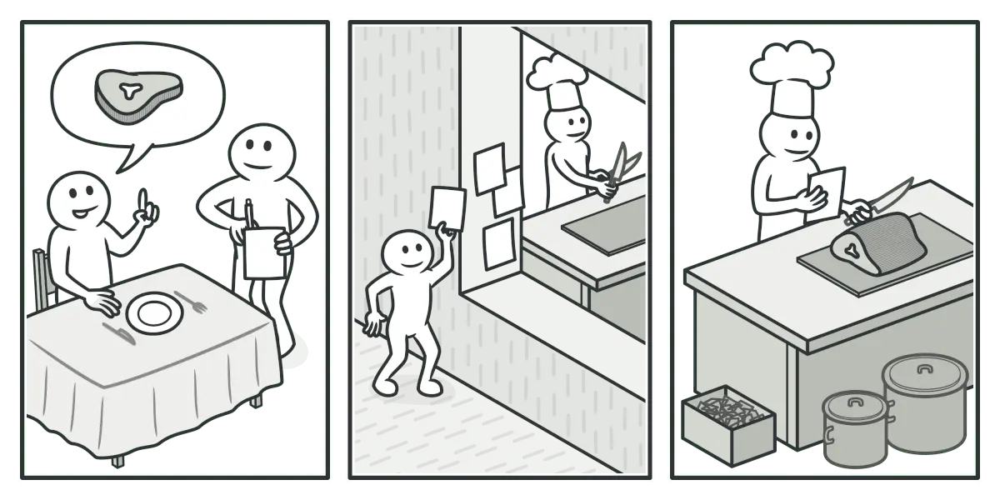

## What is the Command Design Pattern?

Command is a behavioral design pattern that encapsulates a request as an object. This allows you to parameterize methods with different requests, delay or queue a request’s execution, and support undoable operations. This pattern promotes the decoupling of the sender and receiver of a request, enhancing flexibility and maintainability.

## Key components of the Command Pattern

### Command Interface
**Purpose**

- Declares a method for executing a command.
- Ensures that all concrete commands implement this method, providing a consistent interface.

**Responsibilities**

- Defines an `execute()` method that `concrete commands` must implement.

### Concrete Command
**Purpose**

- Implements the Command interface.
- Defines the binding between a `Receiver` object and an action.
- Calls the appropriate operations on the `Receiver`.

**Responsibilities**

- Implements the `execute()` method by invoking the corresponding operation(s) on the `Receiver`.
- Holds a reference to the Receiver.

### Receiver
**Purpose**

- Knows how to perform the operations needed to carry out the request.

**Responsibilities**

- Performs the actual work when its methods are called by the `Concrete Command`.

### Invoker
**Purpose**

- Asks the command to carry out the request.
- Can store and queue commands, and even support undo operations by storing executed commands.

**Responsibilities**

- Maintains a reference to a Command object (or a list of Command objects).
- Calls the `execute()` method on the Command object.

## The real life example

> Imagine you own a small restaurant where you are both the chef and the person  taking orders directly from your customers. As the chef, you prepare each meal  yourself.
>
> As your restaurant gains popularity, you find it increasingly difficult to handle the growing number of orders. To manage this, you decide to hire a waiter. The waiter's responsibilities include taking orders from customers and writing them down on a piece of paper.
>
> The waiter then brings the written orders to the kitchen and sticks them on the wall. You, the chef, can pick up these order slips from the wall and prepare the meals accordingly. Once you finish cooking, you place the meal on a tray along with the corresponding order slip.
The waiter retrieves the tray, double-checks the order, and serves the meal to the customer. 

In this scenario, the paper order serves as a `Command`. It remains in a queue until the chef is ready to prepare it. The order contains all the relevant information required to cook the meal, allowing the chef to start cooking immediately instead of clarifying the order details directly from the customer.

## Pros and Cons

### Pros

- Single Responsibility Principle: Decouples classes that invoke operations from classes that perform these operations.
- Open/Closed Principle: New commands can be introduced into the app without breaking existing client code.
- Undo/Redo: Supports implementing undo/redo functionality.
- Deferred Execution: Allows implementing deferred execution of operations.
- Complex Commands: Facilitates assembling a set of simple commands into a complex one.

### Cons

- Complexity: Introduces a whole new layer between senders and receivers, which can complicate the code.

## Applicability

- Transactional Systems: Financial/payment system, e-commerce platforms
- Task Scheduling: Job schedulers, cron jobs, and task queues, batch jobs, data processing pipelines
- User Interfaces: Optimistic UI

## References
- https://refactoring.guru/design-patterns/command
