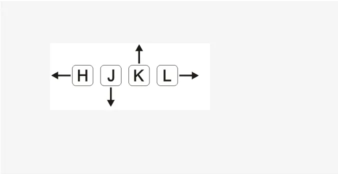

## An introduction to Vim and how to use Vim with Golang
* Vim is a powerful text-editor, usually used server environments with no graphical interfaces. In this post, I will layer a basic foundation of Vim and show you how to use Vim as an IDE for Go.

## What is Vim
Vim is a highly configurable text editor built to enable efficient text editing, the next version of Vi (Vim = Vi Improved), written by Bram Moolenaar, first released in 1991.

* Vim is often called a "programmer's editor,"
* Vim can be used as IDE for its plugins.
* Vim can support for many platforms.

## Install and Config
* Vim can be downloaded at [vim homepage](https://www.vim.org/download.php) or set up by [brew](https://brew.sh/)

`brew install vim`

* Since some plugins can be in needed of lua, you should set up with this command line`brew install vim --with-lua`
* After finished setting, create a.vimrc file. This file is where you store every config, plugins or bundle, as well as other Vim related function.
* Next, set up vim plugins manager. Currently, I’m using [Vundle](https://github.com/VundleVim/Vundle.vim), you can use [panthogen](https://github.com/tpope/vim-pathogen) if you like. Vundle will help in config those plugins in .vimrc, install or update and other tasks. In order to set up, clone vundle in the folder ~/.vim/bundle/ (folder .vim will appear when you finish installed vim)`git clone https://github.com/VundleVim/Vundle.vim.git ~/.vim/bundle/Vundle.vim`

Copy some configs and basic plugins into .vimrc (please note that the “ in vim is comment)

```javascript
set nocompatible              " be iMproved, required
filetype off                  " required

" set the runtime path to include Vundle and initialize
set rtp+=~/.vim/bundle/Vundle.vim
call vundle#begin()
" alternatively, pass a path where Vundle should install plugins
"call vundle#begin('~/some/path/here')

" let Vundle manage Vundle, required
Plugin 'VundleVim/Vundle.vim'

" The following are examples of different formats supported.
" Keep Plugin commands between vundle#begin/end.
" plugin on GitHub repo
Plugin 'tpope/vim-fugitive'
" plugin from http://vim-scripts.org/vim/scripts.html
Plugin 'L9'
" Git plugin not hosted on GitHub
Plugin 'git://git.wincent.com/command-t.git'
" git repos on your local machine (i.e. when working on your own plugin)
Plugin 'file:///home/gmarik/path/to/plugin'
" The sparkup vim script is in a subdirectory of this repo called vim.
" Pass the path to set the runtimepath properly.
Plugin 'rstacruz/sparkup', {'rtp': 'vim/'}
" Avoid a name conflict with L9
Plugin 'user/L9', {'name': 'newL9'}

" All of your Plugins must be added before the following line
call vundle#end()            " required
filetype plugin indent on    " required
" To ignore plugin indent changes, instead use:
"filetype plugin on
"
" Brief help
" :PluginList       - lists configured plugins
" :PluginInstall    - installs plugins; append `!` to update or just :PluginUpdate
" :PluginSearch foo - searches for foo; append `!` to refresh local cache
" :PluginClean      - confirms removal of unused plugins; append `!` to auto-approve removal
"
" see :h vundle for more details or wiki for FAQ
" Put your non-Plugin stuff after this line
```

Next, to install plugins, open vim and run this command line below (by pressing Esc)

`:PluginInstall`

To up date plugins, use
`:PluginUpdate`

That’s enough for you to pick Vim up from the ground.

## Basic Usage Instruction
Vim is a text-editor program first built on UNIX, in order to work in non-user interface environment. At this time, the keyboard hasn’t been upgraded completely, which is why the action on Vim is still different from today.



You can practice using these keys by [vim game](https://vim-adventures.com/)

To open a new file with vim, use the command line: `vim file_name`

There are 3 modes in vim:

* **Normal mode** - appear when you press Ecs, usually has “.” in front of it. Vim will get this as what you type is the command for vim. For example: `:w` is “save document”, `:q` is “exit document”. Vim has its own language, which is called Vim script. Vim script can be executed at normal mode, for example, to print out Hello world, we use

`:echo "hello world"`

* **Insert mode** -appear when you press one of these keys below

a: Insert vào phía sau con trỏ hiện tại
A: Insert vào cuối hàng
i: Insert vào phía trước con trỏ hiện tại
I: Insert vào đầu hàng
o: Insert và mở một hàng trống phía dưới
O: Insert và mở một hàng trống phía trên

* **Visual mode** – appear when you press v, usually used in selecting a big block text, can be used in copy paste or comment,..

You can read [vim command](http://bullium.com/support/vim.html) to know more about the commands in vim

## Using Vim as Go IDE
In order to use Vim as an IDE for Go, we need to set up some plugins for Go.

The most important thing is [vim go](https://github.com/fatih/vim-go/). Vim Go contains a set of libraries that support Go for Vim, for example `godef`, `gofmt`, `go test`.

To install vim go, copy plugin to file .vimrc

```javascript
Plugin 'fatih/vim-go'
```

Then choosing normal mode by pressing `esc` and type this command

```javascript
:PluginInstall
```

Next, continue typing command to install Go binaries

```javascript
:GoInstallBinaries
```

You can basically code Go with only Vim go, but to make things easier, and also enhance its efficiency, you can research and add up some plugins as below

```javascript
    ack.vim
    bclose.vim
    bufexplorer
    nerdtree
    nerdcommenter
    csapprox
    vim-fugitive
    gitv
    vim-gitgutter
    syntastic
    neocomplete.vim
    neosnippet.vim
    auto-pairs
```

In these:
* nerdtree: Help you organize the folders in vim in folder structure, which makes it easier to open file and folder. After finished setting up:


Thanks to plugin of git, you can know which file is under editing, which one has just been added up, and which one has not been committed yet.

* neocomplete: Support auto complete vim


* autopair: Plugin that helps you to quick type using “ ( ‘ [ < by adding “” () “ [] <> as a pair

## Mapping Structure in Vim
Vim has a definition called mapping, which allows its user to mode their keystrokes to support their personal purposes.

```javascript
Khi tôi nhấn key này, tôi muốn bạn làm hành động này thay vì những gì bạn hay thường làm
```

Example: Type some sentences by vim, then run this command

```javascript
:map - x
```

Put your mouse on the text paragraph and press `-`. Vim will instantly delete the characters right under the mouse pointer, as if you’ve just pressed `x`.

At this time, your mapping only works on the text file that you’re editing. In order to mapping your action on all other files, put your mapping on file .vimrc
Here are some of the common mappings:

```javascript
nmap    : used in normal mode
imap    : used in insert mode
vmap    : used in visual mode
noremap : can't be overridden by other mappings
```

For example, when coding in Go, we usually use godef to find the definition of that function. In vim-go, we log into normal mode and type `GoDef`
But we can mapping like this instead:

```javascript
nnoremap <silent> df :GoDef<cr>
```

That means when we’re at normal mode, the keystrokes df will execute the command: `GoDef`. This Map can’t be overridden by any other normal map.Therefore, if you’re looking for a definition of a function, use the keystroke `df`. This will reduce the time of typing process.

Another example for mapping. I usually use [print](https://github.com/k0kubun/pp) library in print out a better result in terminal. The action of login to debug in Go happens regularly, so I set up a map like this:

```javascript
inoremap <silent> pp pp.Println("")
```

That means when I type in insert mode `pp`, it will automatically switch into `pp.Println("")`, which enables me to code faster.

You can read more at [mapping in vim](http://vimdoc.sourceforge.net/htmldoc/map.html).

## Conclusion
Everything is ready! Your only job is to:
* Experienced in using hjkl in vim, as well as the basic commands in vim.
* Search for more plugins to support for vim. This is a page I find very interesting and useful for [plugins in vim](http://vimawesome.com/).
* The key strong point in vim is customization, you should try to figure out how to create new mappings or function that helps fasten your coding process.

These aspects is what I have learnt about Vim and how to code Go using Vim. There are a lot of things to discover in the world of Vim and I would love to hear all of your comments or sharing.
