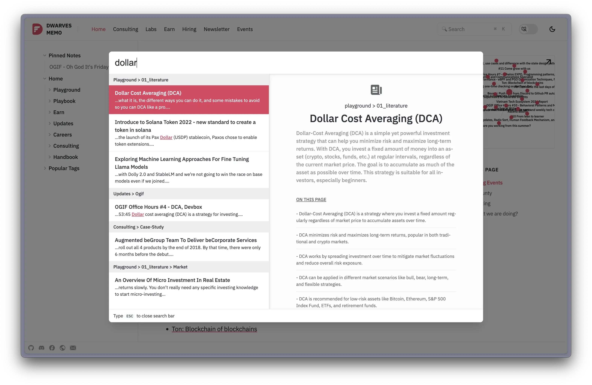

Our journey to develop a fully local search engine for our memo website has been an evolution. Initially, we relied on Algolia, a third-party search solution that provided excellent search capabilities, followed up with [Modal](https://modal.com/docs/examples/algolia_indexer) to index and scrape our website. However, as our platform grew, we began to reconsider this approach. We wanted to move away from server-dependent solutions for several reasons:

1. Privacy concerns: Keeping all search data local enhances user privacy.
2. Cost efficiency: Eliminating the need for external services reduces operational costs.
3. Offline functionality: A local solution allows for offline search capabilities.
4. Customization: Building our own solution gives us complete control over the search experience.

This led us to explore alternatives, and we eventually landed on DuckDB as our core technology. DuckDB's ability to run entirely in the browser, coupled with its powerful SQL capabilities, made it an ideal choice for our local search engine.

Interestingly, our implementation came just before DuckDB introduced their [array type](https://duckdb.org/docs/sql/data_types/array), which they promptly followed with a post on [hybrid search with DuckDB](https://motherduck.com/blog/search-using-duckdb-part-3/). This timing highlights how our journey aligns with the broader trend of leveraging DuckDB for analysis, AI integration, and web applications.

Our search engine combines the power of full-text search, semantic search, and a sleek user interface (thanks @vincent) to deliver fast and accurate results, all while running entirely on the client-side. In this post, we'll walk you through the key components and technologies that make this possible, showcasing how we've achieved a server-free, privacy-focused search solution.

## The Tech Stack
Our local search engine leverages several cutting-edge technologies:

1. DuckDB-wasm: A fully in-browser SQL database
2. Transformers.js: For generating embeddings directly in the browser
3. Alpine.js: For reactive UI components
4. Lodash: For data manipulation
5. Snarkdown: For Markdown parsing

## Key Features
### 1. Hybrid Search
We've implemented a hybrid search approach that combines full-text search with semantic search. This allows us to capture both keyword matches and conceptual similarities.

```sql
WITH search_results AS (
  SELECT
    -- ...fields...
    fts_main_vault.match_bm25(file_path, ?) AS full_text_score,
    array_cosine_similarity(?::FLOAT[1024], embeddings_spr_custom) AS similarity
  FROM vault
  -- ...where clauses...
)
-- ...ranking and combining results...
```

### 2. Advanced Filtering
Users can apply filters using special syntax, a feature created by our engineer, @vincent:

- `author:name` to filter by author
- `tag:topic` to filter by tag
- `title:keyword` to filter by title

For example, a user could search for:
```
machine learning tag:AI author:Jane
```

This query would search for "machine learning" within documents tagged with "AI" and authored by Jane.

### 3. Real-time Embeddings
We use Transformers.js to generate embeddings for search queries in real-time, right in the user's browser:

```javascript
const getEmbeddings = async (query) => {
  const res = window.pipe ? await window.pipe(query, { pooling: 'mean', normalize: true }) : [];
  return res;
}
```

### 4. Efficient Caching
To ensure fast load times, we implement a caching mechanism for our database files:

```javascript
caches.open('vault-cache').then(async (cache) => {
  // ... cache checking and updating logic ...
});
```

### 5. Responsive UI
Using Alpine.js, we've created a responsive command palette interface that provides instant feedback as users type:

```html
<div x-data="{ searching: false, searchPlaceholder: 'Initializing Search...', ... }">
  <!-- ... UI components ... -->
</div>
```

## Performance Optimizations
1. **Indexing**: We use both full-text search (FTS) and HNSW (Hierarchical Navigable Small World) indexing for fast retrieval.

2. **Debounced Search**: We debounce search inputs to reduce unnecessary database queries.

3. **Lazy Loading**: The heavy lifting (like embedding generation) is done only when needed and not on mobile devices.

## Challenges and Solutions
One of the main challenges was balancing search accuracy with speed. We solved this by:

1. Using a hybrid approach that combines full-text and semantic search.
2. Implementing efficient indexing strategies.
3. Caching database files for faster startup times.

## Future Improvements

While our current implementation provides a robust and efficient search experience, there are always areas for enhancement. Here are some key improvements we're considering for future iterations:

### 1. Persistent Search Across Navigation

Currently, our search engine reloads with each page navigation. We aim to implement a solution where the search functionality persists across different pages, providing a seamless user experience. This could involve:

- Using a single-page application (SPA) architecture
- Implementing a global state management solution
- Utilizing browser history API for smoother transitions

### 2. Further Speed Optimizations

Although we've made significant strides in performance, we're always looking to push the boundaries. Some potential optimizations include:

- Implementing progressive loading of search results
- Exploring WebAssembly for even faster computations
- Optimizing our SQL queries for better performance
- Investigating the use of web workers for background processing

### 3. Server-Side Implementation

To improve SEO and initial page load times, we're considering a server-side implementation, particularly for static page generation. This would involve:

- Creating an Elixir version of our search engine
- Generating static pages with pre-computed search data (which is now live, but needs some work)
- Exploring hybrid approaches that combine client-side and server-side search capabilities

By focusing on these improvements, we aim to create an even more powerful and user-friendly search experience. We're excited about the potential these enhancements hold and look forward to implementing them in future updates.

## Conclusion
By leveraging modern web technologies and clever optimizations, we've created a powerful, fully local search engine for our memo website. This approach provides our users with fast, accurate search results without compromising on privacy or requiring server-side processing.

We're excited about the possibilities this opens up for future improvements and would love to hear your thoughts or questions in the comments below!
