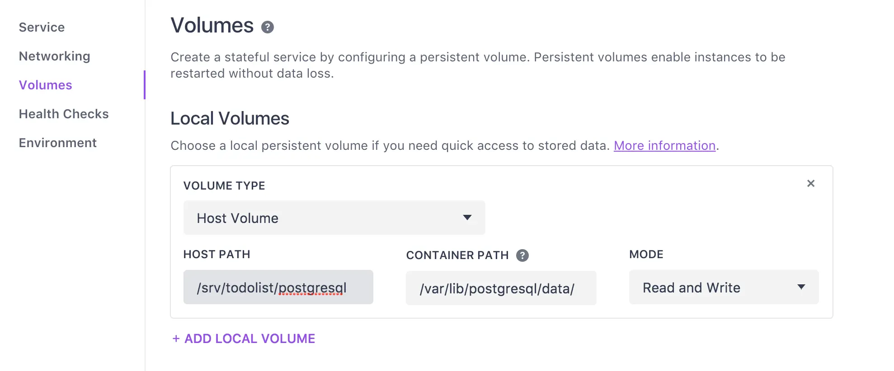

## Create an Application with Golang
First of all, we will go with `Golang` because `Go` is easy to implement backend server and deploy in 1 min. So we will have a few code to initialize `todolist` application that provide `GET` tasks.

```plain_text
func main() {
    // connect DB
    db, err := gorm.Open("postgres",
        fmt.Sprintf("user=%v password=%v host=%v dbname=%v sslmode=disable",
            os.Getenv("DB_USER"), os.Getenv("DB_PASSWORD"), os.Getenv("DB_HOST"), os.Getenv("DB_NAME")))
    if err != nil {
        panic(fmt.Sprintf("Failed to open sql connection: %v", err.Error()))
    }
    db.LogMode(true)
    db.AutoMigrate(models.Task{})

    // we will seed some data
    tasks := []string{"get a coffee cup", "write blog"}
    for _, v := range tasks {
        db.Create(&models.Task{Name: v})
    }

    // init API server
    r := gin.Default()
    r.GET("/tasks", func(c *gin.Context) {
        var data []models.Task
        err := db.Offset(0).Limit(10).Find(&data).Error
        if err != nil {
            c.JSON(http.StatusInternalServerError, err.Error())
        }
        c.JSON(200, gin.H{
            "data": data,
        })
    })
    r.Run()
}
```

Above code allow us easy to customize configuration of database connection. When we deploy application, we just need to change these settings below which are environment variables:

* DB_USER
* DB_PASSWORD
* DB_HOST
* DB_NAME

After that, We need to do some stuffs to dockerize application and push it to docker hub or private docker registry. To do that, let’s create a Dockerfile first:

```plain_text
FROM alpine:3.4

RUN apk add --no-cache ca-certificates

ENV GOPATH /go
ENV DB_USER=postgres
ENV DB_PASSWORD=postgres
ENV DB_HOST=localhost
ENV DB_NAME=todolist

WORKDIR /go/src/todolist/backend
ADD main /go/src/todolist/backend

CMD ["/go/src/todolist/backend/main"]
```

Following to these steps, you will be able to build and push your image to docker hub:

```plain_text
// this will help us to run app in image alpine
$ CGO_ENABLED=0 GOOS=linux go build -a -installsuffix cgo -o main .

// build image and push it to docker hub
$ docker build -t <namespace>/todolist .
$ docker push <namespace>/todolist
```

## Setting up database on DC/OS
Let’s go to our DC/OS and create a `postgres` service

Go to DC/OS and choose package tab, then find `postgres`:


Customize your configuration after click `Advance setting` from pop-up page:


Finally, you need to wait a few minutes and get the result like this:


You also need to config more a little bit to be able to backup data:


A very important thing is sharing volumes. You will need to set a specific node with public IP to make sure if service restart, it will only be deployed to a node that you have specified before. There are 2 things need to be config:

1. Set a specific node in `Service` tab:


2. Share volumes



For me, I usually share volumes inside container to `/srv` in node: `/srv/todolist/postgresql:/var/lib/postgresql/data`

Then, you also need to enable `LOAD BALANCED SERVICE ADDRESS`, it will allow your application connect to `postgres`


After all, click `REVIEW & RUN` to change setting

## Deploy application
As usual, we will need file `marathon.json` to define app and deploy:

You also need to replace your configuration `DB_HOST`, `DB_USER`, `DB_PASSWORD`, `DB_NAME`

```plain_text
{
  "id": "/todolist/backend",
  "cpus": 0.5,
  "mem": 512,
  "instances": 1,
  "container": {
    "type": "DOCKER",
    "docker": {
      "image": "<namespace>/todolist",
      "network": "BRIDGE",
      "portMappings": [
        {
          "containerPort": 8080
        }
      ],
      "forcePullImage": true
    }
  },
  "env": {
    "PORT": "8080",
    "DB_HOST": "todolistpostgresql.marathon.l4lb.thisdcos.directory",
    "DB_USER": "postgres",
    "DB_PASSWORD": "password!",
    "DB_NAME": "todolist",
    "BUILD_ID": "123"
  },
  "healthChecks": [
    {
      "portIndex": 0,
      "protocol": "TCP",
      "gracePeriodSeconds": 300,
      "intervalSeconds": 60,
      "timeoutSeconds": 20,
      "maxConsecutiveFailures": 0
    }
  ],
  "labels": {
    "HAPROXY_GROUP": "external",
    "HAPROXY_0_VHOST": "todolist.yourdomain.com"
  }
}
```

OK, we can deploy now !

```plain_text
$ dcos marathon app add marathon.json
```

As my expectation, it will be like this:


Everything is available now. Let’s check it:


 