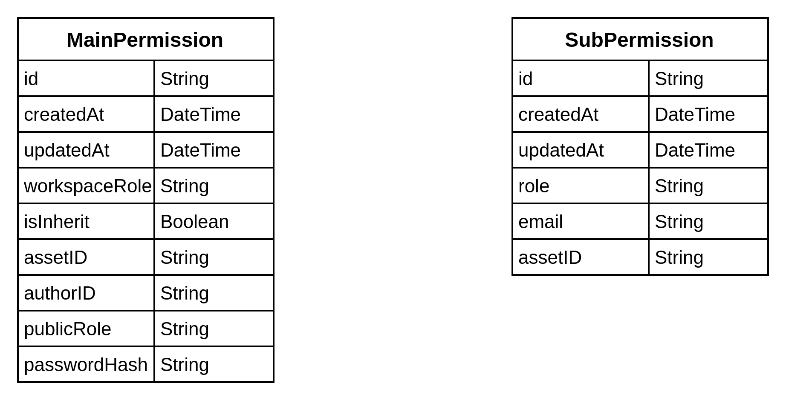
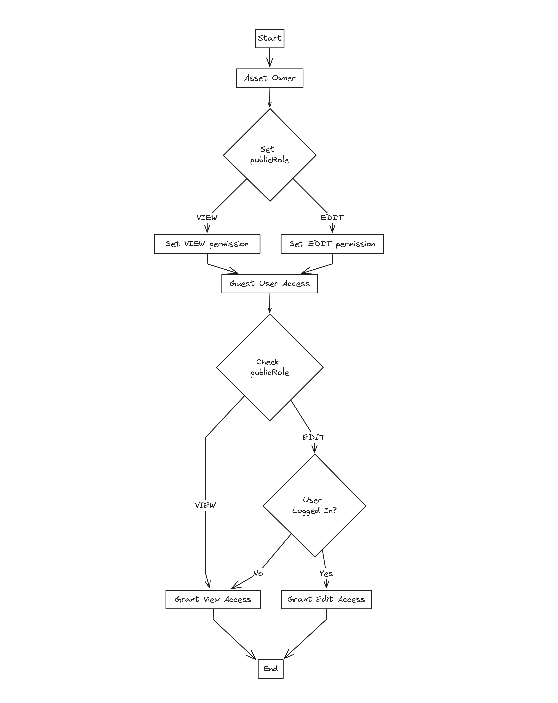
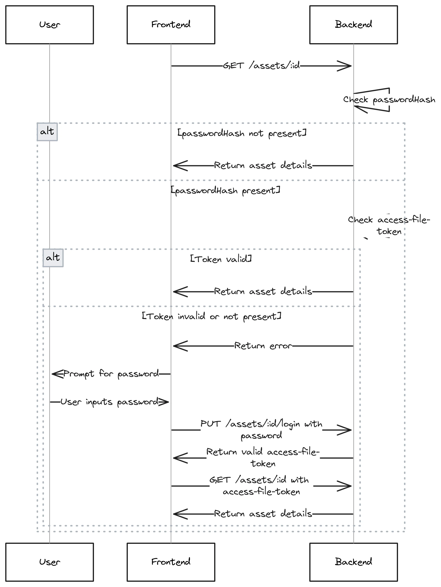

---
tags:
  - directory-structure
  - file-management
  - file-system
authors:
  - datpv
date: 2024-08-09
title: "Design file-sharing system - Part 1: Permission & Password"
description: "In this part, I will discuss how I handle the logic and design the data model for the following features: setting permissions, sharing files for public access, and setting a password for a file."
---
In this section, I will discuss how I handle the logic and design the data model for the following features: setting permissions, sharing files for public access, and setting a password for a file. Refer to the diagram below to understand how permissions work in this system.

## Permissions

### Functional requirements

- Each file will be set permission, and when users interact with it, they must satisfy it.
- Files will inherit permission from the parent by default.
- There are 2 scopes, allow permission for all members in workspace or invite only.

### Data model

**MainPermission Table**
Each asset has one and only one record in this table, it contains general permission details for the asset.
`Public Role` field: Showing the role of guest user when accessing the file
- EDITOR: Can view and edit
- VIEWER: Can only view
- NO_ACCESS: Cannot access the asset

`Child Role` field: Show the permission workspace members and only have value
- FULL_ACCESS: Can perform all operations
- EDITOR: Can view and edit
- VIEWER: Can only view
- NO_ACCESS: Cannot access the asset
- INHERIT: Inherit from parent folder

`Is Inherit` field: `true` if the permission for this asset is inherit from the parent

**SubPermission**
An asset can have many records in this table, showing role for a specific email
Role field: Show the permission for an invitee or project members in this record
- FULL_ACCESS: Can perform all operations
- EDITOR: Can view and edit
- VIEWER: Can only view
- NO_ACCESS: Cannot access the asset
- INHERIT: Inherit from parent folder

### Logic

**Permission Hierarchy**

Permissions are checked in this order:
- Direct user permission on the asset in SubPermission table
- Main permission's childRole (default for workspace members)
- Inherited permission from parent directories

**Permission record rules:**
- When init an asset, we will create a record in MainPermission, with `isInherit = true` and `childRole = 'INHERIT'`, this means the asset inherit permission from parent directories.
- If there is any update in the permission, the `isInherit = false` and `chilRole` value will be set as specific permission but not `INHERIT`.

## Sharing file

### Functional requirement:
- **Setting Public Access**
    - Asset owners can set the `publicRole` in the permission table.
    - The role can be either `VIEWER,` `EDITOR` or `NO_ASSET`.
- **Accessing Public Assets**
    - When a guest user attempts to access a public asset, the system checks the `publicRole`.
    - Based on the `publicRole`, the user is granted view or edit permissions.
    - If the user is not logged in, they are restricted to view-only access.

### Key Components

**`publicRole` in Permission Table**
- **publicRole:** Defines the level of access for public users.
    - `VIEWER`: Allows public users to view the asset.
    - `EDITOR`: Allows public users to edit the asset.
    - `NO_ASSET`: value means the files is not allow public asset

## Password Protection Feature

### Functional requirement

The password protection feature allows users to set a password on their assets to restrict access.  If an asset has a password, any user attempting to access the file must provide the correct password.

### Key Components

**`passwordHash` in Permission Table**
- **passwordHash:** Stores the hashed password for the asset.
- When this field has a value, password protection is enabled for the asset.
- The password is securely hashed before being stored to ensure security.

### Workflow
To make it easy to understand, I will show the workflow for getting file details. This process also applies to other features like updating and setting permissions.

The idea is that the user will get an `asset-file-token` by using `GET /assets/:id/login`. Then, add it to the header for authorization when calling `GET /assets/:id` to get detailed info.

## Conclusion
In conclusion, this system implements a robust and flexible permissions model for file management. It covers essential features such as upload, manage, setting permissions, public file sharing, and password protection. The design allows for granular control over access levels, inheritance of permissions, and secure sharing options. This comprehensive approach ensures that users can effectively manage their files while maintaining appropriate levels of security and collaboration within the workspace.