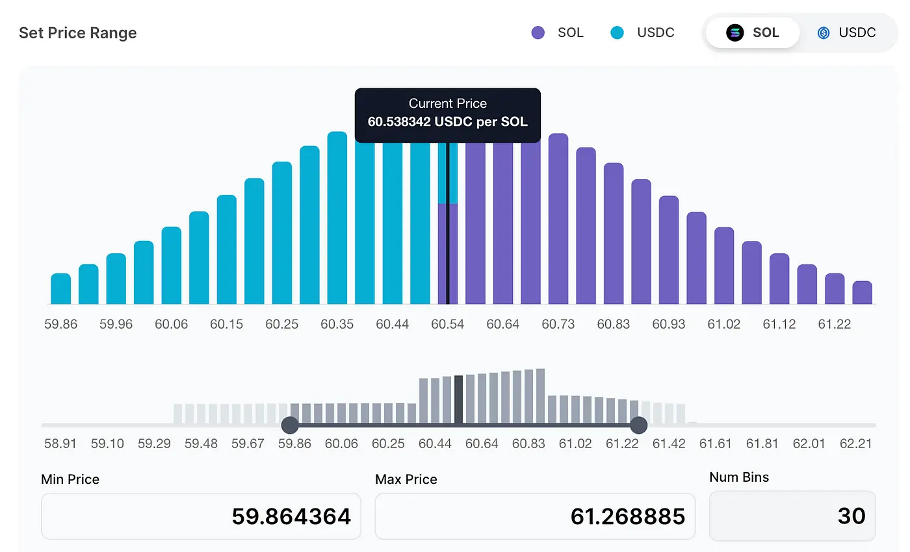

## Introduction
Dynamic Liquidity Market Maker (DLMM) is  a new form of concentrated liquidity AMM on Solana, developed to make it easier and more sustainable for users and project teams to provide broader, deeper liquidity on Solana. DLMM aim to improve LP profitability with dynamic fees, allow new tokens to bootstrap their liquidity in new creative ways, and allow LPs a broader array of LP strategies and more precise liquidity concentration.

## Technical Overview of DLMM
The DLMM allows liquidity providers to contribute to discrete liquidity bins, enabling them to specify buy or sell orders for token pairs at predetermined prices. Essentially, the DLMM's liquidity pools consist of numerous price-specific bins filled with tokens by LPs. Trading within these pools transitions sequentially from one bin to another as tokens are exchanged, ensuring continuous market operation.

### DLMM Bin Price
Liquidity is distributed across discrete bins with a fixed width and fixed price. Within each bin, liquidity can be exchanged at a fixed price  **X + Y = k** within each bin. Basically you add **X** tokens and take out **Y** tokens (or vice versa), until there is only just one type of token left.

Each bin represents a single price point, and difference between 2 consecutive bins is the bin step. Bin steps are calculated based on the basis points set by the pool creator. For example, taking SOL/USDC. If the current price is $20 and the bin step is 25 basis points (0.25%), then the consecutive bins would be 20 x 1.0025 = 20.05, 20.05 * 1.0025 = 20.10 and so on.

### Bin Liquidity
Liquidity in each bin is calculated by the constant sum price variant, `𝑃.𝑥+𝑦=𝐿`, where ***x*** is the quantity of token **X**, ***y*** is the quantity of token **Y**, **L** is the amount of liquidity in the bin and `𝑃=Δ𝑦/Δ𝑥`. **P** is defined as the rate of change of **Y** reserves per change in **X** reserves, and is a price constant unique to each pool.

**P** can be visualized as the gradient of the line in the following image:

### Market Aggregation
The constant sum curve intercepts both the **x** and **y** axes, meaning that the reserves of **X** or **Y** token can be exhausted. When this happens, the current price would move to the next bin either on the left or right.

Active price bin is defined as the bin that contains reserves of both **X** and **Y**. Note that there can only be one active bin at any point in time. All bins to the left of the active bin will only contain token **Y**, while all bins to the right of it will only contain token **X**.

## Differences Over Other Models
### Over AMMs
DLMMs offer a number of benefits over traditional automated market makers (AMMs):

- Reduced slippage: By concentrating liquidity in a specific price range, DLMMs reduce the amount of slippage that traders experience.
- Improved capital efficiency: DLMMs allow liquidity providers to deposit their assets into specific price bins, which makes better use of their capital.
- Deeper liquidity: DLMMs can provide deeper liquidity for asset pairs, even those with low trading volume.
- Improved LP profitability: Dynamic fees allow LPs to make more money on market volatility

### Over CLMMs

## Advantages of DLMM
DLMM offers several benefits but the main ones include:

**Zero Slippage**: Trading within an active bin has zero slippage or price impact. This makes it easier for LPs to concentrate their liquidity even further and capture more volume and fees than they could before.

**Higher capital efficiency:** DLMM offers zero slippage for swaps within the same bins. Further, it also supports lower liquidity requirements and higher volume of trading as liquidity is concentrated on the market value.

**Better profitability and flexibility:** LPs can create richer and more precise strategies by creating liquidity shapes that suit their need. Profitability is also increased as LPs earn a base fee as well as a variable fee when price actions become more volatile, causing the DLMM to switch bins.

## What’s next?
Today, Jupiter is leveraging the DLMM model in its Launchpad, there are many project using Jup Launchpad such as:

- [Jupiter](https://jup.ag/) - Top DEX aggregator in crypto.
- [Zeus Network](https://zeusnetwork.xyz/) - Permissionless communication layer connecting. Solana and Bitcoin.
- [Uprock](https://uprock.com/) - The premier DePIN network fueling AI

In addition, users can create a new pool or add liquidity to the existing DLMM pool to earn fees by visit [Meteora DLMM pools](https://app.meteora.ag/dlmm).

## References
https://docs.meteora.ag
