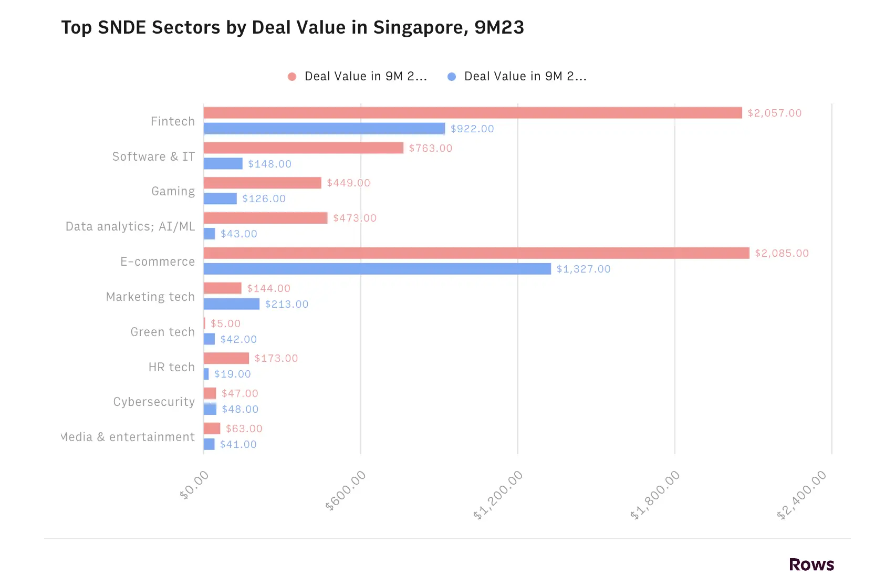

This year’s Echelon X in Singapore was a bustling hub of innovation, bringing together around 10,000 participants, including 154 speakers, 50 TOP100 startups, investors, corporates, and government agencies from over 35 countries.

Singapore once again proved its status as the leading tech and investment hub in Southeast Asia. Along with visiting SPGroup, our team also attended Echelon X to have a better understanding of how the tech and startup ecosystem is heading.

## Building the future through resilience and collaboration

- The 2024 Echelon mission is to strengthen the tech ecosystem by encouraging collaboration, sharing knowledge, and driving collective innovation.
- Echelon X united a dynamic community of forward-thinkers, industry leaders, and passionate individuals, all eager to share ideas and create new paths in their fields.

### Notable trends

- Resilience and working together: almost the main purpose, if we may. Every activity at Echelon focused on building connections to give startups better support, access to funding, and more networking opportunities.
- Sustainability was a core theme, with a focus on integrating eco-friendly practices into business and tech development. This theme aligns with aligning with global trends and government efforts to meet long-term sustainability goals.
- Key topics included artificial intelligence, the Singapore government’s support for the tech sector, and future-proofing business strategies.

## Market insights and investment landscape

### SEA regional highlights

- Thailand and Indonesia are emerging as tech hubs.
- The Philippines saw a 50% increase in startup funding, reaching $2 billion in 2024.
- Indonesia leads with $5 billion in total funding, up 30% from last year.

### Funding landscape

- The SEA/SEAN region has a limited paid market since many users prefer free products. This makes it hard for startups to generate revenue, pushing them to expand into the US, UK, and EU. However, this approach is time-consuming, costly, and highly competitive, leading to investors are still very cautious about where they put the money.
- Startups are optimistic about funding, aiming for sustainable growth and profitability. Even so, investors focus on the quality and expertise of founding teams, making people the key decision-making factor.
- Sensible valuations and disciplined investment approach.
- Funding in 2024 is projected to reach $14 billion, a 40% increase from 2023, promising a recovery in the startup ecosystem.
- The number of deals increased by 25%, showing renewed investor confidence.

### Total deal value in USD for top verticals under SNDE theme in Singapore in 9M23

## Detailed observations

- COVID-19 impacted housing prices and caused ongoing layoffs, which continue in Q1 2024 at rates between 5-20%.
- Vietnamese developers consider moving to countries like Australia or the US if they can't secure permanent residency and local opportunities don't improve.
- AI took the stage. Quite a lot of AI startups came to present themselves. The government also addressed problems with AI and how they planned to overcome them.
- Raising children is expensive, especially for non-permanent residents who pay higher rates. The competitive education system adds to these challenges.
- Platforms like [Binance.com](http://binance.com/) are now accessible, and AWS organized meetups and hackathons with ThoughtWorks. However, there's no sign of LLMs being developed or used in their companies.
- Meeting Nam Nguyen, founder of OplaCRM, was a highlight; he is very open to sharing his knowledge.

## AI landscape

### Growth and applications

- AI is still largely a big tech company's game, with startups mainly developing AI-powered or AI-wrapped products based on these technologies.
- The AI market in SEA is set to grow rapidly, with key uses in software development, data sorting, fraud detection, and management systems. It's expected to grow at 35% annually, reaching $6 billion by 2028.
- Only 15% of large enterprises have fully integrated AI, mainly driven by digital transformation.

### Challenges

- Data security and privacy are major concerns.
- Creating localized AI models and managing high costs are big challenges.
- Companies are investing more in AI ethics and governance to prevent misuse.

## In general

The tech market in Southeast Asia is tough. Big tech companies are laying off employees, and in Singapore, many experienced tech workers are considering moving due to high living costs and job cuts. AI's growing capabilities are also raising job security concerns.

As we look to the future, one thing is clear: new tech will shape innovation. Time will tell.

After Echelon X 2024, we left with a sense of achievement, new insights, and valuable connections. The event provided a clear view of current trends and future developments in the SEA tech market.

