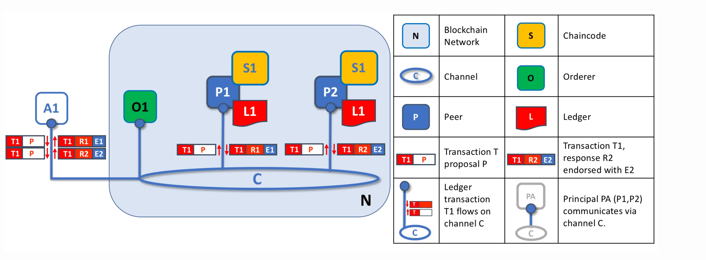

# What is Hyperledger
Hyperledger is an open source community focused on developing a suite of stable frameworks, tools and libraries for enterprise-grade blockchain deployments.

It serves as a neutral home for various distributed ledger frameworks including Hyperledger Fabric, Sawtooth, Indy, as well as tools like Hyperledger Caliper and libraries like Hyperledger Ursa.

## Key concept of Blockchain in Hyperledger
### A Distributed Ledger
Records all the transactions that take place on the network

Replicated across many network participants, each of whom collaborate in its maintenance

### Smart Contracts
Self-executing contract if match pre-defined rules

### Consensus
* Consensus problem( A fundamental problem in distributed-computing and multi-agent systems is to achieve overall system reliability in the presence of a number of faulty processes by agrees some data value that is needed during computation)
* Append value through transaction to network
* Update only when transactions are approved by the appropriate participants
* Update with the same order in any participants

## Hyperledger Fabric Models
### Assets
Asset definitions enable the exchange of almost anything with monetary value over the network as a collection of key-value pairs.

### Chaincode
Enforces the rules for defining, modifying  assets, it's the business logic. Execute against the ledger's current state database and initiated through a transaction proposal -> results in a set of key-value writes that can be submitted to the network and applied to the ledger on all peers.

### Ledger
Ledger is the sequenced, tamper-resistant record of all state transactions in the fabric. There is one ledger per channel, each peer maintains a copy of the ledger of their channels.

### Permissioned Vs Permissionless
**Similarities**
Both are unalterable digitally signed ledgers which are distributed through peer-to-peer network Both maintain ledgers which are updated through a protocol named as consensus. Both claim to maintain an immutable ledger

**Differences**
1. Permissioned
* Varying decentralization: members of the blockchain network are free to negotiate and come to a decision concerning the level of decentralization that the network will have
* Close: consortia members have the ability to restrict access. Not required to be transparent, members can choose to do so freely, depending on the inner organization of the businesses.
* Clean Governance structure: governance is decided by members of the business network. Decisions are made on a central level, where the entirety of the network must agree to a change

→ More control on the central level, more private -> use for B2B business models

2. Permissionless
* Decentralized: no central entity has the authority to edit the ledger, shut down the network or change protocols.
* Open: anyone can access, participate in the validation process
* Public: anything running is verifiable on the networks by everybody, running full nodes, store full history of all transactions
* Anonymity: members join the network as fully anonymous, networks don't need to recognize the member

→ Easier to join, widely access, globally accept  -> cryptocurrency

## Hyperledger Architecture
### Identity
The actors in a blockchain network(peers, orderers, client applications, administrators..) has a digital identity encapsulated in an X.509 digital certificate. - Properties of an actor's identity(organization, organizational unit, role..) wrap as Unique ID.

### PKIs (public key infrastructure)
Is a collection of internet technologies that provides secure communications in a network.

Base on the properties of a peer, cryptography constructing a pair of public and private key(prevent reading messages by third parties), Certificate Authority(CA) is an entity that issues this digital certificates, allows relying parties to rely upon signatures or on assertions made about the private key that corresponds to the certified public key. So that, any message passing to a peer can only be read by this peer.

* **Root CAs**: CAs as root
* **Intermediate CAs**: issued by root CA.
* **Fabric CA**: is a private root CA provider capable of managing digital identities if Fabric participants.
* **Certificate Revocation List(CRL)**: a list of references to certificates that a CA knows to be revoked.

### MSP (Membership Service Provider)
Identifies which Root CAs and Intermediate CAs are trusted to define the members of a trust domain. Also identify specific roles an actor might play either within the scope of the organization the MSP represents, defining access privileges in the context of a network and channel.

* **Organizational Unit**: is a managed group of members(multinational corporation, flower shop) under a single MSP.
* **Local MSPs**: hold Root CAs of an Organization, authenticate at organization level(communications between peer, node). Only one local MSP per node or peer.
* **Channel MSPs**: hold Root CAs of connected Organization through channel to identify each other, there will be a local copy of channel MSP in each node or peer.

**MSP level**
* Network MSP: defines who are the members in the network by defining the MSPs of the participants organization.
* Channel MSP: provides private communications between a particular set of organizations.
* Peer MSP: is a local MSP provides private communications between peer belong to an Organization.
* Orderer MSP: is a local MSP, function like Peer MSP, only apply for node.

## Transaction Flow from Application
* Applications generate a transaction proposal
* Send it to required peers ( indicate by transaction it own )
* These peers the n become endorsing peers, then independently executes a chaincode -> proposal responses(difference peers can return different, inconsistent transaction responses, application is free to discard inconsistent transaction responses)

* Orderer receives transactions containing endorsed transaction proposal responses from many applications
* Orders each transaction relative to other transactions
* packages batches of transactions into blocks ready for distribution back to all peers connected to the orderer ( stop signal of packaging phase: block of the desired size or after a maximum elapsed time)
* Strict order: transactions can be packaged in any order into a block, and it’s this sequence that becomes the order of execution
* No ledger fork: Once transactions are captured in a block, history cannot be rewritten for that transaction at a future point in time.

* Each transaction after order sending to peers within a block is validated by each peer.
* Failed transactions are retained for audit, but are not applied to the ledger
* Every time a block is committed to a peer's ledger, that peer generates an appropriate event(include full block content)

