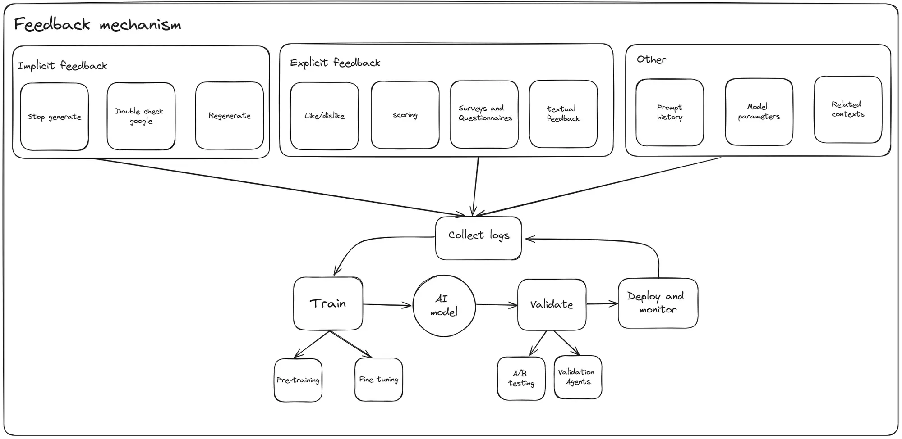
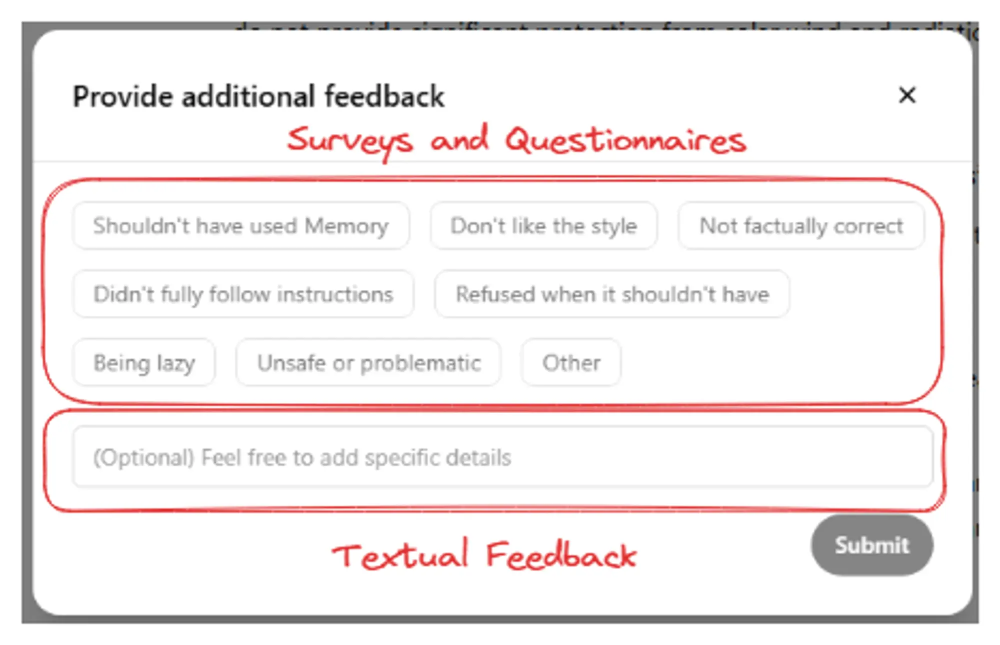

---
tags:
  - llm
  - feedback
  - mechanism
title: "Design feedback mechanism for LLM applications"
date: 2024-08-07
description: "Improving AI models requires collecting accurate user feedback,which can be difficult. The article explores more into the importance of collecting human feedback and discusses the need for creating an organized database to effectively store and use this valuable input. We hope to continuously improve our large language models, ensuring they deliver greater performance and match user expectations more effectively."
authors:
  - datnguyennnx
---

Getting consistent and accurate answers from LLMs is a major challenge. One effective strategy to address this challenge is incorporating a robust feedback mechanism within the app to collect user feedback. The memo will focus on how we collect logs of this feedback, showing how important it is to have a system for collecting input from users. It will also dive into how we design a database to safely store all this valuable feedback, making sure it's organized and useful for improving our models.

## Overview of Feedback mechanism
While we will dig into the details of feedback collection and its impact on LLMs, it’s better to understand the whole picture first. Here’s a step-by-step look at how we use feedback to make our models better:

1. **Collect Logs**: All interactions, implicit and explicit feedback, along with additional context like prompt history and model parameters, are logged.
2. **Train**: With this data, we can choose between fine-tuning and pre-training. Most human feedback will be trained with the RLHF method. 
3. **Validate**: The updated model is then validated through A/B testing and with validation agents to ensure the changes lead to improved performance.
4. **Deploy and Monitor**: The new model is deployed, and its performance is continuously monitored using the ongoing collection of user feedback.

## How User Feedback Improves AI: Implicit and Explicit Methods
### Implicit Feedback
Implicit feedback comes from how users behave when they interact with an AI model, without them directly telling us what they think. There are a few main ways we notice this:

1. **Stop Generate**: If users stop the AI from generating a response quickly, it usually means they don't like what it's saying or find it irrelevant. For example, if they read a few lines and feel it's not helpful, they might stop it.
2. **Double Check Response**: When users go to search engines to check information from the AI, it shows they might not trust what it said. This often happens if the AI gives answers that seem made up, especially with numbers or dates.
3. **Regenerate**: If users ask for a new answer, it means they didn't like the first one. They might use a button to get a different response when the first one doesn't meet their needs. For instance, they might want a better answer to the same question.

### Explicit Feedback
Explicit feedback involves users directly communicating their satisfaction or dissatisfaction with the AI’s responses. The methods include:

1. **Like/Dislike**: Users can give a thumbs up if they like the response or thumbs down if they don’t. This quick feedback helps us know how well the AI’s answers are working. For example, a thumbs up means they found it useful, while a thumbs down means it wasn’t helpful.
2. **Scoring**: Users can give a score to show how good they think the response is. This lets them give detailed feedback on whether the answer was great or just okay. For instance, a 5-star rating helps us see where the AI did well, and a 4-star rating shows areas for improvement.
3. **Surveys and Question**: These ask users specific questions about how well the AI is doing. They can give detailed feedback on what they like and what could be better. For example, a survey might ask about accuracy, how easy it was to use, and if the tone was right.
4. **Textual Feedback**: Users can write their thoughts on the AI’s responses. This lets them explain in detail what worked or didn’t work for them. For instance, they might say how a response helped with their work or where it missed the mark.

## Organizing User Feedback for LLM Application
After collecting user feedback, we'll organize the data using the schema below. This structured approach makes it easier to analyze and understand the feedback. By categorizing it properly, we can see exactly where improvements are needed. This organized data helps create datasets for fine-tuning or pretraining our large language models.

**chat_feedback table:**
- `id`  A unique identifier for each feedback entry.
- `thread_id`  Links the feedback to a specific conversation thread.
- `chat_id`  Identifies the particular message within the thread that the feedback refers to.
- `type_id`  Categorizes the type of feedback provided. We can define enum type_id for storing specify facts.
- `notes`  Allows users to add specific comments or details about their feedback.

**Relationships:**
- `chat_feedback.thread_id` references `threads.id`  This links feedback to the appropriate conversation thread, ensuring we can trace feedback back to the entire conversation context. When we need to load history chat, we can count total thumbs-up and thumbs-down user reactions there are.
- `chat_feedback.chat_id` references [`chats.id`](http://chats.id) This connects the feedback to the specific message. We can render history chat again, improving the user experience of specific chats.
- `chat_feedback.type_id` references `feedback_type.id` This categorizes the feedback, making it easier to analyze patterns and specific issues.

**feedback_type table:**
- `id` A unique identifier for each type of feedback.
- `name` A descriptive name for the feedback type.

We need to track user feedback by `chat_id` and `thread_id`, as well as `feedback_type` and `notes`. We will provide a selection to describe how users interact with the LLM response, which will be stored in `type_id`. We define the types of feedback in the feedback_type table, and we can define common facts for the user to easily choose.

Imagine you're chatting with a chatbot. If you receive a response that's too long, you can click the dislike button then select "Too long" from the feedback options and add a note explaining that the information could be more detailed. This feedback is saved in the system, linked to the specific `chat_id` and `thread_id`, and categorized under the "Too long" type. 

Let's say you're chatting with a bot to get some tips on baking a cake. You ask, "How can I make my cake fluffy?" Instead of giving you baking advice, the bot starts talking about the history of cakes, which isn't what you wanted. So, you hit the "stop" button because the response isn't relevant to your question. This action tells us the answer wasn't helpful or on-topic.

## What’s next
Collecting feedback creates a valuable dataset for later training step, using method like Reinforcement Learning from Human Feedback (RLHF). To understanding step by step using human feedback for fine-tuning large language model, you can found articles about [RLHF method](https://dwarvesf.hashnode.dev/challenges-faced-when-researching-rlhf-with-openassistant) then we go next step training human feedback at [here](). 

## Conclusion
By tracking interactions and analyzing feedback, we can keep improving the outputs to be more accurate and user-friendly. Understanding how to design a database to log the feedback will help us prepare good datasets for later training step.

## Reference
- [Evaluating LLM Outputs (cohere.com)](https://cohere.com/blog/evaluating-llm-outputs)
- [Human in the Loop feedback (orq.ai)](https://docs.orq.ai/docs/human-in-the-loop-feedback)
- [Human in the Loop - Machine Learning - Definition & Examples | Encord](https://encord.com/blog/human-in-the-loop-ai/#:~:text=What%20is%20HITL%3F-,Human%2Din%2Dthe%2Dloop%20(HITL)%20is%20an,%2C%20accuracy%2C%20and%20training%20outcomes.)
- [How to test LLMs in production? (leewayhertz.com)](https://www.leewayhertz.com/how-to-test-llms-in-production/#A/B-testing)