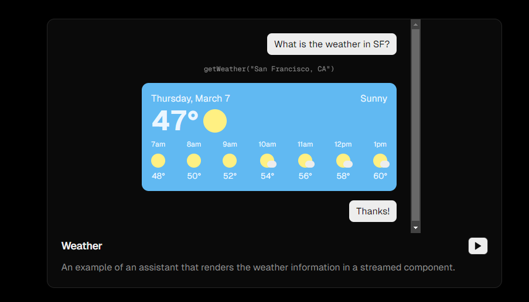
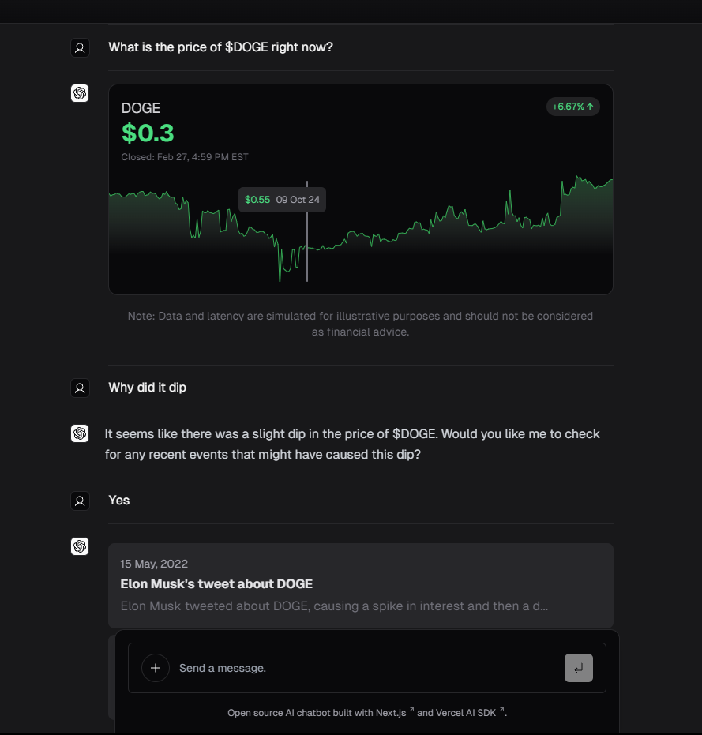
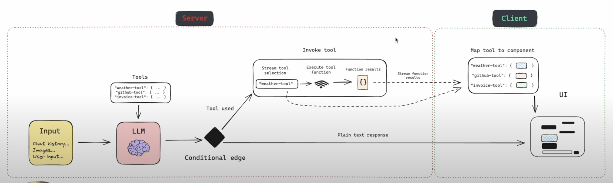
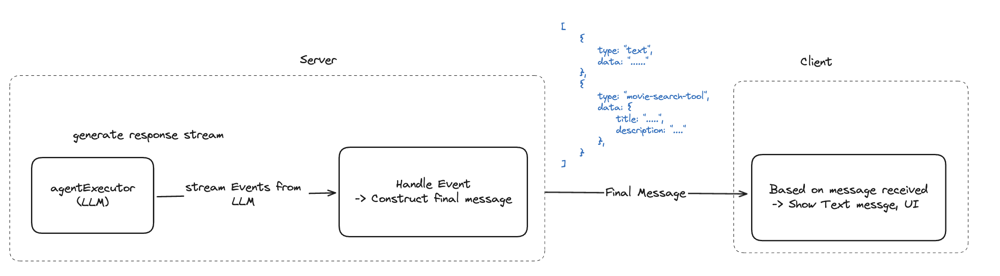
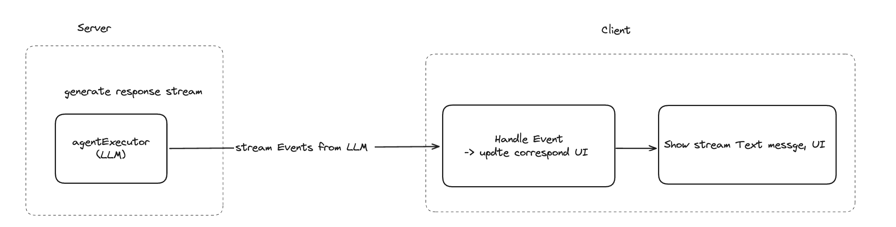

## What is Generative UI?
- A **generative UI** (genUI) is a user interface that responds to the user with AI-generated elements instead of just text messages.
- It offers a personalized experience based on the user's needs and context. Users can interact with this AI-generated interface and sometimes make requests through it.

### Examples


- Instead of generating text to tell you the weather in San Francisco, it will create a UI displaying all the information you need. This approach not only looks better but also delivers the information more effectively.



- In this case, when you ask about stock prices, a user interface will appear that lets you interact with it to view the price of Dogecoin at specific times. It can generate different types of UIs to deliver the information effectively.

## Benefits
- Enhances UI/UX when using chatbots.
- Generative UI allows for highly personalized, tailor-made interfaces that suit the needs of each individual.

## Popular Solution for Generative UI
### Vercel AI SDK
Currently, the most used solution is the Vercel AI SDK.

- Utilizes the `server component` to handle event streaming on the Next.js server instead of on the browser.
- Uses the `createStreamableUI` method to run on the Next.js server, creating a `Suspend-wrapped Component` that can respond to the browser immediately and trigger UI updates without client-side code.
- Here is the pseudo code that simply explains what it does under the hood.

#### Example
```tsx
// use server
const askGPT = async () => {
  const ui = createStreamableUI()(
    // invoke some task
    async () => {
      workflow = createAgentExecutor();
      // handle stream events from LLM
      for await (const streamEvent of (
        runnable as Runnable<RunInput, RunOutput>
      ).streamEvents(inputs, {
        version: "v2",
      })) {
        // handle event stream from LLM
        ui.update(<UI props={data} />);
      }
    }
  )();

  return ui;
};
```

```tsx
const Chat = () => {
  const [elements, setElements] = useState([]);

  const handleSubmit = (message: string) => {
    const ui = askGPT({
      message: message,
    });
    setElements([...elements, ui]);
  };

  return (
    <form
      onSubmit={() => {
        handleSubmit(inputValue);
      }}
    >
      {elements}
      <input />
    </form>
  );
};
```

### Pros:
- Easy to use; everything is provided, so you only need to import the function or copy the code to use it.

### Cons:
- Library is usable for Next.js with server component support.
- Poorly documented for Next.js’s Page Router; it is recommended for the App Router.

By observing the behavior of Vercel AI SDK, we came up with a general idea and 2 approches.

## General Idea
- [Video Explanation](https://www.youtube.com/watch?v=d3uoLbfBPkw&t=406s)



**Goal**

- The chatbot can respond to the user with both text and UI in the correct order.
- The chatbot should understand the responded UI.
- The approach should be implementable on any web technology.

**Idea**

- Langchain-supported tool that allows LLM to detect which agent to take action (given the description, defined parameters) ⇒ On each tool, define the corresponding UI component to render when it triggers
- LLM supports streaming responses. There are two approaches:

### Approach 1


- The message will be constructed in the backend based on all event received, when it's complete, the message will be sent to the frontend

```tsx
// Example final message
[
  {
    type: "text",
    data: "......",
  },
  {
    type: "movie-search-tool",
    data: {
      title: ".....",
      description: "....",
    },
  },
];
```

### Approach 2


- Directly forward stream events to the frontend to handle using (HTTP Streaming, Server-Sent Events, WebSocket, etc.)
- After a tool is done, include the tool result data in the chat history to help the chatbot understand the context.

### Handle event flow
Below is an example for handling event stream generated during LLM processing with langchain.


## References
- [What is GenerativeUI?](https://www.nngroup.com/articles/generative-ui/)
- [Vercel AI SDK RSC](https://sdk.vercel.ai/docs/reference/ai-sdk-rsc)
- [Vercel AI SDK RSC: createStreamableUI()](https://sdk.vercel.ai/docs/reference/ai-sdk-rsc/create-streamable-ui)
