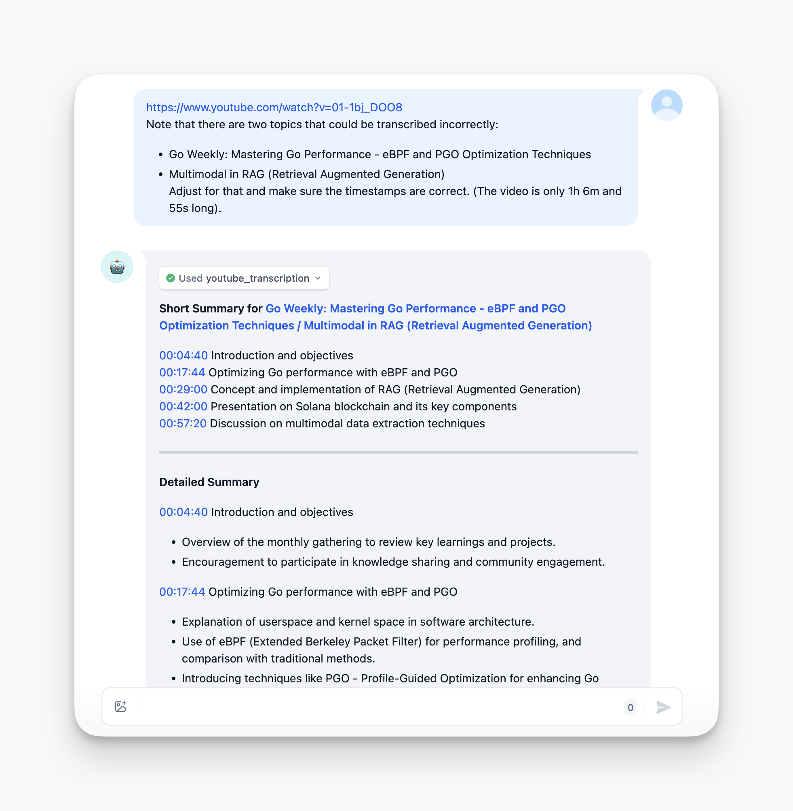
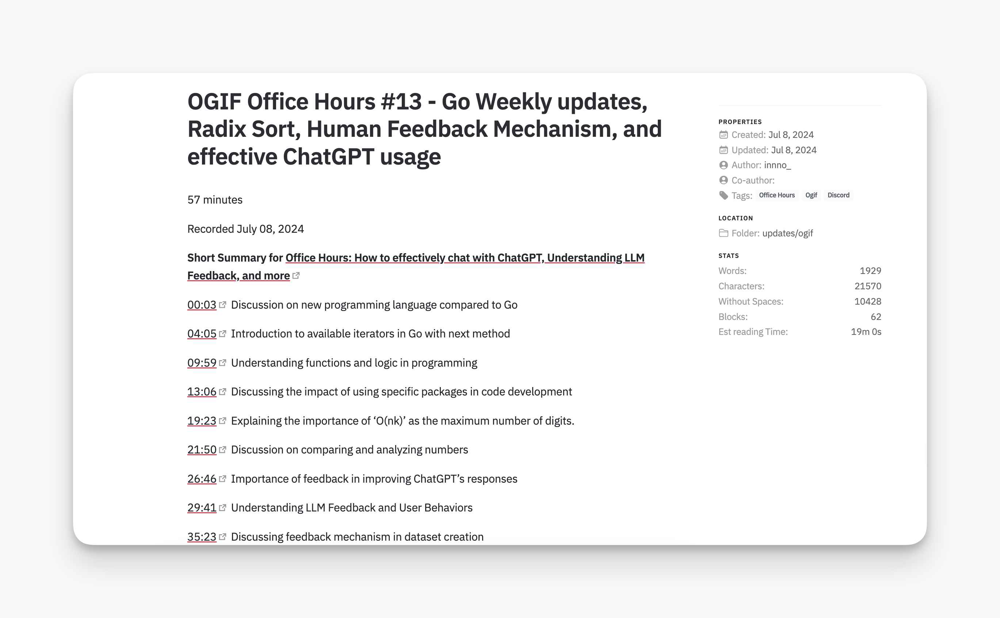
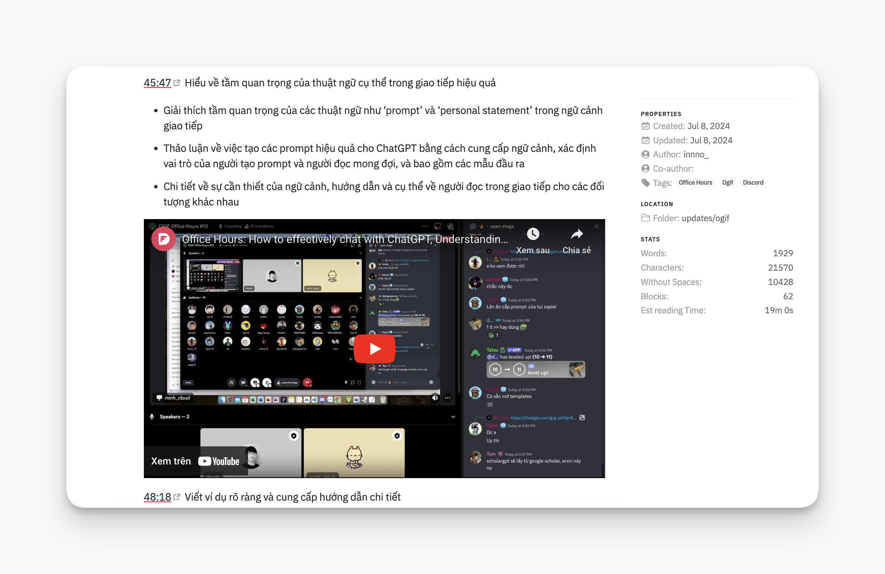
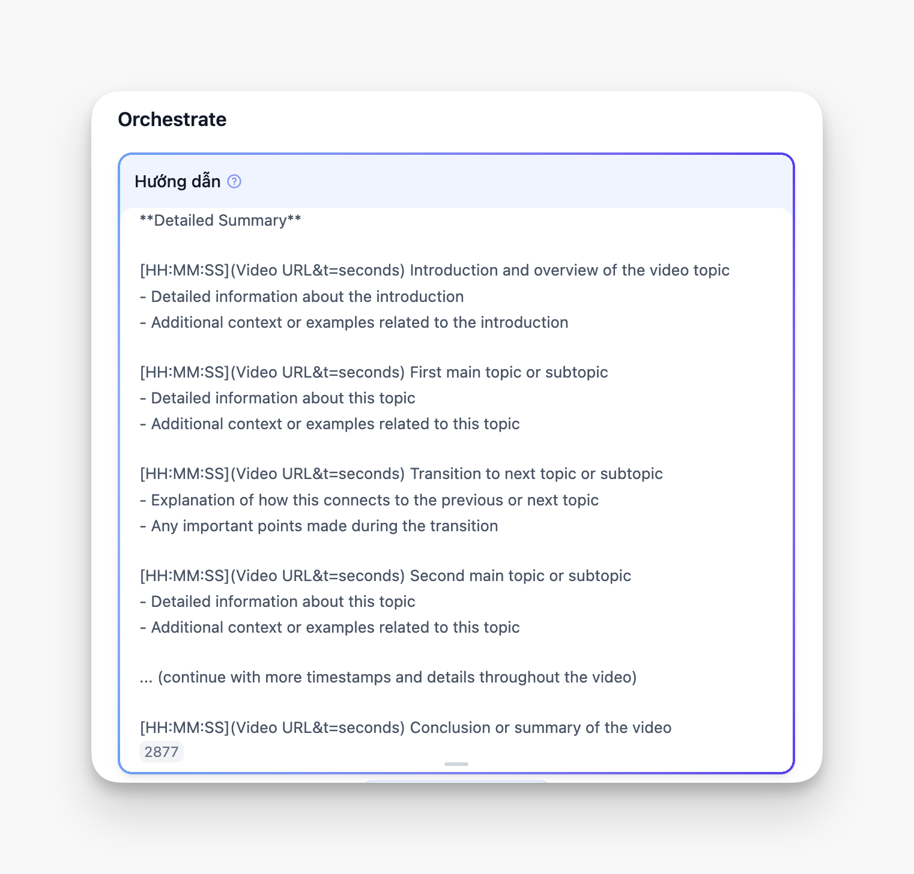

### What’s OGIF?
OGIF stands for "Oh God It’s Friday." It’s our weekly Friday tradition where members share 10-minute talks. The team hops on Discord to share and discuss diverse topics like software development, engineering patterns, industry trends, finance, entrepreneurship, blockchain, AI, and a mix of other cool stuff. It’s a quick, engaging way to learn something new.

We value the importance of sharing our work with other people at Dwarves. And it's a chance for people who don't work directly on development to feel included in the process.

### Meet the OGIF memo summarizer
Working in collaboration with my colleague @innno_, we crafted a chatbot using Dify. This bot transcribes YouTube videos and extracts key points from our OGIF sessions. The result? A major boost in our ability to review and reference the knowledge shared during these meetings.

### How it works?
**YouTube Transcription**: We integrated a YouTube transcription workflow as a function-calling tool for our chatbot.

**Intelligent Summarization**: The chatbot generates structured summaries from the transcribed content using a well-designed prompt.

**Three-Tier Summary Structure**:

1. **Short Summary**: 3-5 key timestamps with brief descriptions of the most important topics.
    
  
    
2. **Detailed Summary**: Comprehensive timestamps, each with 2-3 bullet points providing in-depth information.

  

3. **Languages:** The summary is available in both English and Vietnamese.

  

### The prompt
The core of our summarizer is the prompt we’ve meticulously designed. Here’s what it does:

- Generates structured summaries with accurate timestamps.
    
    
    
- Creates clickable links to specific points in the video.
- Offers both a quick overview and detailed insights.

 

- Maintains consistent formatting for easy reading.
- Provides a comprehensive overview of the video content.

### Benefits
- **Time-Saving**: Team members can quickly grasp the main points of a session without watching the entire video.
- **Easy Navigation**: Clickable timestamps for swift access to specific topics of interest.
- **Knowledge Retention**: The structured summary serves as a reliable reference for future use.
- **Improved Accessibility**: Makes the session content more accessible to team members who couldn’t attend live.

### What’s next?
We’re always looking to enhance our OGIF Memo Summarizer. Some future ideas include:

- Integrating automatic tagging for easy topic categorization.
- Implementing a search function across multiple summaries.
- Creating a visual timeline of topics discussed over multiple sessions.

### Wrapping up
The OGIF Memo Summarizer has improved our weekly knowledge-sharing sessions. Using AI, we've made a system that saves time and enhances the value of our Friday office hours.

We recommend other teams try similar tools to streamline their knowledge-sharing. In software engineering, efficient learning and sharing information can give you a big advantage.

Happy coding and happy sharing.