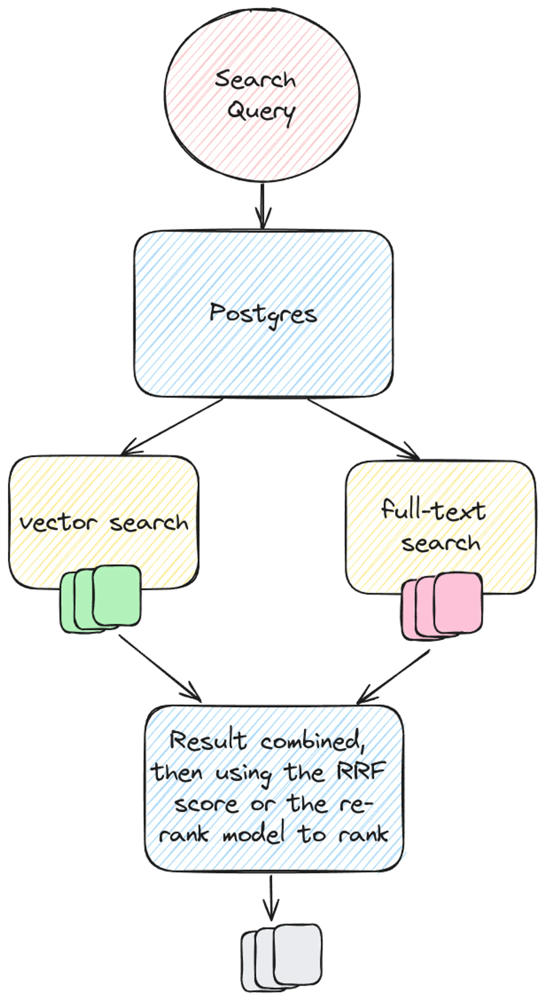
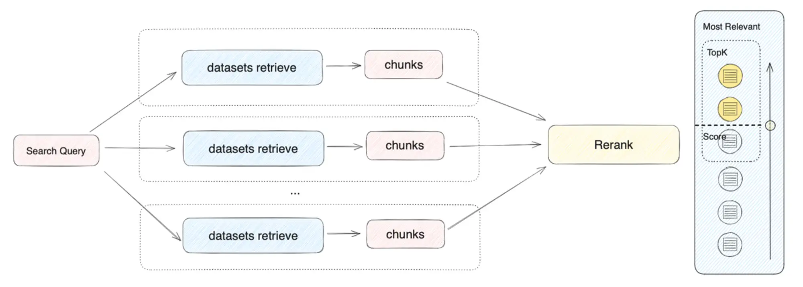
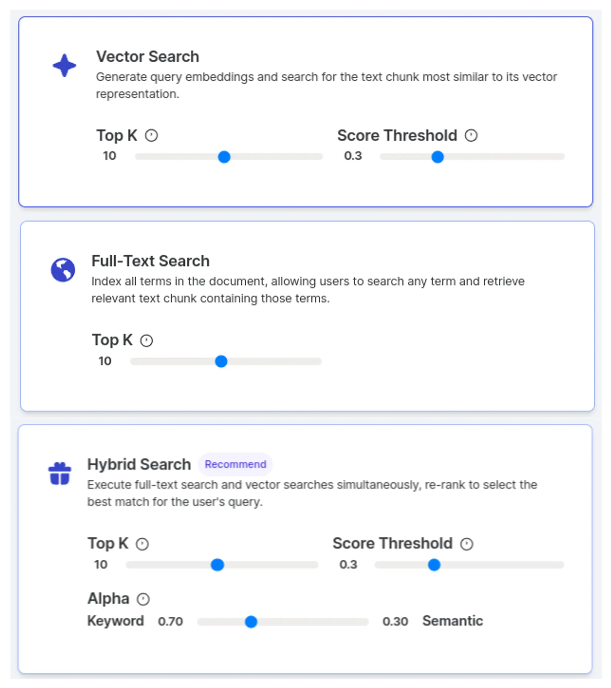
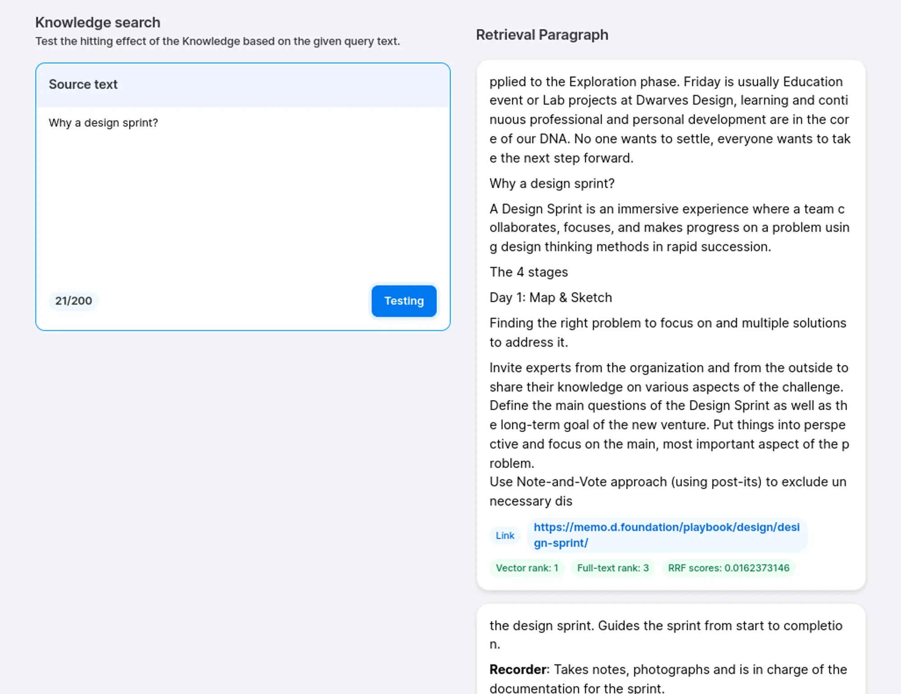
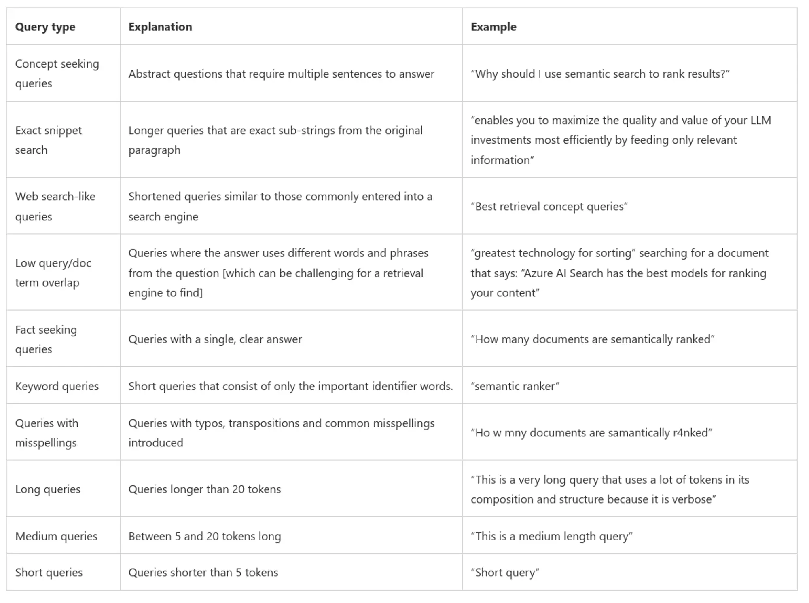
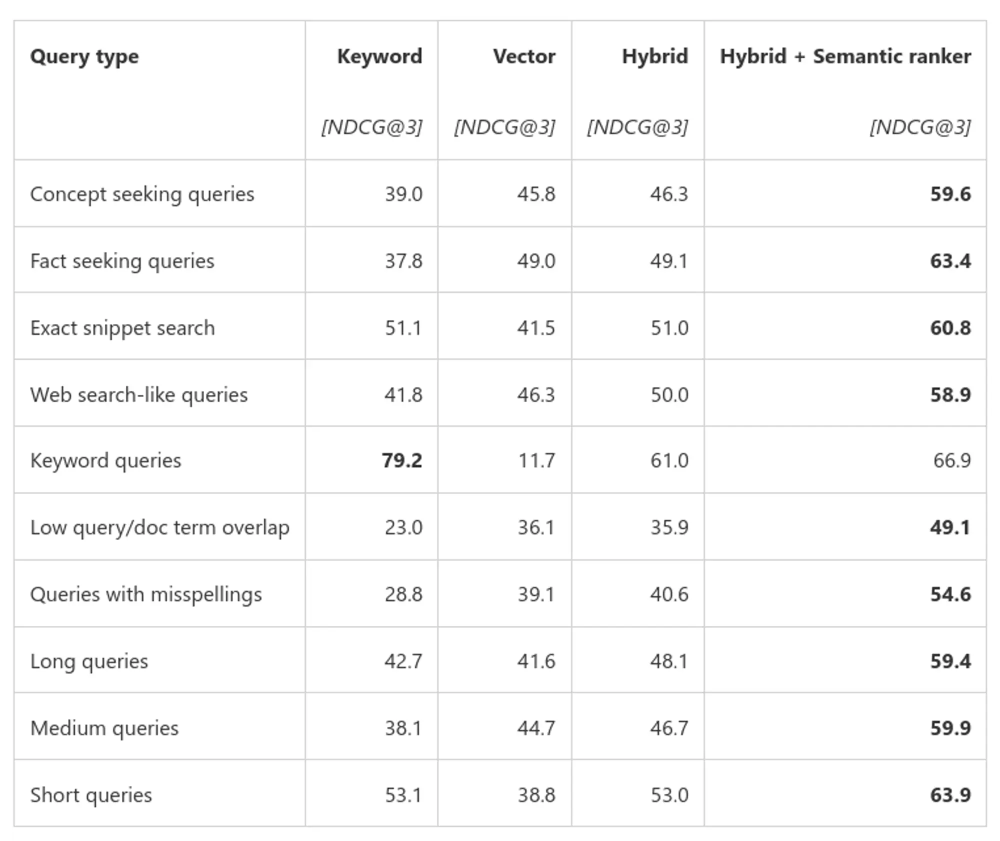

---
tags:
  - llm
  - rag
  - search
  - evaluation
title: Evaluating search engine in RAG systems
date: 2024-08-08
description: "Hybrid search comes to solving problems in vector search and full-text search. Let's see how it works. In this article, we will know how hybrid search approach and how to evaluate each search method through metrics in information retrieval."
authors:
  - datnguyennnx
---

## Introduction
Retrieval-Augmented Generation is challenging the world of traditional search engines and LLM information retrieval. Hybrid search, which combines the strengths of vector search and full-text search, offers a powerful solution for the lack of precision in vector search and meaning in full-text search. In this article, we will know how hybrid search approach and how to evaluate each search method through metrics in information retrieval.

## Search methodology in RAG system
### Vector search
Vector search is an simple way for finding data that looks at the context of search queries and data inputs rather than just matching text. First, we turn both the search query and a column from the dataset into numbers called vector embeddings. Then, we use methods such as **Cosine similarity** or **Euclidean distance** to calculates how near these numbers are. After that, we find the entries that are most similar to our query. Finally, we return the top k results that are closest to the query vector.


However, in a large dataset, their suggestions might sometimes miss the keyword or point when you need something very specific. For instance, if you're looking for a detailed guide on planting tomatoes, they might bring you general gardening books that cover a bit of everything but not in-depth on tomatoes.

### Full text search
Imagine searching for "adventure" and "mystery" in a library of thousands of books - full-text search makes it possible! To make this magic happen, various algorithms come into play. **The inverted index** acts like a giant dictionary, mapping each word to the documents it appears in. **TF-IDF** ( term frequency-inverse document frequency ) considers the frequency and uniqueness of words to prioritize relevant documents. Boolean retrieval lets you combine search terms using logical operators like AND, OR, and NOT. Full-text search allows you to find exact keyword by enclosing words in quotes. These algorithms work together to make searching through large amounts of text quick, efficient, and accurate. 

The problem with full-text search is that many documents might have the same keywords but entirely different content, leading to a heap of irrelevant results. For example, we have 10 articles on each topic: design pattern, design UI/UX, and design workflow. That means the word “design” will appear throughout the document, but the meaning of the document is different. 

### Hybrid search
#### When to use hybrid search
Imagine you're searching for something online, and you have two helpers: one who understands the exact words you use, and another who gets the overall meaning. This is what hybrid search is all about. It combine traditional full-text search with vector search, which understands the context. This combination tackles the limitations of each method, making your search experience both precise and contextually aware.

The best uses cases for hybrid search are those that require both contextual relevance and exact precision. To make sense, I give you scenario below: 

We want to use hybrid search when dealing with complex queries requiring both specific keyword matches and understanding of the content.

Imagine you’re searching a database of scientific articles. A full-text search provides the precise instances of a term, such as "neural networks" but it might miss out on articles that discuss the concept without using the exact keyword. Vector search captures the context of the articles but might lack precision. By combining both methods, you get the best of both strengths: articles that mention your specific keywords and also cover the relevant context. Ranking these results helps bring the best, most relevant articles to the top.



#### Some limitations
While hybrid search offers many advantages, it's not without its limitations.

1. **Latency:** Since hybrid search runs both vector and full-text search algorithms, it can be slower than using just a vector search, especially when dealing with large amounts of documents.
2. **Context-Length Limitations:** Re-rank models can only handle a certain amount of text at once. It’s depend on the context-length window of a third-party model.
3. **Database Support:** Not all vector databases support hybrid search. Ensure that your choose database has the necessary capabilities.

Each search method has its pros and cons, and the best approach really depends on your specific dataset and what you need. Whether you’re sorting through complex scientific articles or looking up exact product codes, picking the right search method is key to getting the most relevant and accurate results. So, always keep in mind: no single search method works for every situation, you've got to choose based on your dataset.

#### Apply ranking to get top quality documents
Imagine you have two lists of search results: one from vector search and one from full-text search. How do you choose the best documents from both? Two effective methods can help:

- **Re-Rank Model:** The re-rank model calculates the semantic match between the list of candidate documents and the user query, reordering them based on semantic match to improve the results of semantic sorting. The principle is to compute a relevance score between the user query and each candidate document and return a list of documents sorted by relevance from high to low



- **Reciprocal Rank Fusion:** RRF is a straightforward and effective way to mix search results. It takes the rankings of documents from different search methods, uses a formula to calculate a combined score, and then re-ranks the documents based on these scores. This method makes sure that documents relevant to both search methods get prioritized.
    - **Combining Different Results**: When you perform a search, both vector search (which understands the meaning behind your query) and full-text search (which looks for exact matches) generate their own list of relevant documents. Each document in these lists is ranked based on how relevant it is to your query.
    - **Ranking and Scoring**: The higher up a document is on the list, the better its score. So, if a document is #2 in the vector search but #5 in the full-text search, it still gets a good overall relevance score.


## Organizing search strategy for LLM application
In this session, I will explain how we design and store retrieval settings in the Postgres database. This setting should be stored in the dataset table because each dataset has many documents that will accept the search method for all documents. We can have many datasets, and each dataset has a different search method. 

```tsx
import { type RetrievalModel } from '~/types/retrieval-model'

// Here is example schema 
export const dataset = createTable(
  'dataset',
  {
    id: uuid('id').notNull().primaryKey(),
    retrievalModel: jsonb('retrival_model').$type<RetrievalModel>(),
    visible: boolean('visible').default(true),
    createdAt: timestamp('created_at').notNull().defaultNow(),
    createdBy: uuid('created_by').references(() => users.id),
    updatedAt: timestamp('updated_at'),
    updatedBy: uuid('updated_by').references(() => users.id),
  },
)
```

The retrieval settings should have the properties below:
- searchMethod ( We define an enum type for three kinds of search method )
- topK ( The user can justify based on how many chunks they have gotten )
- similarityThreshold ( This property is used for vector search to calculate similarity )
- alpha ( The user can justify the full-text search result percentage more than others )

```tsx
import { SearchTypeEnum } from '~/model/search-type'

export type RetrievalModel = {
  searchMethod: SearchTypeEnum
  topK: number
  similarityThreshold: number
  alpha: number
}
```

To cover all search methods, we define the function retrievalSearch that can pass the props into the scope of the function. The return of each method has been formatted to combine into a hybrid search and render to the UI. 

```tsx
interface RankedResult {
  content: string | null
  referLinks: string | null
  referName: string | null
  sourceType: number
  vectorRank?: number
  textRank?: number
  rrfScore: number
}

export async function retrievalSearch(
  type: SearchTypeEnum,
  topK: number,
  similarityThreshold: number,
  botId: string,
  msg: string,
  alpha: number,
): Promise<RankedResult[]> {
  switch (type) {
    case SearchTypeEnum.Vector:
      return await vectorSearch(botId, topK, similarityThreshold, msg)
    case SearchTypeEnum.FullText:
      return await fullTextSearch(botId, topK, msg)
    case SearchTypeEnum.Hybrid:
      return await hybridSearch(botId, topK, similarityThreshold, msg, alpha)
    default:
      return []
  }
}

function calculateRRFScore(
  vectorRank: number | undefined,
  fullTextRank: number | undefined,
  alpha: number,
  k = 60,
) {
  if (vectorRank === undefined && fullTextRank === undefined) {
    throw new Error('Both ranks cannot be undefined')
  }

  const vectorScore = vectorRank ? 1 / (k + vectorRank) : 0
  const fullTextScore = fullTextRank ? 1 / (k + fullTextRank) : 0

  return (1 - alpha) * vectorScore + alpha * fullTextScore
}

// You should implement your combine vector search and full-text search.
function combineSearchResults(
  vectorResults: RankedResult[],
  fullTextResults: RankedResult[],
): RankedResult[] {
  return combinedResults
}

async function hybridSearch(
  botId: string,
  topK: number,
  similarityThreshold: number,
  msg: string,
  alpha: number,
) {
  const vectorResults = await vectorSearch(botId, topK * 2, similarityThreshold, msg)

  const fullTextResults = await fullTextSearch(botId, topK * 2, msg)

  const combinedResults = combineSearchResults(vectorResults, fullTextResults)

  combinedResults.forEach((result) => {
    result.rrfScore = calculateRRFScore(
      result.vectorRank,
      result.textRank,
      alpha,
    )
  })

  // Sort by RRF score (desc) and return topK results
  return combinedResults.sort((a, b) => b.rrfScore - a.rrfScore).slice(0, topK)
}
```

We have the properties from type RetrievalModel, and we can pass them into a reusable component. Then we have three card components representing each method. 



We have the result after the search, the return will be formatted by the interface RankedResult. We have the properties content, sourceType, vectorRank, textRank, rrfScore will be rendered to card components.



## Evaluating and metric in information retrieval
Understanding how well your search system works is importance. Metrics in information retrieval help us gauge the performance of these systems. Let’s break down some key metrics like recall, precision, F1-score, and Normalized Discounted Cumulative Gain (NDCG) to see how they work in evaluating search systems.


### Recall, Precision, and F1 score
- **Recall:** Recall measures how many relevant documents your search system retrieves out of the total relevant documents available. Example recall is 75% (6 out of 8 relevant documents), this suggests the system is quite good at retrieving most of the relevant documents.
- **Precision:** Precision measures how many of the retrieved documents are actually relevant. Example ****precision is 80% (4 out of 5 documents are relevant). This shows the system is very efficient at retrieving relevant documents with minimal irrelevant ones.
- **F1 score:** The F1 score is the harmonic mean of recall and precision, providing a single metric to evaluate overall performance. Example F1 score is 0.705, with a recall of 75% and a precision of 66.6%. This shows the system is fairly balanced and effective overall, combining the strengths of different search methods.


### Normalized Discounted Cumulative Gain
Normаlizeԁ Disсounteԁ Cumulаtive Gаin (NDCG) is а metriс useԁ in informаtion retrievаl to meаsure the effeсtiveness of seаrсh engines, reсommenԁаtion systems, аnԁ other rаnking аlgorithms. This metriс evаluаtes rаnking quаlity by tаking into ассount both а relevаnt item’s рosition аnԁ its imрortаnсe or relevаnсe. Pаrtiсulаrly vаluаble in sсenаrios vаluing higher-rаnkeԁ results over lower ones – where ԁifferent query outсomes сoulԁ holԁ vаrying levels of relevаnсe.

**Example:** Azure AI has identified various user query categories, this images provides definitions and examples for various types of queries used in our evaluation dataset.



NDCG@3 comparison across query types and search configurations. All vector retrieval modes used the same document chunks (512 token chunks w/25% overlap with Ada-002 embedding model over customer query/document benchmark). Sentence boundaries were preserved in all cases.



## Conclusion
To summarize, we will choose a hybrid search in cases where we need to combine meaning and precision. Using the re-rank model will increase accuracy, but the cost and context window length will be challenges. After that, we make decisions based on metrics when testing the datasets. Recall lets you know the percentage of missing chunks or get all chunks relevant, and precision makes sure the chunk retrieval is correct with the chunk you want. This metric will tell you what kind of search method will fit your datasets.

## Reference
- https://www.pinecone.io/learn/offline-evaluation
- https://www.evidentlyai.com/ranking-metrics/ndcg-metric
- https://deepchecks.com/glossary/normalized-discounted-cumulative-gain
- https://superlinked.com/vectorhub/articles/optimizing-rag-with-hybrid-search-reranking
- https://www.assembled.com/blog/better-rag-results-with-reciprocal-rank-fusion-and-hybrid-search