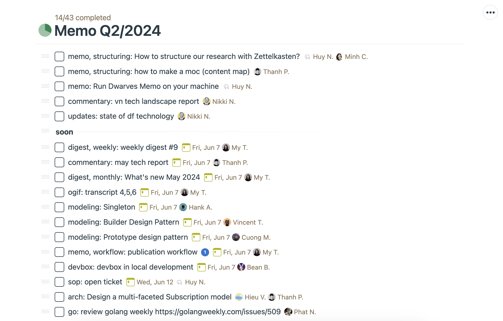
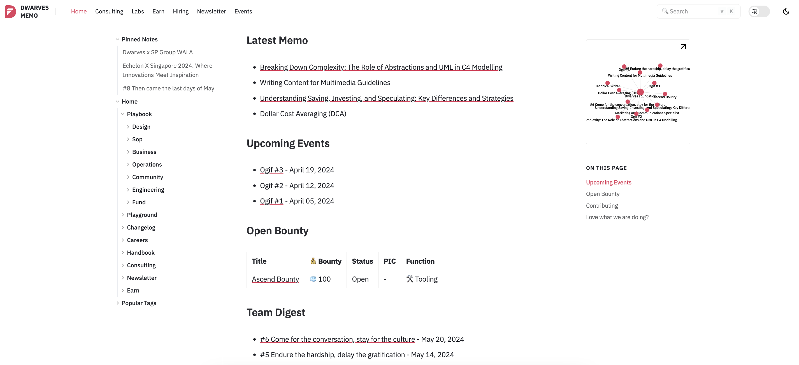
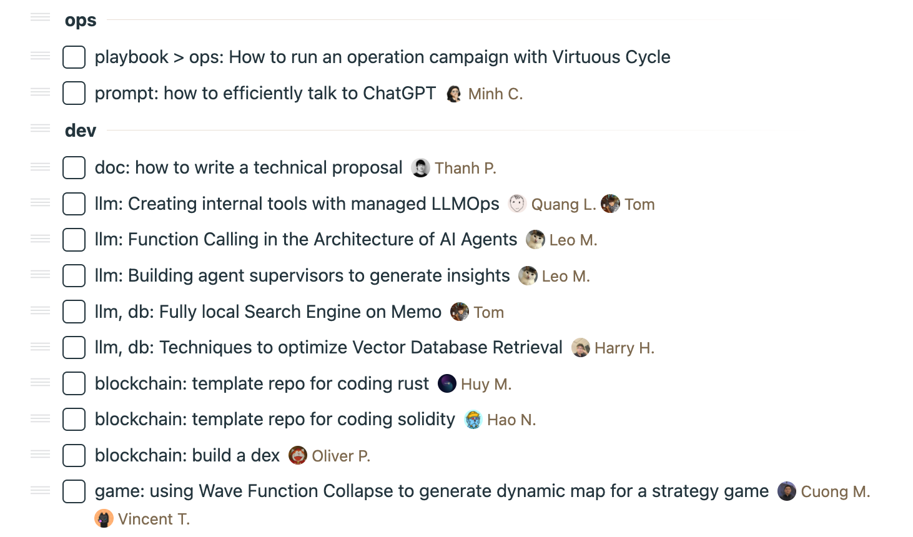
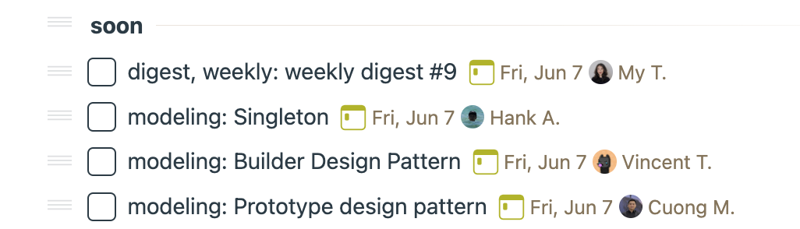

---
tags:
  - memo
  - instructions
  - guideline
title: Memo Knowledge Base Meeting
date: 2024-06-20
description: Here are the simple steps we follow each week to keep the Memo content pipeline organized and our team informed. 
authors:
  - innno_
---
### Memo knowledge base meeting
Memo is our team's wiki on how we work, learn, operate the team at Dwarves. It's a one-stop shop for all things Dwarves, written by us for fellow craftsmen.

Here are the simple steps we follow each week to keep the Memo pipeline organized and our team informed. 

### Sort out Memo Content
- Check all memos to-do lists in Basecamp and ensure the content pipeline is up to date.

- Prepare a quick update on any changes or new info.
- Share this update in our Friday meeting.
- Make sure [memo.d.foundation](http://memo.d.foundation) >  ``Home``shows the latest content.

### Basecamp Memo To-Do List
- Assign each cluster to the relevant team member, and make sure everyone knows their responsibilities.

- If content needs to be done soon, move it to the ``Soon``. This section includes articles that are prioritized for upcoming publication.
- Keep the to-do list in ``Soon`` less than 10 items.
- Focus on the most important tasks first and meet the deadline.

### Map of Content
- Develop and sort out your content map to track existing content, what needs updating, and what new content is planned. e.g: [df-topic](https://docs.google.com/spreadsheets/d/1HzCwXFrWkaCQoYXaZsHnb-Qge6kJEPoSDLVRULJKREc/edit#gid=0).
- Check out this guide to create [map of content.](https://memo.d.foundation/playground/01_literature/how-to-make-a-moc/)

By sticking to the checklist each week, we can ensure our memo is in the loop, and our projects stay on track.