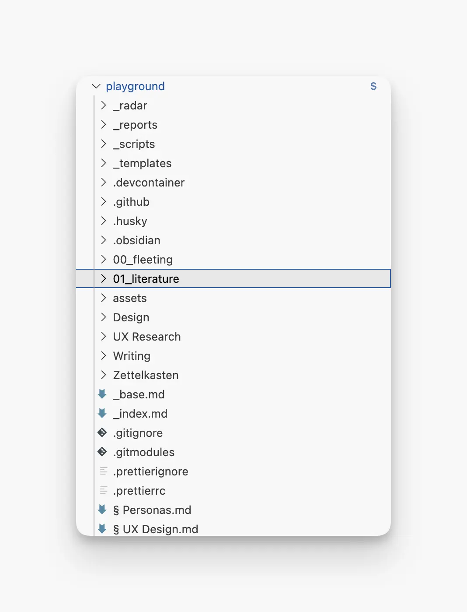
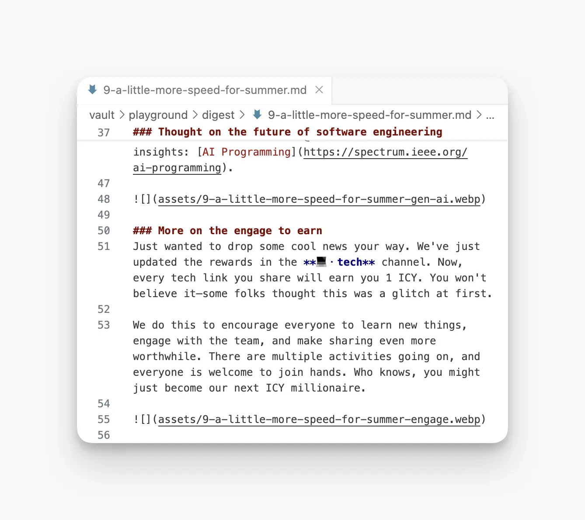

---
tags:
  - instructions
  - guideline
  - memo
title: Memo Publication Workflow
date: 2024-06-12
description: This guide will help you step-by-step create content and publish on memo. 
authors:
  - minh
  - innno_
menu: playground
toc: false
notice:
type: instructions
event_date:
pinned:
hide_title: false
---

### Choosing the right directory for the right topic

The first thing is to determine the field that you’re writing in. Whether you're interested in writing about blockchain, communication, design, engineering, market, security, or writing there's a directory for you in `playground`.

If you’re unsure where your content fits, just message our supporters on Discord for guidance.

### Writing your content

- To set up your local environment for writing a memo, check out [this guide](https://memo.d.foundation/playground/01_literature/how-to-set-up-environment-for-editing-memo/).
- To learn how to write, submit, and publish your memo, see [this guide](). Before you start, ensure each article includes these **mandatory fields**: title, description, author, date, and tags.

- Name your files using kebab case, e.g: [how-to-write-a-memo.md](http://how-to-write-a-memo.md/).
- Verify all links in your article by running the repository locally.
- Upload any images to the `assets` folder and reference them accordingly.
- For image and screenshot guidelines in your article, refer to [this guide](https://memo.d.foundation/playground/01_literature/how-to-take-better-screenshots-on-mac/).

### Review process

After writing your article, let a reviewer know if it's a draft or the final version.

- For content: Our experts will review and improve your work. For example, @tom handles engineering, and @nikki focuses on communications.
- For format and design: @anna oversees the visual and structural aspects. Once you're done, take a screenshot, upload it to our server, and ping @anna for her feedback.

### Feedback

Gather all of the feedback, and work on them. For detailed instructions, read the article [Life cycle of a publication](https://memo.d.foundation/playground/01_literature/lifecycle-of-a-publication/).
