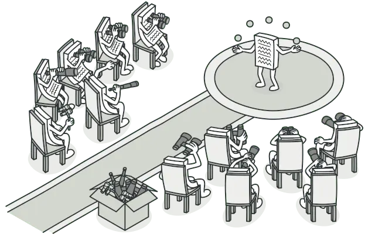

---
tags:
  - design-pattern
  - listener
  - event-subscriber
  - observer-pattern
title: "Introduce the Observer pattern and its use cases"
date: 2024-07-12
description: "Concept of the Observer Pattern with its pros and cons."
authors:
  - hienld
---




## Problem

Imagine that you have two types of objects: a Customer and a Store. The customer is very interested in a particular brand of product (say, it’s a new model of the iPhone) which should become available in the store very soon.

The customer could visit the store every day and check product availability. But while the product is still en route, most of these trips would be pointless.


On the other hand, the store could send tons of emails (which might be considered spam) to all customers each time a new product becomes available. This would save some customers from endless trips to the store. At the same time, it’d upset other customers who aren’t interested in new products.

It looks like we’ve got a conflict. Either the customer wastes time checking product availability or the store wastes resources notifying the wrong customers.

## Concept of the Observer Pattern

### Definition

The Observer pattern is a design pattern where an object, known as the subject, maintains a list of its dependents, called observers, and notifies them of state changes.

### Real-World Analogy

If you subscribe to a newspaper or magazine, you no longer need to go to the store to check if the next issue is available. Instead, the publisher sends new issues directly to your mailbox right after publication or even in advance.

The publisher maintains a list of subscribers and knows which magazines they’re interested in. Subscribers can leave the list at any time when they wish to stop the publisher sending new magazine issues to them.

## Examples

### DOM Events and Event Listeners

In the browser, we use the Observer pattern through DOM events. The DOM element is the subject, and event listeners are the observers.


```js
button.addEventListener('click', () => {
  console.log('Button clicked!');
});
```

### Custom Event Emitters

We can create our custom event emitters to decouple code and enhance modularity.

```js
const EventEmitter = require('events');
const emitter = new EventEmitter();
       
emitter.on('event', () => {
  console.log('An event occurred!');
});

emitter.emit('event');
```

In this example, `emitter` is the subject. When we emit the event, all registered observers get notified.

### Redux: Leveraging the Observer Pattern

Redux is a state management library that uses the Observer pattern under the hood.
The Redux store is the subject, and components that subscribe to the store are the observers.


```js
const { createStore } = require('redux');
       
const reducer = (state = {}, action) => {
  switch (action.type) {
    case 'UPDATE':
      return { ...state, data: action.payload };
    default:
      return state;
  }
};

const store = createStore(reducer);

store.subscribe(() => {
  console.log('State changed:', store.getState());
});

store.dispatch({ type: 'UPDATE', payload: 'new data' });
```

Here, the store dispatches actions, and subscribed components get notified to update their state.

## Pros & Cons

Pros:

- Loose Coupling: Reduces dependencies between subject and observers, making the system easier to maintain and extend.
- Automatic Updates: Observers are automatically notified and updated when the subject's state changes, keeping them in sync.
- Reusability and Flexibility: Observers and subjects can be reused independently. New observers can be added without modifying the subject.
- Event Handling: Provides a structured way to handle events and notify interested parties.
- Simplifies Communication: Abstracts the notification mechanism, simplifying communication between objects.

Cons:

- Potential for Memory Leaks: If observers are not properly unregistered, they can lead to memory leaks.
- Unexpected Updates: Observers may receive updates at unexpected times, leading to potential race conditions or inconsistent state.
- Performance Overhead: Notifying all observers can introduce performance overhead, especially if there are many observers or complex notifications.
- Complexity in Simple Scenarios: Can introduce unnecessary complexity for simple applications.
- Difficulty in Debugging: Tracking the flow of notifications and understanding the sequence of updates can be challenging.

## Reference
- https://refactoring.guru/design-patterns/observer
