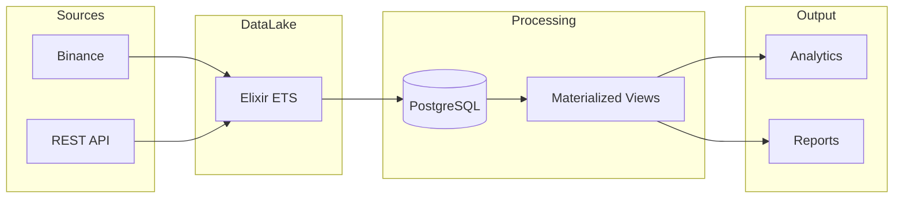
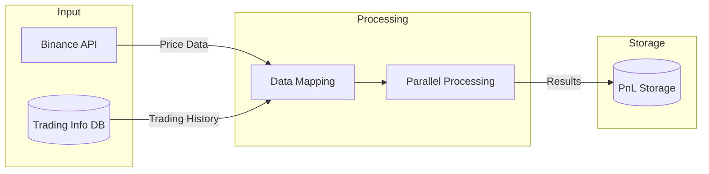
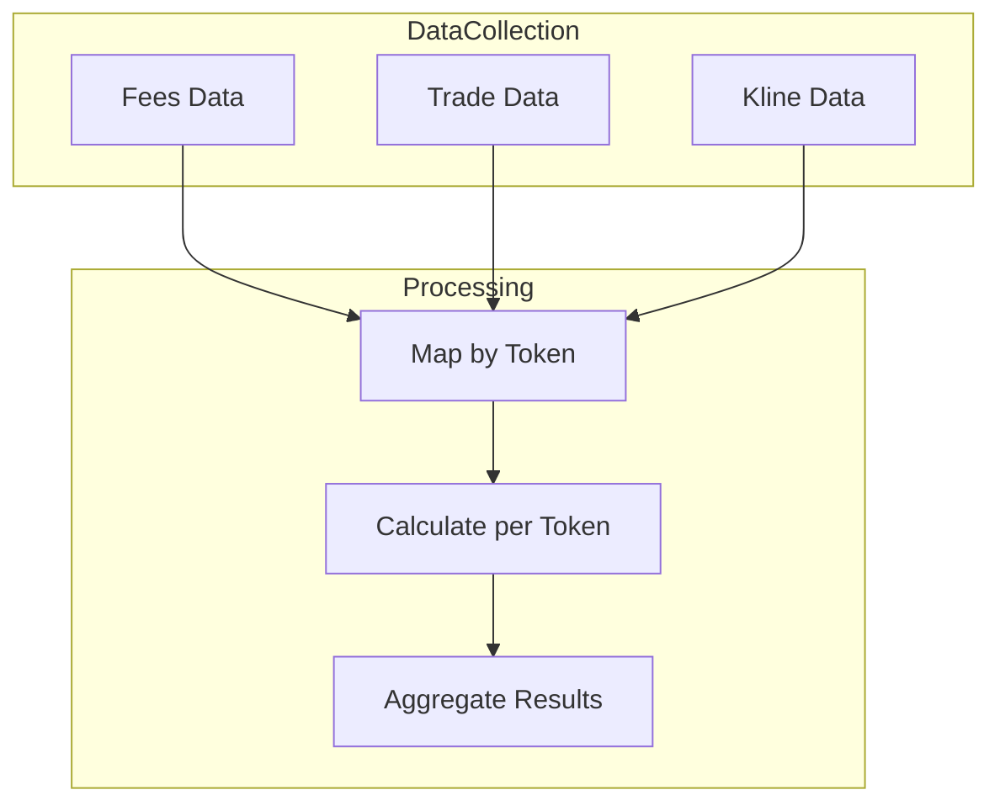
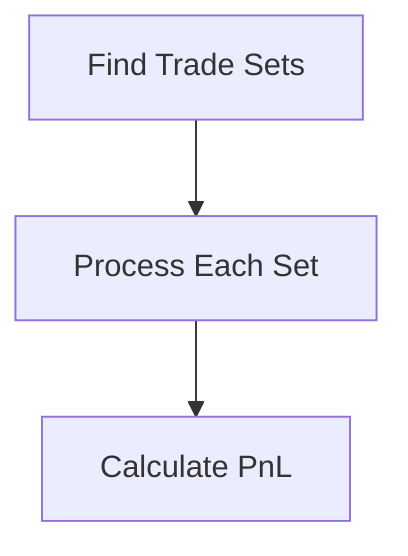

## Executive Summary

Recovering historical trading profit and loss (PnL) data is a critical challenge for finance and cryptocurrency platforms. When historical records are unavailable, users cannot validate past trading strategies, assess long-term performance, or reconcile discrepancies. This blog details how I tackled this problem by transforming a technically daunting challenge into a robust, maintainable data pipeline solution.

---

## Background and Context

### What is Trading PnL?

In trading, **Profit and Loss (PnL)** represents financial outcomes:
- **Realized PnL**: The actual profit or loss from completed trades.
- **Unrealized PnL**: The potential gain or loss from open positions.

For instance, when you close a Bitcoin position at a higher price than you entered, your realized PnL reflects the profit after fees. If the position is still open, unrealized PnL tracks potential outcomes as prices fluctuate.

### Why Does Historical PnL Matter?

Historical PnL data provides traders with:
1. **Performance Insights**: Understanding which strategies worked and which didn’t.
2. **Compliance and Reporting**: Regulatory or internal needs often require accurate historical data.
3. **Strategy Validation**: Testing new algorithms against past market conditions relies on accurate PnL records.

### The Problem at Hand

While designing a trading PnL chart for my platform, a significant gap emerged: historical PnL data for certain periods was missing. The existing system calculated PnL in real-time but didn’t store intermediary data, making reconstruction impossible without extensive changes to the codebase.

---

## The Challenge

> “How can we reconstruct historical trading PnL data efficiently when the original records no longer exist?”

This question encapsulated two core issues:
1. **Data Loss**: Real-time calculations discarded intermediary steps, leaving gaps in historical records.
2. **System Complexity**: The platform’s codebase, written in Elixir, was intricate, tightly coupled, and unfamiliar to me.

Moreover, the system’s reliance on multiple data sources (trades, market prices, fees) and the sheer volume of transactions compounded the problem.

---

## Technical Requirements

To reconstruct PnL, the following were essential:
- **Historical Trade Data**: Information about each executed trade, including sizes, directions, and timestamps.
- **Market Prices**: Historical price data to calculate unrealized PnL.
- **Fee Details**: Trading commissions, funding rates, and other costs affecting PnL.
- **Efficient Processing**: Handling massive datasets without overloading system resources.

---

## System Analysis

### From Complex Code to Data Flows

Instead of delving into intricate application logic, I reimagined the system as a series of **data flows**, where data is ingested, transformed, and stored across multiple layers. Below is the existing flow:



- **Data Sources**: Trading data originates from Binance (market data, trades) and a REST API.
- **Temporary Storage**: Elixir ETS stores raw data temporarily before processing.
- **Transformation**: Postgres stores normalized data, which is further refined using materialized views for specific use cases.
- **Outputs**: Processed data powers analytics and reporting tools.

### Reconstructing the Flow

From the above flow of data, we can easily determine which parts of the flow we should reproduce to find the old PnLs. 
- Firstly, data comes from Binance
- Second, data passes through ETS before processing
- Finally, data is transformed to missing PnL and stored in Postgresql DB

One more important thing is the formula to calculate PnL when transforming data in the 3rd step.
- For the realized PnL that represents confirmed gains or losses from closed trades and affects your actual cash balance. The formula is:
	```go
	Realized PNL = Σ(closed trade realized PNL) 
				   - Σ(commission, funding, insurance)
	```

- For the unrealized PnL, it is the potential profit or loss from open trades. In the simple way, we can calculate it via the following formula
	```go
	Unrealized PNL = Position Size * Direction of Order * (Mark Price - Entry Price) 
	```

There are many things that must be reproduced. But we will not implement all of them completely. Some useful data stored in the Postgresql DB can be reused. Let’s check! 
 - Trading positions information that contain:
	- Open trade history as `user_trades`
		- Realized PNL of closed trades
		- Commission fee for trades
		- Historical data contains the price, and quantity of assets when open, and close trades. These data can be used to calculate the average entry price at the time proper trade is opened or closed.
	- Transfer, profit, and fee as `future_incomes`
		- Funding fee
		- Locked positions commission fee
		- Insurance fee (for the future)

Comparing to the available data to the above formulas, we can see that everything is enough to calculate the unrealized PnL without Binance. But Binance is needed in retrieving the old marking prices to calculate historically unrealized. So we can illustrate the new flow as follows.



---

## Implementation

The reconstruction process involves five major steps:

1. **Data Collection**  
   Fetch necessary data from two sources:
   - **Database**: Historical trading data, fees, commissions.
   - **Binance API**: Historical Kline data for price points.

2. **Mapping Data**  
   Group the data by trading pairs (tokens) for efficient processing.

3. **Token-Level Calculation**  
   For each token:
   - Use minute-level Kline data to calculate fees, realized PnL, unrealized PnL, and entry prices.
   - Apply cumulative calculations to ensure accuracy.

4. **Aggregate Results**  
   Sum PnL across all positions for the user’s account.

5. **Storage and Visualization**  
   Save results back into the database and visualize them in the PnL chart.



---

## Outstanding Challenges

**Volume of Data**  
Minute-level Kline data is essential for accuracy, but retrieving and processing it is resource-intensive:
- One month of data requires **43,200 points per token**.
- Accounts with **300+ open positions** significantly amplify the workload.
- Binance API limits Kline data to **1,500 points per request**, introducing additional complexity.

**PnL Accuracy**  
PnL, specifically realized PnL, is stuck to the trade set to help us know the total PnL of this trade set by accumulating the closed trade PnL and fee over time. So if we retrieve the list of user trades randomly, it may produce the wrong PnL and let our report make nonsense.

---

## Optimization Strategies
- **Time-Series State Reconstruction**: Our trading events naturally fall into their proper timeline. Each trade, fee, and price change finds its proper place in the chronological sequence. So our system can reconstruct a trading position's PnL at any moment. 
- **Map-Reduce**: As mentioned above, an account needs a long time to process. So forcing all our data through a single filter is impossible. The real benchmark test takes me about 5 hours to recover 1 trade set. By creating mapping by trading pairs, the data can be processed in parallel and done in minutes.
- **Parallel Processing**: Awakening that each token has its own PnL let us think about trying to process them in parallel to reduce the time cost.
- **Running Total**: Basically, each trade set is considered done once all positions of the account are closed completely. It means from a specific time, we can track the cumulative sum of positions (both long and short) for each account. A trade cycle is complete when the cumulative quantity equals zero. So we can update the flow a bit to resolve the missing trade set problem.



---

## Quality Assurance

To validate the reconstruction process:
- **Unit Testing**: Test with small data samples, validating each step with detailed logs.
- **Cross-Validation**: Compare reconstructed PnL with existing records in the database.
- **Visual Analysis**: Render reconstructed data onto charts to ensure trends align with expected strategies.

---

## Conclusion

This case study highlights the power of a **data-centric approach** in solving financial system problems. By treating the challenge as a structured data pipeline problem, we avoided risky codebase modifications and developed a robust, scalable solution. Techniques such as parallel processing, time-series reconstruction, and efficient data retrieval were key to solving the problem within system constraints.

This approach demonstrates that **data-driven solutions** can effectively address complex challenges while maintaining flexibility and performance for future needs.
