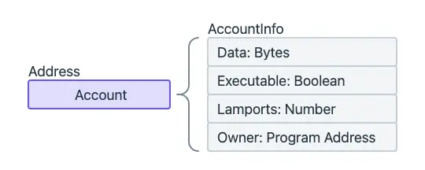
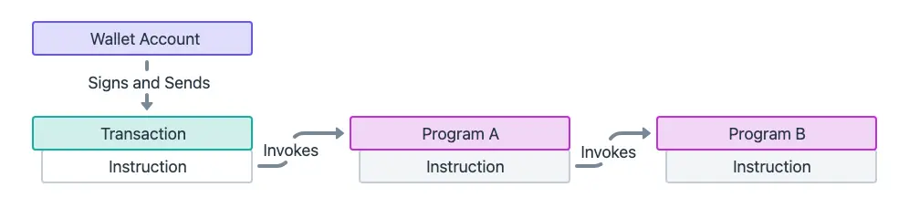

## Introduction
Solana is a high-performance blockchain platform designed for decentralized applications and cryptocurrencies. Known for its fast transaction speeds and low costs, Solana uses a unique consensus mechanism called Proof of History (PoH) to achieve high throughput and scalability. It supports a growing ecosystem of decentralized finance (DeFi) projects, non-fungible tokens (NFTs), and other applications.

To help everyone understand Solana to write smart contracts on it, this article will introduce the core concepts of Solana.

## Accounts
Accounts are where data is stored on the Solana blockchain*.* Accounts can store up to 10MB of data, which consit of either excutable program code or program state. Accounts require a rent deposit in SOL, proportional to the amount of data stored, which is fully refundable when the account is closed. Every account has a program "owner". Only the program that owns an account can modify it data.

## Types of Accounts
There are two types of accounts on the Solana blockchain: executable and non-executable. Programs are executable accounts and store the immutable code of a program. Data storage and token balances are stored in non-executable accounts as their data can be changed. To control who can change this data, non-executable accounts have an owner program address assigned to them. 

For each type of account, there will be typical accounts.

Data accounts store data

Program accounts store executable programs

Native accounts that indicate native programs on Solana such as System, Stake, and Vote

Within data accounts, there are 2 types:

- System owned accounts
- PDA (Program Derived Address) accounts

## Programs
Solana Programs, often called "smart contracts" on other blockchains, are the executable code that interprets the instructions sent inside of each transaction on the blockchain. They can be deployed directly into the network’s core as Native Programs or published by anyone as On Chain Programs. Programs are the core building blocks of the network and handle everything from sending tokens between wallets to accepting votes of DAOs, to tracking ownership of NFTs.

Unlike most other blockchains, Solana completely separates code from data. All data that programs interact with are stored in separate accounts and passed in as references via instructions. This model allows for a single generic program to operate across various accounts without requiring additional deployments.

## Types of programs
The Solana blockchain has two types of programs:

- Native programs
- On chain programs

Native programs are those built directly into the core of the Solana blockchain. These programs are divided into [Native Programs](https://docs.solana.com/developing/runtime-facilities/programs#bpf-loader) and [Solana Program Library (SPL) Programs](https://spl.solana.com/).

On chain programs is user-written programs, often called "smart contracts" on other blockchains, are deployed directly to the blockchain for anyone to interact with and execute.

## Transactions and Instructions
On Solana, we send transactions to interactions with the network. Transactions include one or more instructions, each representing a specific operation to be processed. The execution logic for instructions is stored on programs deployed to the Solana network, where each program stores its own set of instructions.

An instruction is a request to process a specific action on-chain and is the smallest contiguous unit of execution logic in a program. You can imagine a instruction as a function which handles logic on web2. 

Each instruction must include the following information:

- Program address: Specifies the program being invoked.
- Accounts: Lists every account the instruction reads from or writes to, including other programs.
- Instruction Data: A byte array that specifies which instruction handler on the program to invoke, plus any additional data required by the instruction handler (function arguments).

## Program Derived Addresses (PDAs)
PDAs are addresses that are deterministically derived and look like standard public keys, but have no associated private keys. This means that no external user can generate a valid signature for the address. However, the Solana runtime enables programs to programmatically "sign" for PDAs without needing a private key. 

PDA was created can sign transactions to modify its data. That is very useful when you need storage that can only be modifiable by your program.

## Cross Program Invocations (CPIs)
A Cross Program Invocation (CPI) refers to when one program invokes the instructions of another program. This mechanism allows for the composability of Solana programs.

You can think of instructions as API endpoints that a program exposes to the network and a CPI as one API internally invoking another API.

When a program initiates a Cross Program Invocation (CPI) to another program:

- The signer privileges from the initial transaction invoking the caller program (A) extend to the callee (B) program.
- The callee (B) program can make further CPIs to other programs, up to a maximum depth of 4 (ex. B->C, C->D).
- The programs can "sign" on behalf of the PDAs derived from its program ID.

## References
https://solana.com/docs
