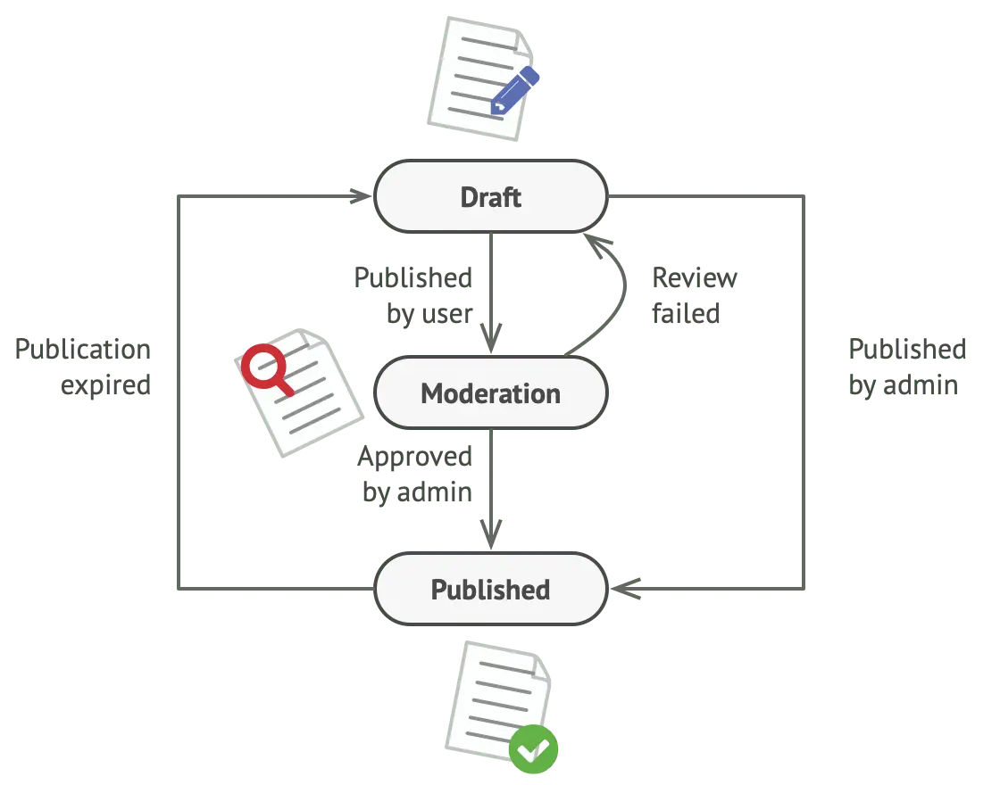
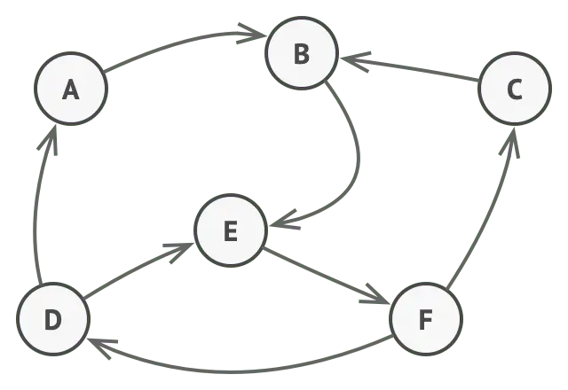
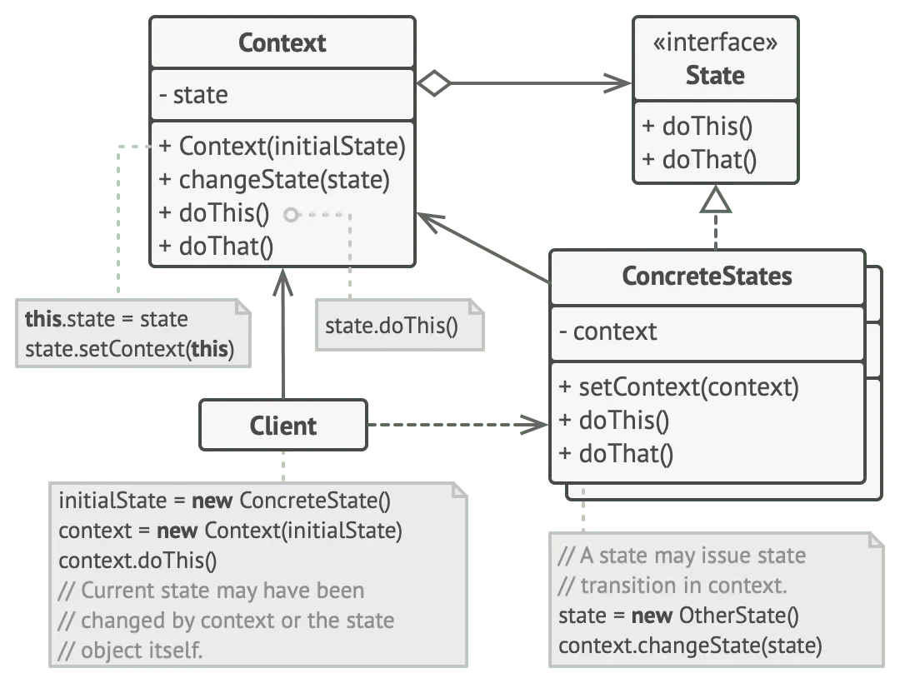

> The State Design Pattern is a behavioral design pattern that allows an object to change its behavior when its internal state changes. This pattern is particularly useful for scenarios where an object can exist in multiple states and its behavior varies based on these states.

## Example Scenario

Consider a Document class with three states: Draft, Moderation, and Published. The publish method behaves differently in each state:

- Draft: Moves the document to Moderation.
- Moderation: Publishes the document if the current user is an administrator.
- Published: Does nothing.



### Common Implementation Issues

```py
class Document is
    field state: string
    // ...
    method publish() is
        switch (state)
            "draft":
                state = "moderation"
                break
            "moderation":
                if (currentUser.role == "admin")
                    state = "published"
                break
            "published":
                // Do nothing.
                break
    // ...
```

- Monstrous Conditionals: As the number of states and transitions increases, the conditional logic becomes complex and difficult to manage.
- Maintenance Difficulty: Changes to the state transitions require updating conditionals in multiple places, increasing the risk of errors
- Scalability Issues: Predicting all possible states and transitions at the design stage is challenging, and the state machine can become bloated over time as new states and behaviors are added.

### Solution using State pattern

The State pattern addresses these issues by encapsulating state-specific behavior into separate state classes. This way, the context class delegates the behavior to the state objects, making the code cleaner and easier to manage.


## Concept of State pattern



In the State Design Pattern, the state of an object is represented by a set of state-specific classes. The object, known as the context, delegates state-specific behavior to the current state object. As the state of the context changes, it transitions between different state objects, each of which implements a particular set of behaviors.


### Structure



- **Context**: Maintains an instance of a `ConcreteState` subclass that defines the current state.
- **State**: Defines an interface for encapsulating the behavior associated with a particular state of the Context.
- **ConcreteState**: Implements the behavior associated with a state of the Context.


### Advantages
- **Simplifies State Transitions**: Encapsulates state-specific behavior and state transitions, making it easier to add new states without modifying existing ones.
- **Enhances Readability**: Improves code readability and maintainability by organizing state-specific behavior into separate classes.
- **Promotes Open/Closed Principle**: Facilitates adherence to the Open/Closed Principle, allowing the system to be extended with new states without altering existing code.


### Use Cases
The State Design Pattern is particularly beneficial in scenarios such as:

- **Finite State Machines**: Implementing state machines where an object can be in one of a limited number of states.
- **User Interfaces**: Managing different UI states like enabled, disabled, focused, etc.
- **Game Development**: Handling various game states such as running, paused, stopped, etc.
