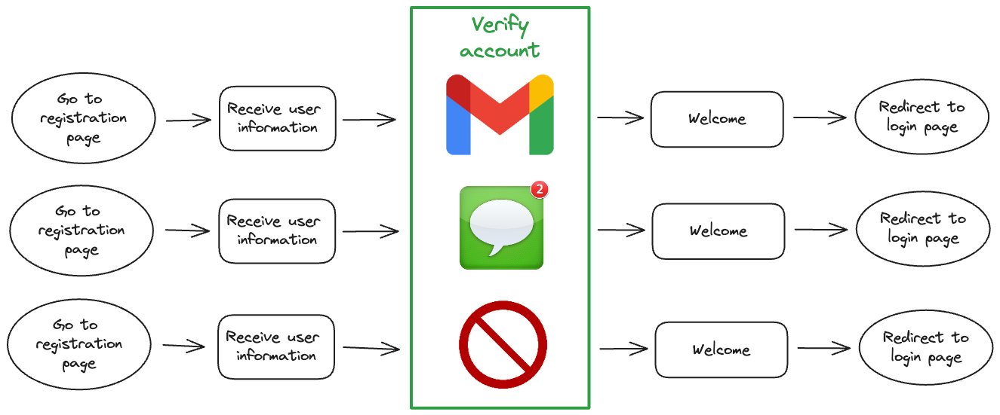
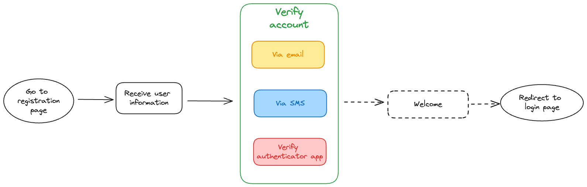
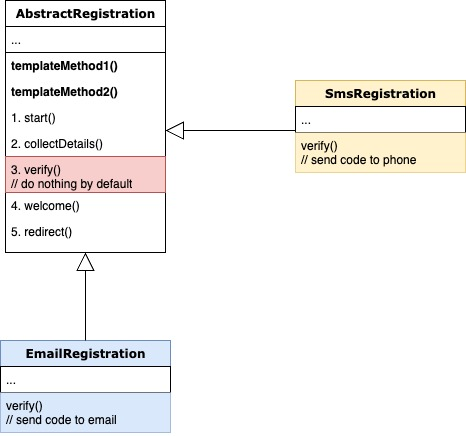

---
tags:
  - design-pattern
  - behavioral-pattern
  - golang
title: "A Tour of Template method pattern with Golang"
description: "Template method: the problem, the concept, the solution, its use cases, implementations, pros & cons. The Template Method pattern in Go offers a powerful way to define algorithm skeletons and handle variations. We examine its application in user registration, showcasing code reusability and scalability in Golang development."
authors:
  - anhnh
date: 2024-06-28
---


## Problem

Just imagine we need to implement a registration feature for our applications (web, mobile). A typical registration will have some basic steps such as fill in the form, verify account, redirect to login page, etc.

At the beginning, our apps only supported verification via email. After months, the team realized that the amount of mobile users significantly increased. So we decided to support more verification methods via SMS/authenticator app or allow to register without verification.



## Concept

**Template method** is one of **Behavioral design patterns**. It can be defined by the followings:

- Defines skeleton of an algorithm
- Lets subclasses override specific steps of the algorithm without changing its overall structure

## Solution by Template method

The Template method offers us an answer to those issues from the above scenario. By applying the pattern, we break the operation (registration) down into multiple steps (receive user form, verify, welcome, redirect to login page, etc.) and create a method which invokes the steps in a specific order. Basically we construct a **template** by calling the steps inside a **method**. That's why the template is called **Template method**.



All work above can be put together inside a single place (aka base class/type). The steps can either be abstract, or have default implementation:
- **For common steps**: code are identical, we define default implementation to avoid code duplication and let every subclasses to have the ability to reuse the code.
- **For other steps**: code are unique and independent between cases, we can do one of the followings for each:
  - **Declare as `abstract`**: require every subclass to have their own unique implementation
  - **Write default implementation**: any subclass with different logic can feel free to override the step
  - **Using `hooks`**: Has default implementation with empty body. Only used when the step is not mandatory in our main operation. The operation would work even if there is appearance of that step or not.
  *e.g.* The registration feature would behave normally even if we remove *welcome* step

### Structure


*Note*: We can have multiple template methods, in case we need to use those same steps but in different order


## Applicability

Use Template method pattern when you have multiple approaches to achieve your task, but they have many identical steps and just a few steps with minor differences

Use Template method pattern when:
- You need to define a template for an operation/algorithm
- You have multiple approaches/methods to achieve your task, but they have many identical steps and just few minor differences

## Pseudocode (golang)

Since **Go** does not have abstract class and inheritance, the implementation will be a bit different

**Step 1**: create an interface (instead of abstract class) declaring abstract methods which represent every step of registration process

```go
type IRegistration interface {
  Start()
  Collect()
  Verify()
  Welcome()
  Redirect()
} 
```
<br/>

**Step 2**: Define template method `Register()` including steps' invocations
```go
func Register(r IRegistration) {
  r.Start()
  r.Collect()
  r.Verify()
  r.Welcome()
  r.Redirect()
}
```
Pay attention to the only paramter `r`, it will be determined and provided by the client (details in step 5)
<br/><br/>

**Step 3**: create base type `BaseRegistration` implements `IRegistration`
```go
type Registration struct {
  Name     string
  Phone    string
  Email    string
  Verified bool
}

// step 1
func (r *Registration) Start() {
  println("Welcome to Dwarves Foundation")
}

// step 2
func (r *Registration) Collect() {
  // Receive and handle user inputs
  // ...
  // db.Save(r.Name, r.Phone, ...)
}

// step 3 implementation will be delegated for other sub types
// func (r *Registration) Verify()

// step 4 - display a welcome message to newcomer
// this is an optional step in registration process
// so we can either define it as a hook or provide a default implementation
func (r *Registration) Welcome() {
  status := ""
  if r.Verified {
    status = "✅"
  }
  fmt.Printf("Hi, %s %s\n", r.Name, status)
}

// step 5 - common step
func (r *Registration) Redirect() {
  println("Redirecting to login page ...")
  // context.Redirect('/login')
}
```
<br>

**Step 4**: `Verify()` implementations
We use composition instead of inheritance in **Go** by embedding struct `Registration`

- **Phone (SMS)**
```go
type Sms struct {
  Registration
}

func (s *Sms) Verify() {
  // generate code
  // send code using sms provider
  // ...
  println("Verification code sent to your phone")

  // verify code
  // ...
  r.Verified = true
  println("You have verified successfully!")
}
```
<br/>

- **Email**
```go
type Email struct {
  Registration
}

func (e *Email) Verify() {
  // generate code
  // send code using email provider
  // ...
  println("Verification code sent to your email")

  // verify code
  // ...
  r.Verified = true
  println("You have verified successfully!")
}
```
<br/>

For example, we may also support non-verified registration in the future (limited features)
```go
type NonVerified struct {
  Registration
}

func (v *NonVerified) Verify() {
  // nothing to do here
}
```
<br/>

**Step 5**: Client code `main.go` - assume that we select verification method based on user device
```go

func main() {
  // check user device
  ua := context.Header("User-Agent")
  var r registration.IRegistration
  switch true {
  case isDesktop(ua):
    r = &registration.Email{}
  case isMobile(ua):
    r = &registration.Sms{}
  default:
    r = &registration.NonVerified{}
  }

  // invoke template method
  registration.Register(r)
}
```


## Benefits & Drawbacks
### Benefits
- Define constant skeleton for an operation/algorithm<br/>
- Optimize code reusability<br/>
- Scalable<br/>

### Drawbacks
- Tight-coupling code between client and subclasses<br/>
- Not useful when we have too many conditions inside template method<br/>
- Customization may cause redundant code. Adding one step for one use case would either require definining it in base class or every other subclasses<br/>
- Wrong *usage* of inheritance might accidentally break our operation/algorithm. e.g. `panic()` inside `Verify()` implementation<br/>

## References
- https://refactoring.guru/design-patterns/template-method
