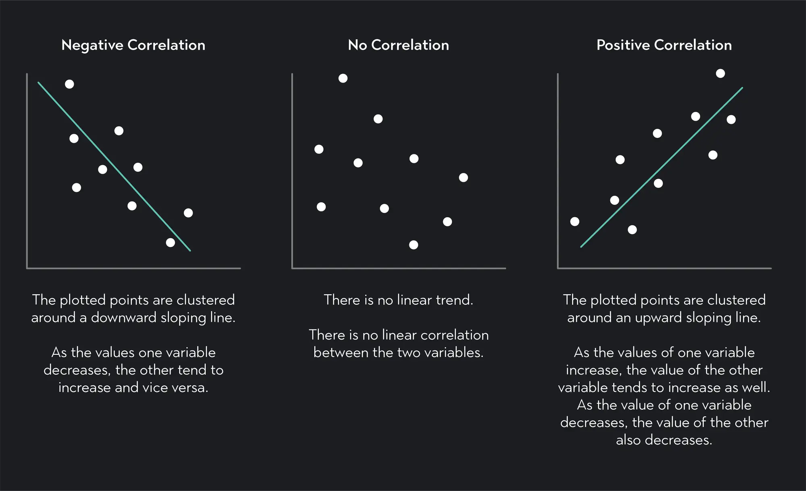
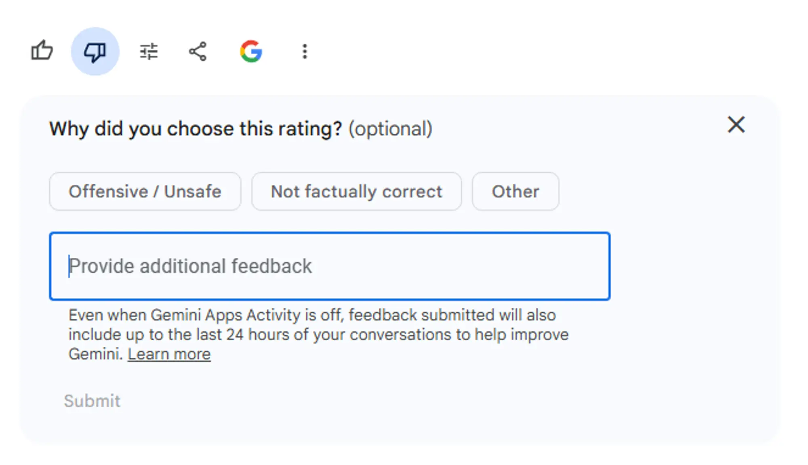

---
tags:
  - llm
  - feedback
  - pattern
title: "Thumbs up and Thumbs down pattern"
date: 2024-01-07
description: "The article talks about how important human feedback is for making large language models better, especially using thumbs up and down. It explains the Pearson correlation coefficient, which measures how variables are related. The thumbs system is an easy way for users to show if responses are helpful or not, which encourages more feedback and keeps users engaged. This feedback helps improve training data and makes the models more accurate. The article includes examples in sentiment analysis for reviews and content moderation, showing how this feedback helps understand user opinions and filter out bad content on sites like YouTube and Twitter."
authors:
  - datnguyennnx
---

Collecting user feedback is importance for improving the accuracy and relevance of responses. One simple yet powerful feedback mechanism is the thumbs up and thumbs down system. This article explores how labeling feedback in this manner can enhance the training data for LLMs and provides a case study for obtaining human feedback.

### Pearson Correlation Coefficient

The Pearson correlation coefficient is a statistical measure that quantifies the strength and direction of the relationship between two variables. It ranges from -1 to +1, where +1 indicates a perfect **positive** linear relationship, -1 indicates a perfect **negative** linear relationship, and 0 indicates no linear relationship. This coefficient is widely used in various fields to understand how variables are related and to make predictions based on these relationships.

### Thumbs Up and Thumbs Down Feedback

- **Thumbs Up (Positive Feedback)**: When a user interacts with an LLM and receives a helpful, accurate, or satisfying response, they provide a "thumbs up" or a positive rating. This indicates that the LLM's output was valuable and aligned with the user's intent.
- **Thumbs Down (Negative Feedback)**: Conversely, if a user receives an unhelpful, incorrect, offensive, or otherwise unsatisfactory response, they give a "thumbs down" or a negative rating. This feedback signals that the LLM's output needs improvement.

### Simplifying User Interaction and Increasing Engagement

**User-Friendly Feedback Mechanism:** Using thumbs up and down is a simple way to get user feedback. When it's quick and easy, more people are likely to join in. This means more feedback, which gives the model better data to learn from.

**Encouraging Consistent Feedback:** Since giving a thumbs up or down is so easy, people can keep giving feedback without feeling it's a hassle. This steady feedback is really important for models that need constant input to get better over time. The more feedback the model gets, the better it can understand and guess what users like.

### Case Studies

**Sentiment Analysis in Review Systems:** In sentiment analysis, using thumbs up and down can really help in figuring out if reviews are positive or negative. For example, an algorithm that sorts product reviews can use this simple feedback to get better at understanding how people feel. This makes it easier for the model to catch the subtle ways people express their opinions, leading to more accurate results.

**Content Moderation and Filtering:** In content moderation, using thumbs up and down feedback can help spot inappropriate or harmful stuff. When users give a thumbs down to something they don't like, the model learns to filter out similar content in the future. This feedback loop is key to keeping online spaces safe and positive. Platforms like YouTube and Twitter use likes and dislikes to manage and filter content. This feedback helps algorithms find trends, popular posts, and catch possible misinformation or harmful content.

### Reference

- [Pearson Correlation Coefficient (r) | Guide & Examples (scribbr.com)](https://www.scribbr.com/statistics/pearson-correlation-coefficient/)
- [What’s Missing to Evaluate Foundation Models at Scale - TruEra](https://truera.com/ai-quality-education/generative-ai-observability/whats-missing-to-evaluate-foundation-models-at-scale/)
- [How Content Filtering Makes It Possible to Do Moderation at Scale – Besedo](https://besedo.com/blog/content-filtering-vs-moderation/)
- [(PDF) Thumbs Up or Thumbs Down? Semantic Orientation Applied to Unsupervised Classification of Reviews (researchgate.net)](https://www.researchgate.net/publication/248832100_Thumbs_Up_or_Thumbs_Down_Semantic_Orientation_Applied_to_Unsupervised_Classification_of_Reviews)
- [How to Make the Most Out of LLM Production Data: Simulated User Feedback | by Pasquale Antonante, Ph.D. | Towards Data Science](https://towardsdatascience.com/how-to-make-the-most-out-of-llm-production-data-simulated-user-feedback-843c444febc7)