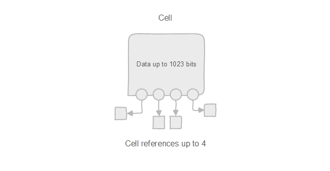
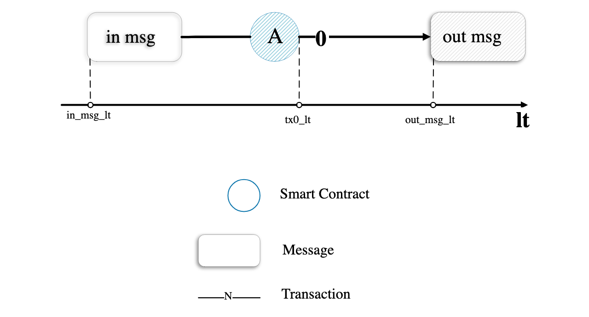

In my previous post, [Ton: Blockchain of Blockchains](), I talked about some core technologies that make TON strong. However, it was just an overview. To begin developing on TON is not enough. Today, I will introduce some core concepts in TON that you will frequently work with as a TON developer.

#### Cells and Data Storage
**Cells are the atomic unit of data storage in TON**. It is a data structure containing:

- Up to 1023 bits of data
- Up to 4 references to other cells

Currently, TON has 2 types of cells: ordinary and exotic
- ordinary: basic, standard cell.
- exotic: specialized cells with specific functions.
  - Pruned Branch Cell: represents a pruned branch in a data structure.
  - Library Reference Cell: references external libraries or modules.
  - Merkle Proof Cell: contains proofs for verifying data in a Merkle tree.
  - Merkle Update Cell: contains information to update a Merkle tree.

When serializing cells into byte arrays, it is called  Bag of cells. **Every data stored on TON including blocks and the state of the network is a bag of cells.**

#### Smart contract

As mentioned in the previous post, everything in TON is a smart contract. That contains:
- Address: (workchain_id, account_id) pairs present smart contract as a unique identifier.
- Code: code that can be run on TVM, and represents the rule and business logic of this contract.
- Data: the state of the smart contract, includes variables that store information and can be modified by the contract’s code.
- Balance: the amount of TON held by the contract.
- Others: flags requesting tick-tock calls at each block (active only for fundamental contracts), auto-splitting information and published library cells, etc.

#### Message

To communicate between smart contracts aka actors on TON network, we need to send messages. A message is a package of data that contains the following elements:
- Source Address: Sender’s address.
- Destination Address: Receiver’s address.
- Value: Amount of Toncoins being transferred.
- Payload: Data or instructions for the recipient.
- State Init: Optional initialization data for the recipient.

We have 2 types of messages:
- Internal Messages: Facilitate communication and value transfer between smart contracts within the TON network. They are used for contract-to-contract interactions.
- External Messages: Allow users and external entities to interact with smart contracts. They are typically used to invoke functions or services provided by the smart contracts.

#### Transaction

On TON, we have the transaction that records the state changes of processing a message. That basically contains:
-	Inbound Message: The message that triggered the transaction.
-	State Changes: Modifications to the account or smart contract state, such as balance updates or data modifications.
-	Outbound Messages: Any new messages generated as a result of processing the inbound message. 
-	Gas Fees: Computational resources consumed during the transaction.

Not every transaction leads to outgoing messages or updates to the contract’s storage; this depends on the specific actions defined by the contract’s code. 

One more important point to note is that unlike Ethereum or most other synchronous blockchains, where each transaction can contain several smart contract calls, in TON, **a transaction is executed on a single smart contract, and smart contracts communicate through messages.**

#### Gas 

In Solidity, gas concerns are minimal for contract developers. If a user provides insufficient gas, the transaction will be completely reverted (though the gas spent will not be refunded). If sufficient gas is provided, the actual costs will be calculated and deducted from the user’s balance automatically.

In TON, the scenario differs:

- Insufficient gas leads to partial transaction execution.
- Excess gas must be refunded, a responsibility falling on the developer.
- When multiple contracts exchange messages, each message requires individual control and calculation.

TON does not automatically calculate gas. The entire transaction execution, with all its outcomes, can be lengthy, potentially leaving the user with an insufficient toncoin balance by the end. **So the developer must take care of gas costs**. However, calculating gas is not an easy task. So we often need to set a minimum gas limit for each transaction, then refund the excess gas later. For example: 

- Today, every transaction costs around ~0.005 TON.
- And NFT marketplaces usually take an extra amount of TON (~1 TON) and return (1 - transaction_fee) later.

> FYI: Fee formula on TON 
  transaction_fee = storage_fees
    + in_fwd_fees
    + computation_fees
    + action_fees
    + out_fwd_fees

#### Conclusion

With all the above concepts, we can now begin developing on TON. But these are actually not enough. We will continue diving deep into more complex concepts such as data format, transaction layout, or bounceable addresses when developing something in the next post.
