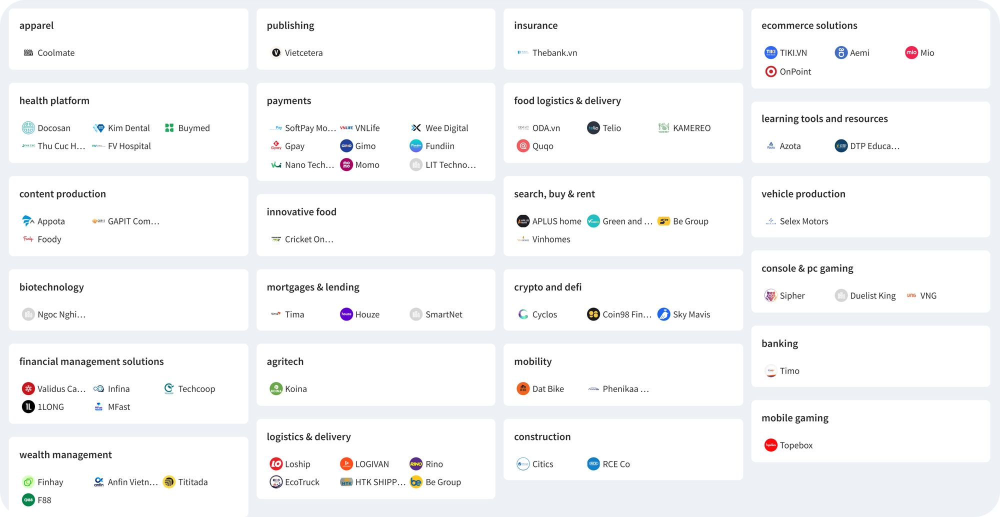
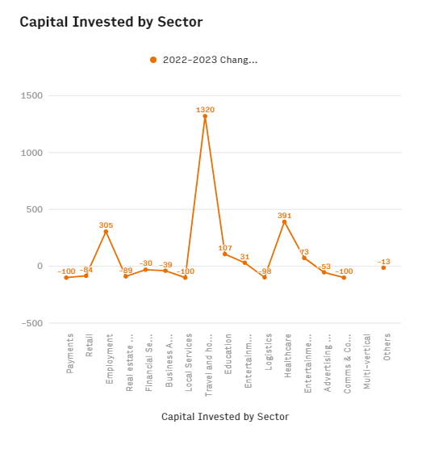
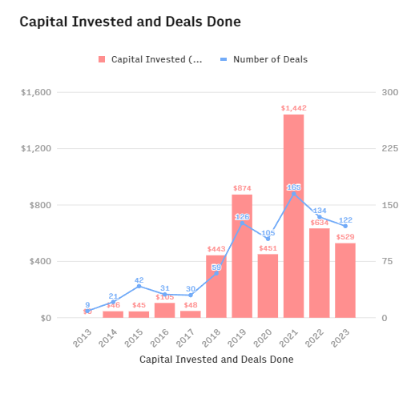

---
tags:
  - market-report
title: Vietnam Tech Ecosystem 2024 Report 
date: 2024-07-11
description: The 2024 Vietnam Tech Market Report highlights Vietnam's resilient tech scene, ranking third in Southeast Asia despite a 17% drop in investments. With a booming digital economy expected to reach $43 billion by 2025, the report covers key trends, major players, and new legal updates driving innovation.
authors:
  - minhle
---

### Current State of the Vietnam Tech Market

- **Investment Total:** $529 million, a 17% drop from 2022.
- **Resilience:** Vietnam's VC funding fell 17%, compared to a global 35% drop.
- **Regional Standing:** Third in Southeast Asia for deal count and value, behind Singapore and Indonesia.
- **Sector Growth:** Healthcare and Education investments surged by 391% and 107%.
- **Active Investors:** Nearly 100, with Singapore leading, followed by Vietnam.
- **Exit Landscape:** Growth in the public market, improved stock market governance, and increased M&A activities driven by local conglomerates.

### Vietnam Digital Economy Landscape

- Vietnam's digital economy is the fastest-growing in Southeast Asia, driven by high internet penetration, favorable government initiatives, and a thriving startup ecosystem.
- The digital economy is expected to grow 20% annually, reaching $43B by 2025
    

### Tech Investment Landscape 2023

- Despite global economic challenges, Vietnam maintained its third position in Southeast Asia for deal count and value.
- Investment sectors with notable growth include Healthcare and Education.
- Active investors primarily from Singapore and Vietnam, with a focus on early-stage deals

### Top Active Investors in 2023

### Notable Trends in the Startup Ecosystem

### Key Invested Industries in First Half of 2024 (in millions of USD)

### Exit Landscape

- Significant growth in public markets and M&A activities, with local conglomerates playing an increasing role.
- Proactive government initiatives and favorable economic conditions are driving IPO and M&A activities

### Latest Legal Developments

- Policies to foster innovation include tax exemptions for innovative enterprises, support for tech parks, and mechanisms to encourage scientific research.
- NIC Hoa Lac's inauguration and the bilateral Comprehensive Strategic Partnership with the US are expected to boost the semiconductor industry and innovation ecosystem

### Key players in AI/Fintech in Vietnam

- **500 Startups Vietnam**: Co-founded by Binh Tran and Eddie Thai, this fund has invested in over 70 startups, including Sky Mavis and Infina.
- **VSV Capital**: Based in Hanoi, VSV Capital supports early-stage tech companies, with a notable accelerator program backing over 130 startups.
- **VinaCapital Ventures**: A $100 million VC platform investing in tech companies in Vietnam, with a focus on fintech and Web3.
- **Zone Startups Vietnam**: Provides strategic guidance and seed capital to startups, part of a global network, with investments in fintech like Fundiin.
- **Do Ventures**: Early-stage VC in Ho Chi Minh City, investing in sectors like fintech and AI, targeting the Vietnamese middle class.
- **ThinkZone Ventures**: A $60 million fund based in Hanoi, investing in early-stage tech startups across various sectors.
- **Son-Tech Investment**: A $50 million Vietnam-focused VC, supporting tech companies in fintech and other sectors.
- **Openspace Ventures**: Southeast Asian VC with investments in Vietnamese tech companies, focusing on responsible B2B and B2C businesses.
- **Golden Gate Ventures**: Southeast Asian VC firm investing in tech startups across the region, with significant involvement in Vietnam.

### Key players in blockchain/crypto in APAC

#### Animoca Brands / Animoca Ventures

- **Summary**: Animoca Brands, founded by Yat Siu in 2014 and headquartered in Hong Kong, is a prominent Web3 gaming software company and venture capital firm. With over 400 investments, it focuses primarily on gaming and NFTs. In 2022, Animoca Brands launched Animoca Ventures with a reduced fundraising target of $800 million. Together, they made 37 investments in the past year, including Mythical Games, OP3N, and Xterio.
- **Website**: [Animoca Brands](https://www.animocabrands.com/)

#### Foresight Ventures

- **Summary**: Singapore-based Foresight Ventures focuses on blockchain and cryptocurrency, managing over $400 million in assets. Backed by Bitget, it launched a $200 million secondary fund in 2022. Foresight Ventures has a portfolio of 56 investments, with 25 in the last year, including Sei Network and Story Protocol.
- **Website**: [Foresight Ventures](https://www.foresightventures.com/)

#### HashKey Capital

- **Summary**: HashKey Capital, part of HashKey Group, has been a significant player since 2015, managing over $1 billion in assets. With 224 investments, it raised $500 million for its Phase III fund. Recent investments include Aethir, dappOS, and PolyHedra.
- **Website**: [HashKey Capital](https://www.hashkey.com/)

#### Hashed

- **Summary**: Founded in 2016 in Korea, Hashed has grown significantly, with early investments in Terra and The Sandbox. Despite a slowdown after the Terra crash, it remains active with investments in Radius, Notifi, and Aura Network. Hashed Emergent focuses on Web3 investments in emerging markets like India.
- **Website**: [Hashed](https://www.hashed.com/)

#### Infinity Ventures Crypto

- **Summary**: Headquartered in Taipei, IVC focuses on GameFi, DeFi, and Web3, with a $70 million fund. With 119 investments, it made 21 investments in the last year, including Tribe3 and MetaZone.
- **Website**: [Infinity Ventures Crypto](https://www.ivcrypto.io/)

#### IOSG Ventures

- **Summary**: Founded in 2017, IOSG Ventures is an early-stage venture firm with a research-driven approach, focusing on Web3 and decentralized finance. With 141 investments, it recently invested in EigenLayer and Scroll.
- **Website**: [IOSG Ventures](https://www.iosg.vc/)

#### NGC Ventures

- **Summary**: Based in Singapore, NGC Ventures has invested in over 50 projects, managing around $400 million. It recently launched a $100 million Web3 eco-fund. Notable investments include LayerZero and Connext.
- **Website**: [NGC Ventures](https://www.ngc.fund/)

#### OKX Ventures

- **Summary**: The investment arm of OKX focuses on blockchain infrastructure, DeFi, and NFTs, with 130 investments. Recent investments include LayerZero and Prisma Finance.
- **Website**: OKX Ventures

#### Spartan Group

- **Summary**: Spartan Group, based in Singapore and Hong Kong, focuses on long-term blockchain investments. With 177 investments, it has recently invested in Aspecta, Kaito, and Anoma Network.
- **Website**: [Spartan Group](https://spartangroup.io/)

#### SevenX Ventures

- **Summary**: Founded in 2020, SevenX Ventures emphasizes "immersive investing" and has 115 investments. Recent projects include Manta Network and EthStorage.
- **Website**: [SevenX Ventures](https://sevenxventures.com/)

### References

1. Vietnam Innovation and Tech Investment Report 2024
2. Dealroom